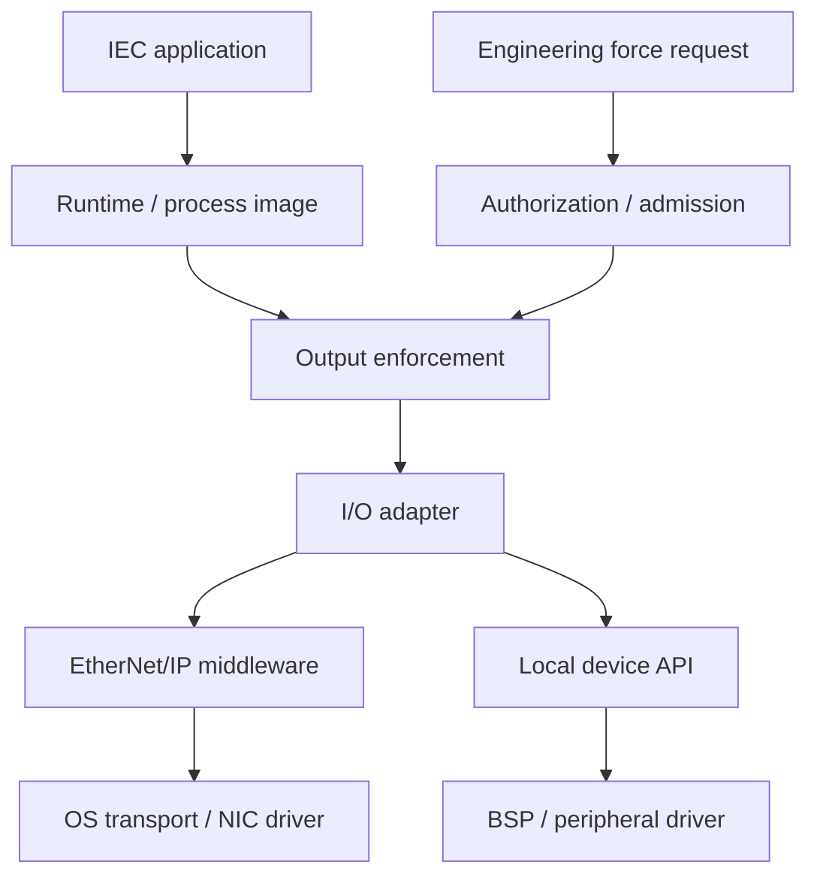

# IronPLC / RegulBUS: задание на архитектуру firmware DCS

Версия: 2.2 — владение состоянием, stateless/stateful-компоненты и обоснованный выбор FSM/EFSM.  
Дата: 2026-09-22.  
Базовая платформа для примеров: FreeRTOS. Второй порт: Linux с квалифицированным профилем исполнения. VxWorks — архитектурный референс и дополнительный тест границ портируемости, без обязательства выбрать этот продукт.  
Статус: исправленное задание на проектирование и верификацию, **не свидетельство готовности продукта к эксплуатации**.

## Как использовать документ

Передать документ целиком LLM, системному архитектору или команде разработки. Часть A фиксирует найденные дефекты исходного задания. Часть B — самодостаточное исправленное задание. Часть C задаёт проверку результата и допуск к production.

Проектируется firmware контроллера для DCS/BPCS: программная платформа, PLC runtime, управление приложениями, I/O, резервирование и эксплуатационные контракты. Это не проект всей DCS, включая операторские станции и historian, и не спецификация сертифицированной SIS.

Требования ниже — проектные решения и требования к будущим доказательствам. В этом документе не проводились аудит исходников IronPLC, испытания аппаратуры или model checking. Существующему upstream IronPLC перечисленные возможности не приписываются.

Термины **MUST**, **MUST NOT**, **SHOULD** обозначают соответственно обязательное требование, запрет и рекомендацию с документируемым исключением. `TBD` разрешён при проектировании, но не в обязательных параметрах выпускаемого production-профиля.

### История архитектурных уточнений

**2.1 — программные слои по референсу Wind River.**

Добавлена послойная модель firmware по предоставленному изображению Wind River: BSP, Kernel, Core OS, OS Services, Middleware, DCS platform / PLC Runtime и IEC application. В версии 2.1 она сопоставлялась с пятью основными контекстами, для которых преждевременно требовались обязательные FSM. Engineering tools вынесены на host; для каждого target component определяются контракт, execution domain, единица сборки/обновления и квалификационные тесты. Hypervisor/partitioning оставлены отдельными вариантами deployment. Ни один новый слой не становится универсальным управляющим автоматом.

**2.2 — состояние как отдельный предмет проектирования.** Пять контекстов сохранены; требование ровно пяти FSM снято. Stateless/stateful, pure/effectful, представление памяти и её сохранность рассматриваются независимо. Добавлены матрицы слоёв и внутренних компонентов, нормативные требования S01–S12, реестр состояния, семантика reset/retain/failover, граница decision/commit/effect и проверка жизненного цикла операций. Обновлены HW_KEY, OS, HW_DIAG, RUNTIME, APPLICATION, формат результата, инварианты и приёмка. Добавлены замечания D29–D36 и сценарии T35–T44. Первичные источники и пределы их применимости приведены в разделе 28.

Главный принцип редакции: **необходимое состояние имеет явного владельца; вычисления и решения по возможности чистые; FSM/EFSM применяется к поведению с существенным порядком действий.** Эта редакция заменяет прежнее требование пяти обязательных statechart, а не добавляет поверх него ещё один подход.

---

# Часть A. Результат проверки «адвокатом дьявола»

## A.1. Вердикт

Декомпозицию HW_KEY / OS / HW_DIAG / RUNTIME / APPLICATION сохранить. Исходное задание, однако, нельзя считать достаточным для production DCS: оно описывало логические состояния, но недоопределяло исполнение при отказах, владение выходами, временные ограничения и восстановление.

Ортогональность означает раздельное владение состоянием и отсутствие зависимости от чужой внутренней FSM. Она **не означает** отсутствие взаимодействия, независимость отказов или возможность продолжать программную реакцию после остановки общей ОС.

## A.2. Найденные проблемы и внесённые исправления

`P0` — дефект, способный нарушить управление, эксклюзивность выходов или достоверность гарантий. `P1` — существенный дефект расширяемости, диагностики или эксплуатационной модели.

| ID | Приоритет | Возражение | Исправление |
|---|---|---|---|
| D01 | P1 | «Слои не знают друг о друге» буквально невыполнимо: потребитель обязан понимать смысл входов. | Запрещено знание реализации и внутренних enum; разрешены узкие публичные контракты и направленные зависимости. |
| D02 | P0 | Независимые FSM не являются независимыми failure domains. При остановке RTOS они могут замереть вместе. | Разделены логическое владение, execution context и физический fault-containment boundary. |
| D03 | P0 | `Runtime.RUNNING → os.ready` не может мгновенно сохраняться при асинхронном отказе ОС. | Заданы инварианты на точках принятия решений и ограниченное время реакции; физические выходы защищает отдельный путь. |
| D04 | P0 | HW_DIAG с `execution_safe` / `outputs_safe` незаметно принимает технологические решения. | Диагностика публикует ресурсные факты и достоверность; пригодность выводит владелец конкретного действия по утверждённому профилю. |
| D05 | P0 | Изменение permission не определяет, должен ли поворот ключа запускать PLC. | Разделены ограничения полномочий, intent переключателя, Start request и restart policy. |
| D06 | P0 | Не определено, кто действительно запрещает запись в физические выходы. | Назначен единственный авторитетный output-enforcement boundary, включая доступ по протоколам и режим force. |
| D07 | P0 | Несколько атомарных `bool` не образуют согласованный снимок. | Добавлены версии, boot identity, freshness, совместимость поколений и точка линеаризации решения. |
| D08 | P0 | После `can_start=true` ключ или capability могут быть отозваны до выполнения команды. | Повторная проверка на commit, приоритет revocation и явная ограниченная задержка после commit. |
| D09 | P1 | Запрет bootstrap/orchestration делает порядок запуска неявным. | Разрешены composition root и небольшой boot pipeline; запрещён универсальный управляющий Service Manager. |
| D10 | P0 | Задача внутри той же ОС не гарантирует реакцию на её зависание. | Требуется независимый watchdog / output timeout / аппаратный inhibit с доказанным покрытием отказов. |
| D11 | P1 | Замена RTOS на Linux трактуется как автоматическая эквивалентность real-time. | Контракты и доменная логика переносимы; timing, isolation, драйверы и storage заново квалифицируются. |
| D12 | P0 | Загрузка Candidate может сделать Application «не готовой», хотя Original работает. | Qualification и pin относятся к конкретному artifact; приём/проверка имеют отдельные операции; активное execution binding имеет одного владельца. |
| D13 | P0 | Не разделены режим TEST и Test Edits. | TEST — запрет application-driven физических воздействий; Test Edits — пробное выполнение новой генерации в выбранном режиме. |
| D14 | P0 | Совпадение StableStateId и типов объявляется отсутствием любого скачка процесса. | Гарантия ограничена сохранением state; поведение нового алгоритма и траектория выходов не доказаны этим условием. |
| D15 | P0 | O(1) pointer switch скрывает стоимость ожидания barrier и миграции изменяемого state. | Отдельные бюджеты подготовки, quiescence и commit; миграция обязана доказать согласованность с продолжающимися записями. |
| D16 | P0 | Синхронный резерв ошибочно считается законным владельцем I/O. | Разделены sync readiness, решение о роли и fencing, реально исполняемый на границе записи. |
| D17 | P0 | Правило двух потерянных link противоречит обещанию takeover при любом отказе PRIMARY. | Правило сохранено; отказ с потерей обоих валидных каналов явно исключён из гарантии автоматического takeover. |
| D18 | P0 | `+1000` в sequence counter смешивает номер пакета и статистику потерь. | Протокольный sequence идёт последовательно; потери считаются отдельно. Legacy-индикатор возможен только как UI-проекция. |
| D19 | P0 | EMA по 10/100 измерениям принимается за верхнюю границу latency/jitter. | EMA оставлена как оценка тренда; timeout обосновывается отдельно, с jitter, scheduling delay и запасом. |
| D20 | P0 | Hold-last на 100 ms трактуется как универсальная безопасная мера. | Для каждого output group заданы допустимый age, причина удержания, конечная реакция и процессное обоснование. |
| D21 | P0 | Firmware update смешивается с application online change. | Раздельные транзакции, совместимость версий, recovery после power loss и запрет неподтверждённых rolling updates. |
| D22 | P0 | Ключ и permission-биты подменяют authentication/security. | Физические ограничения пересекаются с авторизацией пользователя и сессионными/транзакционными проверками. |
| D23 | P1 | Минимизация M(N) провоцирует один универсальный механизм для разных инвариантов. | Определён same-class test; новый класс гарантий может законно добавлять механизм. |
| D24 | P0 | «Production-ready» выводится из красивых FSM и Rust. | Введены измеримые release gates: fault injection, timing, recovery, cybersecurity, FAT/SAT и закрытие блокеров. |
| D25 | P1 | Вертикальные software layers ошибочно принимаются за последовательную иерархию управляющих FSM. | Введены отдельные layer view, behaviour view и deployment view с таблицей соответствия. |
| D26 | P1 | `OsPort` незаметно подменяет всю firmware-платформу либо тянет в Runtime произвольные OS APIs. | Kernel, BSP, core services и middleware разделены; порты задаются нуждами потребителей, а не перечнем функций ОС. |
| D27 | P0 | Engineering tools, debug agent или optional middleware становятся скрытой зависимостью непрерывного управления. | Самостоятельное исполнение без host; trace budgets, debug admission и политика отсутствующих services. |
| D28 | P0 | Смена слоя, библиотеки, process или image ошибочно объявляется независимо безопасным hot update / fault isolation. | Для каждого компонента отдельно задаются image membership, update unit, protection domain и recovery boundary. |
| D29 | P1 | Пять контекстов автоматически превращены в пять обязательных FSM. | Обязательны State Inventory и выбор representation; FSM/EFSM только при обоснованном lifecycle. |
| D30 | P0 | Stateless worker или pure step ошибочно объявляет весь контроллер stateless и исключает память FB из миграции. | Разделены границы, purity и семантическая память; полный state scope сохранён. |
| D31 | P0 | Derived READY/cache переживает отзыв фактов, reboot или failover как действующее право. | Provenance, revision/freshness, invalidation и проверка authority при commit/enforcement. |
| D32 | P0 | Functional core скрывает гонку между решением, commit и физическим эффектом. | S09: сериализация, актуальность, effect identity, completion и partial outcome. |
| D33 | P0 | Stateful трактуется как сохранение/репликация всей RAM, включая native handles и часы. | State Inventory и отдельные cold/warm/edit/HA semantics; локальные ресурсы восстанавливаются. |
| D34 | P0 | «Чистая архитектура» вводит полный copy StateStore, remote state lookup или unbounded effects на scan. | Preallocated bounded execution, допустимое in-place обновление, сохранение exact-match O(1) root switch. |
| D35 | P0 | Поздний completion старой операции завершает новую после cancel/reset. | Корреляция operation/boot/session/generation и явный recovery при неопределённом эффекте. |
| D36 | P1 | Отказ от FSM только прячет фазы в bool, а сокращение enum выдаётся за успех N+1. | Выбор проверяемой модели; типизированная память, инварианты и межкомпонентные traces. |

Замечания закрыты **на уровне задания**: вместо недоказуемых обещаний введены обязанности проектировщика и критерии проверки. Реализационное закрытие P0 возможно только после получения соответствующих доказательств.

---

# Часть B. Исправленное задание для LLM / архитектурной команды

## 1. Миссия, границы и ожидаемый результат

Ты — системный архитектор firmware промышленного PLC/DCS-контроллера. Спроектируй production-oriented архитектуру на Rust с раздельным владением состоянием, чистыми вычислительными компонентами, обоснованными локальными FSM/EFSM и контрактными границами. Примеры исполнения дай для FreeRTOS; покажи замену платформы на Linux без изменения доменных правил. Используй схему Wind River как референс разделения программной платформы на слои; дополнительно проверь возможность VxWorks adapter на уровне контрактов, не объявляя его реализованным или квалифицированным.

Не начинай с кода. Сначала определи онтологию, владельцев состояния, классы отказов, полномочия и временные обязательства. Затем выведи контракты, необходимую память, модели поведения и реализационный профиль. Количество контекстов не определяет количество автоматов.

В состав результата входят:

- пять основных контекстов HW_KEY, OS, HW_DIAG, RUNTIME, APPLICATION;
- State Inventory и компонентная классификация stateless/stateful, pure/effectful, representation и lifetime по разделам 4.10–4.16;
- отдельные layer view, behaviour view и deployment view: software stack, state/effect ownership и фактические execution/protection/update boundaries;
- границы bootstrap, I/O enforcement, application deployment, firmware maintenance и redundancy;
- управление конфигурацией, persistent state, engineering requests, диагностикой и аудитом;
- правила переноса RTOS → Linux и квалификации платформ;
- доказуемые инварианты, сценарии отказов, тесты и production release gates.

Нельзя объявлять всю DCS безопасной на основании надёжности одного контроллера. Технологические interlock, безопасные положения исполнительных механизмов и допустимое время потери управления задаёт анализ конкретного объекта. Firmware обеспечивает проверяемое исполнение этих требований.

Этот профиль не заявляет SIL и не заменяет SIS. Для safety-related применения нужен отдельный lifecycle и обоснование по применимым стандартам. Область IEC 61511 — жизненный цикл SIS в процессной промышленности; она не сводится к выбору языка или FSM. См. [официальное описание IEC 61511-1](https://webstore.iec.ch/en/publication/24241).

## 2. Зафиксированные ограничения проекта

Следующие решения сохраняются; нельзя молча менять их ради удобства архитектуры.

1. Нет универсального `ServiceManager`, `SystemManager` или аналога, знающего все внутренние состояния и управляющего всем жизненным циклом.
2. Пользовательский язык и переменные остаются IEC 61131-3. Идентичности state, конфигурация deployment и метаданные контрактов находятся вне нестандартного синтаксиса переменных.
3. Active code immutable. Для application hot edit используются два code bank; полная Candidate generation готовится в spare bank с ограниченным бюджетом.
4. Runtime — конечный исполнитель проверки совместимости и переключения; IDE не может навязать ему небезопасное состояние.
5. Для exact-match state используется тот же LiveStateStore; переключение root не требует полного копирования state на barrier.
6. Структурные изменения требуют явного MigrationPlan и доказанного протокола согласованности.
7. Роли резервирования называются `PRIMARY` / `SECONDARY`; статусы синхронизации — `SYNC_*`.
8. Redundancy использует два выделенных optical sync-link, отдельно от engineering, SCADA и технологического I/O.
9. На наблюдённом состоянии `!L1 && !L2` SECONDARY теряет право автоматического takeover. Действующий PRIMARY не прекращает application только по этой причине.
10. EtherNet/IP рассматривается как I/O-интеграция. Нельзя предполагать, что протокол автоматически обеспечивает fencing, сохранение соединений или нужное время восстановления.

При обнаружении несовместимости требований покажи её и возможные решения. Не объявляй несовместимые свойства одновременно выполненными. Особенно это касается гарантии takeover при полном исчезновении PRIMARY и обоих sync-link.

## 3. Правило N+1: механизм, а не заплатка

```text
N := required same-class behaviors
M(N) := independent mechanisms required to cover N

prefer min M(N)

same_class(N+1) → prefer M(N+1) = M(N)

same_class(N+1) ∧ M(N+1) > M(N)
    → reconsider abstraction
```

`M` — не число файлов, crates, состояний, адаптеров, потоков, таблиц конфигурации или тестов. Это число независимых способов обеспечить один и тот же класс поведения.

Same-class означает совпадение семантического обязательства, модели полномочий и класса отказов. Если появился новый инвариант — например эксклюзивное владение I/O при сетевом разделении — новый механизм может быть оправдан.

Минимизируй M при сохранении bounded execution, понятных границ ответственности, проверяемости и fault containment. Универсальная event bus, через которую неявно управляется всё, не считается успехом N+1.

Для каждого N+1 теста представь: исходный механизм, новое требование, аргумент same-class/new-class, изменяемые части, неизменяемые части, новые доказательства и изменение M.

## 4. Владение состоянием и механизмами

### 4.1. Основные контексты

| Контекст | Единственный владелец | Публичный результат | Что ему запрещено |
|---|---|---|---|
| HW_KEY | Декодирование, стабильность и валидность физического селектора; аппаратные ограничения | Authority constraints и явный selector intent | Читать runtime enum, ставить Runtime в RUN, выдавать права пользователя |
| OS / Platform | Доступность необходимых платформенных сервисов и квалификация execution domain | Platform evidence/capabilities; узкие platform ports | Знать IEC POU, Test Edits, режим приложения или PRIMARY/SECONDARY |
| HW_DIAG | Результаты диагностики идентифицированных ресурсов и качество evidence | Health records по ресурсам | Объявлять технологический процесс безопасным; выбирать режим Runtime |
| RUNTIME | Actual execution, task/scan state, faults исполнения, активный execution binding и barrier | Execution status, progress, results запросов | Декодировать контакты ключа, управлять RTOS boot, обновлять firmware |
| APPLICATION | Immutable artifacts, manifest/schema, qualification records, каталог и время жизни ссылок | Проверенный artifact handle и compatibility evidence | Дублировать actual execution или владеть изменяемым LiveStateStore |

Эти пять областей — bounded contexts, а не строки вертикального software stack и не пять предписанных автоматов. Один контекст может содержать чистые функции, структуры состояния и несколько локальных протоколов. Владелец состояния — логическая ответственность; отдельные thread/process для каждого владельца не обязательны.

### 4.2. Дополнительные границы, необходимые для production

| Граница | Узкая ответственность | Почему это не god object |
|---|---|---|
| Composition root / bootstrap | Создать ресурсы и connections; выполнить зависимые pre-scheduler этапы | Не содержит политику RUN, hot edit, HA или технологических fault |
| I/O output enforcement | Пропускать только допустимые output frames; выполнять timeout/fallback и проверку owner | Владеет только физическим write boundary, а не жизнью всех компонентов |
| Deployment transaction | Stage, пробное переключение, commit/discard application generation | Опирается на контракт barrier; не пишет во внутреннее состояние Runtime |
| Firmware maintenance transaction | Проверить, установить, активировать и восстановить firmware image | Не является операционным режимом PLC и не управляет обычными scan |
| Redundancy | Replication, sync qualification, role transition и запрос ownership | Не может обходить I/O fencing или подменять Runtime state |
| Watchdog enforcement | Контролировать срок доказанного progress и выполнить recovery action | Не обязан знать все FSM; проверяет ограниченный health/progress contract |

Не делай отдельную FSM автоматически для каждого существительного. Новый автомат нужен, если есть собственный temporal lifecycle, различимые права переходов или восстановление после частичного выполнения. Функция-проекция, валидатор или конфигурация сами по себе FSM не требуют.

### 4.3. Что означает ортогональность

Состояние системы представимо произведением локальных состояний, но достижимое пространство — его подмножество, ограниченное контрактами и инвариантами.

```text
RepresentableState = Key × Platform × Health × Runtime × Artifacts × Transactions × HA
ReachableState ⊆ RepresentableState
```

Не перечисляй все комбинации в глобальном enum. При этом ортогональные regions **не устраняют** сложность верификации произведения: проверяй существенные взаимодействия и недопустимые комбинации.

### 4.4. Как использовать референс Wind River

Предоставленное изображение `1000152799.jpg` показывает программные слои VxWorks и окружающие средства разработки. Его дата и версия продукта не установлены; список конкретных библиотек нельзя считать текущей обязательной комплектацией. Изображение используется как композиционный референс, а не как доказательство внутренних FSM или гарантий продукта.

Wind River описывает BSP как связь конкретной платы с ОС, включая boot/configuration и аппаратные операции; Workbench в этом описании относится к средствам разработки и загрузки на target. Это подтверждает необходимость отдельных hardware adaptation и host-tooling границ. См. [Wind River: Board Support Packages](https://www.windriver.com/products/board-support-packages).

Текущий datasheet VxWorks перечисляет не только kernel, но также network, file systems, security, connectivity и tooling. Используем этот факт для полноты состава firmware, без переноса рекламных performance/certification claims на IronPLC. См. [Wind River: VxWorks Datasheet](https://www.windriver.com/resource/vxworks-datasheet).

Ниже — **наша проектная декомпозиция**, а не реконструкция исходного кода Wind River. Границы могут не совпадать с расположением функций внутри конкретной ОС.

### 4.5. Layer view: состав target firmware

| Уровень снизу вверх | Ответственность в нашем продукте | Контрактная граница | Что не входит в ответственность |
|---|---|---|---|
| Hardware | CPU/SoC, память, PHY, watchdog, питание, I/O | Документированные аппаратные свойства и ограничения | Программные полномочия инженера и режим IEC application |
| BSP / hardware adaptation | Board identity, pin/clock/reset configuration, IRQ/DMA resources, low-level peripheral access | Узкие board/device interfaces; documented boot handoff | RUN/STOP, выбор PRIMARY, технологическая output policy |
| Kernel / execution substrate | Native scheduling, interrupt/exception handling, синхронизация, clock/memory primitives | Platform adapters переводят native primitives в нужные потребителям порты | PLC task configuration, deployment policy и global controller state |
| Core OS / device infrastructure | Общие device APIs, driver registration/lifecycle, buffers, filesystem/block-device infrastructure | Device/Storage interfaces с lifetime, completion, bounded error semantics | Логика PLC, force permissions, право владения выходами |
| OS Services | Network transport, time services, storage services, instrumentation и resource evidence | Network/Clock/Storage/Trace ports | Вендорские PLC-режимы и arbitration engineering commands |
| Middleware | Выбранные protocol/security/serialization библиотеки, industrial communication и engineering transport adapters | Protocol-neutral domain requests/results и I/O evidence | Самостоятельное разрешение RUN, обход I/O enforcement, прямое изменение StateStore |
| DCS platform / PLC Runtime | HW_KEY и HW_DIAG policy/evidence processing, Runtime, Application lifecycle, deployment, HA, output admission | Публичные доменные contracts, execution binding, process-image/effect interfaces | Владение native OS internals и board registers |
| IEC application | POU/FB/Programs, технологическая логика, объявленные tasks и state schema | Проверенный executable contract и разрешённые effect ports | Произвольный доступ к BSP, kernel handles и служебной памяти firmware |

Разделение BSP и Core OS означает разделение board-specific доступа и общего device API. Один драйвер может состоять из частей на обеих границах; для каждой части должен быть один владелец, без дублирования register access/reset authority.

Kernel, Core OS и OS Services — логические категории ответственности. В Linux часть функций этих категорий исполняется внутри kernel; во FreeRTOS необходимая функциональность собирается из kernel, BSP и выбранных libraries. Название строки не доказывает наличие отдельного process, binary или protection domain.

Native scheduler и PLC scheduling — разные уровни: Runtime определяет release/порядок IEC tasks и deadlines своего профиля, platform port отображает их на квалифицированные OS execution contexts. Не создавать второй универсальный планировщик ОС внутри Runtime.

`APPLICATION` владеет каталогом immutable artifacts и их qualification records. Операции получения, проверки и удаления имеют собственный lifecycle; Runtime владеет исполняемым экземпляром и binding. `IEC application` в верхней строке — сама исполняемая логика. Эти сущности MUST различаться в модели данных и полномочий.

### 4.6. Behaviour view: как контексты и механизмы размещаются поверх слоёв

| Контекст / доменный механизм | Где находится поведение | Откуда приходят факты и услуги | Что остаётся неизменным при замене поставщика |
|---|---|---|---|
| HW_KEY | Доменный decoder/authority policy | BSP/device provider даёт samples, validity и timestamps | Смысл ограничений и intent; Runtime не узнаёт GPIO layout |
| OS / Platform | Lifecycle платформенной обвязки и evidence конкретных port providers | Kernel, Core OS, OS Services | Публичные capability/failure semantics; не native task states |
| HW_DIAG | Доменная модель resource health и evidence | Board sensors, ECC/driver reports, diagnostic providers | Resource-oriented contract и политика свежести |
| RUNTIME | Доменное IEC execution и binding/barrier | Execution/clock/state/I/O ports | Mode/scan/hot-edit semantics |
| APPLICATION | Каталог, qualification и операции над artifacts | Storage, integrity/verification и compatibility providers | Manifest/artifact semantics и валидность handles |
| Redundancy / deployment | Отдельные доменные протоколы | Transport, persistence, Runtime barrier, output ownership | Qualification и transaction invariants |

Не создавай дополнительные `BSP_READY`, `MIDDLEWARE_RUN`, `KERNEL_PRIMARY` как режимы Runtime. Конкретный service может иметь lifecycle, но его state принадлежит этому service; потребители получают capability/evidence.

Переход от пяти контекстов к восьми строкам layer view **не увеличивает автоматически M(N)**: это разные представления тех же механизмов. Референс уточняет место ответственности, не вводит новый способ управлять каждым состоянием.

### 4.7. Contract graph не обязан повторять вертикальный стек

Домен зависит от нужного ему интерфейса, adapter реализует интерфейс через доступные native services. Для execution не требуется пройти через сетевой middleware. Для local I/O не требуется Ethernet stack. Callback/interrupt может идти снизу вверх через контракт, не изменяя чужую FSM напрямую.

Пример пути физических записей; стрелки означают разрешённую передачу предложения/запроса, а не compile-time imports:



Диаграмма показывает общий admission boundary; для remote I/O конечный endpoint также обязан выполнять требуемое fencing/timeout. Наличие middleware перед NIC не предоставляет права записи. Для protocol FB и иных effect ports обязательны эквивалентные проверки. Low-level API не экспортируется IEC application как альтернативный путь к outputs.

### 4.8. Engineering environment и target agents

Workbench на референсе соответствует host-side среде разработки, сборки, загрузки, отладки и анализа. В нашем проекте эту роль выполняют IDE/CLI/CI и compiler/toolchain. Выбор оболочки IDE не меняет runtime contracts.

На target могут находиться engineering endpoint, telemetry/trace provider и ограниченный debug agent. Для каждого укажи authentication, capabilities, execution budget, production enablement и допустимые эффекты. Они не становятся посредником, без которого невозможно выполнить очередной scan.

Прерывание связи с IDE или закрытие IDE не отменяет уже допущенное непрерывное управление. Pending engineering operation обрабатывается по своей transaction policy; потеря сессии не равна безусловной отмене принятого действия. Если объекту нужен supervisory timeout, он оформляется отдельным явно заданным control input, а не скрытой зависимостью от Workbench.

Debug halt/breakpoint способен нарушить scan deadline. В production physical-control profile запрещено произвольно останавливать control task. Разрешённая maintenance/debug процедура сначала обеспечивает предусмотренное состояние outputs и HA policy. Trace без остановки получает отдельный bandwidth/CPU budget и overload semantics.

### 4.9. Optional partitioning / hypervisor

Блоки VxWorks 653, MILS и Hypervisor на изображении нельзя трактовать как три обязательных слоя, которые требуется установить одновременно. Точный состав исходной картинки не устанавливает deployment нашего контроллера. Wind River отдельно описывает семейство VxWorks, VxWorks 653 и Helix как варианты для разных задач. См. [Wind River: семейство embedded platforms](https://www.windriver.com/resource/vxworks-product-overview).

Базовый профиль — контроллер на квалифицированной RTOS/Linux без обязательной виртуализации. Если требуется mixed-criticality partitioning, задай отдельный профиль: privileged substrate, guest ОС, physical/virtual BSP, распределение cores/RAM/devices, interrupt routing, watchdog и права DMA.

У этого профиля собственные timing/isolation evidence. SMP/AMP или несколько процессов сами по себе не доказывают независимость отказов. Hypervisor не заменяет HA-пару и не устраняет общий отказ питания/SoC. Добавление такого свойства — новый класс гарантий, а не бесплатная реализация N+1.

Bootloader и root of trust остаются отдельной boot/update boundary: их можно включать в одну поставку с BSP, но нельзя из этого выводить одну update procedure или независимую горячую заменяемость.

### 4.10. Четыре независимые оси проектирования

Требования S01–S12 нормативны и применяются вместе с release gates. Границы компонентов в таблицах ниже — проектное решение IronPLC/RegulBUS. Первичные источники в разделе 28 обосновывают отдельные принципы; они не подтверждают реализацию или квалификацию нашего продукта.

**S01 — граница и необходимость истории.** Для каждого компонента MUST указать, что именно считается его границей: функция, экземпляр, процесс или сервис с зависимостями. Stateful-компонент владеет историей между операциями, необходимой для последующего корректного поведения. Stateless worker может обращаться к внешнему state owner; вся композиция от этого stateless не становится. Локальные временные переменные одного вызова не равнозначны истории между вызовами.

Критерий необходимости памяти: если две разные истории при одинаковом текущем входе требуют разных правильных действий, существенная история MUST быть представлена где-либо явно. Проектировать следует достаточную память о прошлом, а не обязательный полный журнал всех событий. Для TON это данные выдержки времени; для PID — интегратор/история; для повторяемой инженерной команды — identity и статус операции.

| Ось | Возможные решения | Независимое обязательство |
|---|---|---|
| История на выбранной границе | Stateless / stateful | Где находится необходимая память и кто ей владеет |
| Наблюдаемые эффекты | Pure / effectful | Что читает/изменяет внешний мир, кто разрешает эффект |
| Представление | Числовой вектор, структура, очередь, immutable value, FSM/EFSM | Почему представление соответствует алгоритму и инвариантам |
| Lifetime / восстановление | Volatile, retained, durable, replicated, reconstructible | Что сохраняется при каждом типе restart/failover и почему |

**S02 — чистота и statefulness независимы.** Чистая `step(state, input, time, policy)` может реализовывать переход stateful-системы. Обёртка MMIO без собственных полей остаётся effectful. Константная таблица конфигурации не требует lifecycle FSM; изменение выбранной версии конфигурации — отдельная операция. Термин stateless MUST NOT использоваться без названной границы. REST-ограничение клиентской сессии [R1](#r1) и отделение вычислений от эффектов [R4](#r4) относятся к разным осям этой модели.

### 4.11. Выбор представления поведения

**S03 — FSM выводится из обязательств.** Для каждого предлагаемого автомата MUST предъявить существенную зависимость поведения от фазы или истории событий. Ожидания/completions, deadlines, отмену и восстановление описать там, где они существуют; их не требуется выдумывать ради применения FSM. Число контекстов, файлов или software layers не задаёт число FSM. При отсутствии существенных фаз SHOULD использовать прямую функцию/структуру/алгоритм.

| Поведение | Предпочтительное представление | Обязательная проверка |
|---|---|---|
| Mapping, bounds/schema check, readiness из фактов | Чистая функция | Полнота входов, invalid/stale cases, детерминированность |
| PID, фильтр, счётчик, edge detector | Типизированная память + функция обновления | Начальные условия, reset, числовые границы, временная семантика |
| Буфер, allocator, refcount, DMA ring | Структура данных + протокол владения | Capacity, lifetime, concurrency и reclamation |
| Start/stop, receive/verify, hot edit, ownership handover | FSM/EFSM операции | Допустимые переходы, late/duplicate events, timeout/recovery |
| Status, severity, общий health, can_start | Производная проекция | Provenance, revision/freshness, отсутствие самостоятельной authority |
| Immutable artifact/config | Значение с identity и lifetime ссылок | Integrity, qualification context, pin/release и согласованная публикация |

EFSM разделяет control phase и данные: `Writing` плюс offset, operation identity, deadline и digest context. Не превращать каждое значение счётчика в отдельный именованный state. Разделение phase/data согласуется с примером [R2](#r2). Statechart с иерархией/ортогональными regions допустим при снижении сложности; его семантика событий должна быть определена.

Формальная transition-system модель допустима и для компонентов без enum: переменными модели могут быть очередь, binding и числовая память. Наличие математического состояния не требует FSM-framework в production-коде. Обратная замена явных фаз набором несогласованных bool не является устранением state machine и MUST NOT использоваться для обхода проверки переходов.

### 4.12. Stateless/stateful по программным слоям

**S04 — классификация компонентная.** Каждый проектируемый компонент и внешняя зависимость на используемой контрактной границе MUST иметь строку в матрице. Внутренности готовой ОС/библиотеки не требуют искусственной декомпозиции до каждой функции; для них фиксируются использованные contracts, ресурсы, assumptions и qualification evidence. Таблица задаёт минимальное покрытие, а не требование переписать готовую ОС. Чистые части ниже получают все нужные данные явно; фактические обращения к устройствам, clock, storage и сети остаются эффектами.

| Слой | Части без собственной истории / pure candidates | Stateful-части и память | FSM/EFSM и граница владельца |
|---|---|---|---|
| BSP / HAL | Декодирование samples, единицы, register masks, validation конфигурации | Board configuration, device state, IRQ/DMA ownership, reset identity | Многошаговая инициализация/reset конкретного устройства; аппаратное состояние не исчезает из-за тонкой HAL |
| Kernel | Локальные вычисления над явно переданными данными | TCB, ready/wait queues, timers, mutex, allocator metadata | Native task/resource lifecycle принадлежит ядру; не дублировать его в доменном OS enum |
| Core OS / drivers | CRC, проверка дескрипторов, разбор готового frame | Handles, buffers, DMA rings, inflight requests, filesystem metadata/journal | Локальные open/drain/reset/recovery и правила завершений |
| OS Services | Преобразование времени, нормализация ошибок, проекции метрик | Transport connections, clock synchronizer, watchdog progress, bounded log queues | Протоколы установления/восстановления; health/readiness остаются проекциями |
| Middleware | Codecs, schema validation, mapping в domain request | Сессии, subscriptions, anti-replay, request dedup, transactions | Handshake/reconnect/transaction; stateless API не устраняет state нижнего транспорта |
| DCS platform / Runtime | Admission, compatibility, policy evaluation, status projection | Execution binding, scan/task memory, diagnostics history, HA и deployment | Только соответствующие lifecycle/transaction protocols; детали — раздел 4.13 |
| IEC application | Арифметика, scale, combinational logic, проверки текущих значений | FB/POU data, PID, filters, timers, counters, edges, hysteresis | Технологические последовательности; числовые алгоритмы не принуждаются к enum-модели |
| Host tools — вне target | Проверки модели, преобразования IR, отображение публичных данных | Project edits, active engineering requests, subscriptions, UI navigation | Download/debug/deployment operations; закрытие IDE не уничтожает target-owned state |
| Hypervisor — если выбран | Validation resource configuration | vCPU, mappings, interrupt/device ownership | Lifecycle partition/vCPU; не общая FSM управления PLC |

Сосуществование lifecycle status, counters и ресурсных структур иллюстрирует Linux runtime PM [R3](#r3); необходимую числовую память FB — CODESYS PID [R5](#r5).

Для DCS-функций вне scope target — historian, операторские alarm/acknowledgement — нельзя объявлять весь backend stateless на основании чистого UI. При включении их в будущий scope нужен собственный реестр состояния; текущая редакция не добавляет их реализацию в firmware.

### 4.13. Внутренние компоненты пяти контекстов и общих механизмов

| Компонент | Чистое решение/преобразование | Необходимая owned memory | Представление / owner |
|---|---|---|---|
| HW_KEY decoder | Sample → candidate position/quality | Не требуется | Функция |
| HW_KEY qualifier | Обновление квалификации по sample/time | Candidate, stable_since, accepted position, freshness, intent identity | Маленькая структура; FSM при обоснованной фазности; owner HW_KEY |
| HW_KEY authority mapping | Qualified position + policy → constraints | Самостоятельная копия прав не требуется | Проекция; не команда прямой записи Runtime |
| Platform capability/readiness | Evidence + consumer requirements → admission | Native resources у providers; consumer snapshot ограничен сроком | Provider owners + pure projection; без общей OS FSM |
| HW_DIAG acquisition/qualification | Limits, debounce/qualification rule | История подтверждения, counters, latched evidence и timestamps | Resource-local records; acquisition effectful |
| HW_DIAG test runner | План допустимого теста | Phase, operation ID, progress, deadline | FSM/EFSM многошагового теста; не общего severity |
| Runtime admission | Request + consistent snapshot → allow/reasons | Самостоятельная история не требуется | Чистая функция; commit у Runtime |
| Runtime execution | План изменения режима/исполнения | ModeSelection, phase, binding, task/scan context, fault records | Локальная execution model + структуры; один authoritative owner каждого поля |
| IEC execution state | Числовой step по явным данным | Все persistent-between-scans FB/POU objects по state schema | LiveStateStore; логическая область экземпляра, Runtime контролирует доступ |
| Application verifier | Manifest/schema/bytes + explicit verification context → result | Streaming job/progress и qualification records при необходимости | Pure checks внутри effectful bounded operation |
| Application catalog | Lookup/compatibility projection | Artifact references, qualification identity, pins | Каталог/структуры; получение и retirement имеют отдельные операции |
| Deployment / hot edit | Plan/delta/admission | Operation, code bank references, migration journal и commit outcome | Transaction FSM/EFSM; binding меняет Runtime по контракту |
| I/O admission | Frame + binding/permit/owner snapshot → decision | Сам evaluator не владеет текущим owner | Pure policy; решение не является fencing |
| I/O enforcement | Проверка номера/срока/owner и fallback policy | Owner epoch, last accepted sequence/time, hold deadline, actual command | Stateful write boundary; handover/recovery protocol при необходимости |
| HA qualification | Link/checkpoint/version evidence → eligibility | Link sessions, sync progress, role/ownership transaction | Data + локальные FSM/EFSM; сохраняется правило 0/0 |
| Firmware maintenance | Integrity/compatibility/activation plan | Slot records, operation journal, power-fail recovery | Durable transaction FSM/EFSM |
| Diagnostic presentation | Owner records → ControllerStatus | Cache только как производная копия | Проекция с provenance и freshness |

**S05 — единственный источник факта.** Для каждого authoritative field MUST существовать один логический владелец изменений. Передача ownership допустима только через определённый протокол. Один владелец не означает один глобальный thread. Несколько readers используют согласованные snapshots/handles. Общий mutable registry, доступный произвольным writers, запрещён. Наличие hardware gate и software view не создаёт два источника истины: нужно явно назвать, какой факт каждый из них подтверждает и кто реально исполняет запрет.

**S06 — производное состояние.** Readiness/status SHOULD вычисляться из authoritative evidence. Cache MUST содержать зависимости/ревизии и срок допустимого использования; clock-dependent результат нельзя считать актуальным только по неизменившейся revision. Если результат защёлкнут, подтверждается оператором или участвует в recovery, это уже отдельная история: назначить владельца, update/reset policy и включить в State Inventory.

### 4.14. State Inventory и границы сохранности

**S07 — реестр обязателен.** Для каждого семантического вида состояния MUST задать следующие поля; массив однородных экземпляров допускает одну схему плюс instance identity. `StateId` в этом реестре не требует расширять IEC-синтаксис и не тождественен StableStateId пользовательского state schema.

| Поле реестра | Обязательное содержание |
|---|---|
| Identity / scope | Component, state kind, instance/resource/operation identity и версия схемы |
| Necessity | Какая пара историй требует различного поведения; либо почему это immutable/derived data |
| Authority / readers | Кто меняет значение; кому и в каком виде оно доступно |
| Representation | Structure, numeric memory, bounded container, phase + data; обоснование |
| Initialization / reset | Начальное значение, reset event, boot/session identity и запрещённые восстановления |
| Consistency | Atomicity boundary, update order, snapshot dependencies и commit point |
| Lifetime / recovery | Cold/warm/process/provider restart, hot edit, Untest и HA failover по отдельности |
| Storage / replication | RAM/retain/durable/replicated/reconstructible; checkpoint and durability boundary |
| Time / budget | Clock domain, freshness/deadline, capacity, per-scan work и overflow action |
| Evidence | Invariants, source requirements, тесты и остаточные ограничения |

Минимальные исходные решения для дальнейшего уточнения:

| Вид памяти | Restart / cold boot | Hot edit | HA takeover |
|---|---|---|---|
| FB/POU semantic state | Defaults или явно разрешённый согласованный retain; warm policy отдельна | Exact-match reuse LiveStateStore; structural MigrationPlan | Восстановление принятого совместимого checkpoint по выбранному профилю |
| Code/schema/config | Проверенный совместимый durable selection либо recovery | Immutable generation и контролируемый binding | Проверенные code/schema/config соответствуют checkpoint |
| Task/stack/mutex/DMA/socket | Восстановить локальные ресурсы; старые handles невалидны | Не включать в semantic state migration | Не копировать native handles с peer; создать и квалифицировать локально |
| PID/timer/edge memory | Reset/retain policy с технологическим смыслом | Входит в полный semantic state scope | Перенос по семантике алгоритма; время — по объявленному clock contract |
| HW_KEY/health freshness | Получить новые samples и requalification | Не зависит от code switch | Локальные физические факты резерва; данные peer не заменяют локальную диагностику |
| Diagnostic latch / acknowledgement | Политика сохранения по типу fault | Не стирать как побочный эффект deployment | Репликация только нужных доменных записей; local faults остаются локальными |
| Output authority | Новый boot не возрождает старое право | Сохранение лишь при действующих permit/epoch | Новое право только через fencing; восстановленный role enum недостаточен |
| Deployment/update result | Durable journal или явный OutcomeUnknown + recovery | Собственный lifecycle операции | Реплицировать необходимые facts/outcomes; правила для каждой стадии |
| Derived status/cache | Пересчитать после получения свежих фактов | Invalidate при изменении зависимостей | Пересчитать; cached READY не даёт права takeover |

**S08 — сохранность не выводится из слова stateful.** Нельзя автоматически сохранять всю RAM во Flash или crossload всей памяти процесса. Политика репликации определяется необходимостью продолжить семантическое поведение. Persistent-between-scans не равнозначно retained-across-power-loss. Непереносимые pointers и resource handles MUST NOT попадать в semantic checkpoint. Таймеры MUST учитывать смену clock identity и квалифицированную политику учёта времени перерыва, а не сравнивать raw monotonic timestamps разных CPU.

### 4.15. Decision, commit и фактический эффект

**S09 — чистое решение не является полномочием.** Для каждого внешнего эффекта MUST определить путь:

1. Владелец получает согласованный snapshot в пределах нужного consistency domain: identities, revisions, quality, freshness и clock observation.
2. Чистая логика вычисляет proposed state change и ограниченный набор effect intents. Интент содержит target, operation/request identity и ожидаемые generation/epoch/revision, где они существенны.
3. Владелец сериализует конфликтующие операции, повторно проверяет существенные предпосылки и фиксирует определённый commit. Отзыв права не становится обычным низкоприоритетным сообщением.
4. Исполнитель эффекта проверяет свой актуальный contract/fencing и выполняет bounded action. Поздний/повторный intent не получает право только потому, что ранее был вычислен чистой функцией.
5. Completion коррелируется с текущими operation/boot/session/generation. Устаревший ответ не завершает новую операцию. Owner публикует Applied/Failed/OutcomeUnknown согласно реальному evidence.

Это требования к протоколу, а не обязательная общая очередь или универсальный effect engine. Для простой локальной операции этапы могут быть объединены при доказанной atomicity. Для physical I/O изменение RAM и воздействие на устройство обычно не образуют одну атомарную транзакцию: задаются partial-effect/retry/query/recovery semantics. Durable ordering записи intent и эффекта определяется для конкретной операции, а не общим лозунгом «сначала сохранить state».

**S10 — RT-ограничения.** Functional-core модель MUST NOT навязывать полное копирование LiveStateStore, heap allocation на каждом scan, неограниченный event log или remote store на критическом пути. Допускаются preallocated buffers, ограниченный delta/plan и обновление owned memory на месте. Объём работы, публикация snapshot и reclamation должны иметь верхнюю границу. Semantic exact-match switch сохраняет согласованный O(1) root switch; ожидание barrier и иная работа оцениваются отдельно.

### 4.16. Rust, проверяемость и расширение N+1

**S11 — язык усиливает границы, но не заменяет протокол.** Encapsulation, owned types и контролируемый mutable access SHOULD отражать State Inventory. Typestate допустим для локальных линейных API, когда фаза известна компилятору; runtime FSM/EFSM подходит для событий, reboot и протоколов, зависящих от внешнего мира. Ни typestate, ни borrow checker не доказывают свежесть permits, timing, durable commit или отсутствие двух физических writers. Rust ownership и distributed authority — разные обязательства; см. [R6](#r6).

**S12 — проверка соответствует модели.** Чистые функции проверяются на явных входах, invalid cases и свойствах. Алгоритмическая память — по траекториям, reset и числовым границам. Контейнеры — на capacity/lifetime/concurrency. FSM/EFSM — по traces, таймаутам, duplicate/late events и recovery. Общая система — по межкомпонентным инвариантам. Replay входов должен воспроизводить доменные решения в объявленной модели; побитовая эквивалентность floating point между платформами требует отдельного контракта и не обещается автоматически.

State Inventory — проектный реестр, не новый runtime manager. Не создавать центрального писателя всей памяти ради удобства схемы. N+1 считается по независимым механизмам и классам обязательств: новый экземпляр filter/diagnostic resource не требует нового вида FSM; введение fencing или power-fail recovery может законно добавить протокол. Сокращение числа enum не считается оптимизацией, если та же память и переходы просто скрыты в bool, callbacks или UI.

## 5. Контракты: значение, достоверность и срок действия

### 5.1. Разделение понятий

| Понятие | Смысл | Пример |
|---|---|---|
| Fact | Наблюдённое обстоятельство с качеством и возрастом | Контакт селектора замкнут |
| Capability | Подтверждённая возможность с условиями и ограничениями | Доступен квалифицированный cyclic execution profile |
| Authority constraint | Ограничение допустимого действия | Application replacement запрещён аппаратным селектором |
| Intent / request | Запрос на действие | Перейти в RUN |
| Command | Принятый исполнителем запрос с идентичностью и lifecycle | Транзакция изменения режима принята |
| Event | Уведомление о факте изменения | Публикация новой версии diagnostic record |
| State | Авторитетное состояние конкретного владельца | Runtime фактически CYCLIC |
| Projection | Неавторитетный вывод для наблюдения | RUN_DEGRADED |

Публичные request/response API разрешены. Запрещён доступ к чужому внутреннему `set_state(...)`, а не любое межкомпонентное взаимодействие.

### 5.2. Обязательная спецификация каждого контракта

Для каждого контракта задай:

- owner, потребителей, область действия и trust boundary;
- допустимые значения, единицы измерения, идентификаторы и semantic version;
- publisher boot/session identity и монотонную revision внутри этой identity;
- время наблюдения, clock domain, правила freshness и максимальную задержку публикации;
- `Unknown`, `Valid`, `Stale`, `Invalid` либо эквивалентную типобезопасную модель;
- кто оценивает expiry, если publisher больше не работает;
- atomicity, memory ordering, срок жизни snapshot и правила reclamation;
- значения после boot, reboot издателя, потери связи и version mismatch;
- необходимость periodic refresh либо событийной публикации с lease;
- порядок revocation/grant, приоритеты и поведение при переполнении транспорта;
- схемы совместимости с config revision, application generation и schema identity;
- стоимость чтения и публикации; предел объёма данных; диагностику отказа.

Эти поля задаются по смыслу контракта: не заставляй неизменяемый проверенный artifact имитировать heartbeat живого датчика. Для artifact важны идентичность, целостность, совместимость и lifetime pin; для live evidence — freshness.

### 5.3. Никакого boolean soup

Вместо набора разрешений с невозможными комбинациями используй semantic types. Например:

```rust
// Эскиз интерфейса, не готовая реализация и не доказательство lock-free.
enum Evidence<T> {
    Unknown,
    Valid { value: T, stamp: EvidenceStamp },
    Invalid { reason: ReasonCode, stamp: EvidenceStamp },
}

struct EvidenceStamp {
    publisher_boot: BootId,
    revision: Revision,
    observed_at: MonotonicInstant,
    max_age: Duration,
}

enum RequestedMode { Program, Test, Run }

struct HardwareConstraints {
    allowed_modes: ModeSet,
    engineering_ops: OperationSet,
    selector_intent: Option<ModeIntent>,
}

struct ExecutableHandle {
    generation: GenerationId,
    manifest_digest: Digest,
    state_schema: SchemaId,
    compatibility: CompatibilityEvidence,
    // Реализация гарантирует pin/lifetime независимо от имени в каталоге.
}
```

`Stale` может вычисляться потребителем по stamp; publisher не обязан успеть опубликовать его перед собственным отказом. Реальные сообщения MUST иметь ограниченный размер; произвольные строки и контейнеры не переносятся в hard real-time path.

### 5.4. Согласованность без мифа о глобальном snapshot

Атомарное чтение каждого контракта не означает одновременный снимок всех физических источников.

Потребитель формирует свой `DecisionSnapshot`: выбранные версии, quality, age и ссылки на совместимые generations/configuration. Он проверяет отношения совместимости, а не равенство независимых revision.

Для локальной транзакции определена точка commit. Перед ней повторно проверяются критические запреты, identity и preconditions. После неё изменения среды обрабатываются за установленное время. Никакой snapshot не отменяет будущую неисправность.

Clock одного контроллера нельзя напрямую сравнивать с monotonic timestamp другого. Для remote evidence нужны session sequence, локальное время приёма и доказанная freshness-семантика. UTC/PTP/NTP нужны для корреляции по отдельному контракту и не подменяют локальные safety/timeout таймеры.

## 6. Исполнение компонентов, эффекты и конкурентность

### 6.1. Детерминированная модель

Для компонента с историей SHOULD использовать модель `event + owned state + explicit observations → proposed state changes + effect intents`. Для компонента без истории достаточно `explicit inputs → result`. FSM/EFSM — один из вариантов первой модели. Чистая функция вычисляет результат; владелец определяет, когда изменение принято и когда эффект разрешён.

Время, policy/config revision и необходимые evidence MUST быть явными входами логики. Чтение clock, сети, mutable globals или MMIO внутри объявленной чистой функции запрещено. Функция может локально изменять временные данные без наблюдаемого внешнего эффекта; purity не требует конкретного синтаксиса или библиотеки.

Не требуй общей очереди или одного thread для всех владельцев. Для каждого исполняемого компонента укажи context, WCET/budget обработки, максимальный backlog, синхронизацию и поведение при overload. Для чистой функции укажи bounds входа и вычисления; отдельная очередь ей не предписывается.

Запреты и trip нельзя передавать только как теряемые edge events. Используй level evidence / latch / срок действия permission с проверкой потребителем. Телеметрия может быть lossy с счётчиком потерь; управляющий запрос должен получить результат либо явную неопределённость, разрешаемую query по ID.

### 6.2. Приоритет и conflict resolution

На одной точке решения приоритет имеет отзыв права или блокирующий fault, затем контролируемый stop, затем grant/start и обслуживающие операции. Для конфликтов maintenance, deployment, switchover и изменения конфигурации нужна явная матрица совместимости.

Операции одного конфликтного домена сериализуются по его владельцу и epoch. Это не даёт такому владельцу право изменять соседние FSM.

Каждый запрос содержит `request_id`, controller boot/session, principal, target, expected revision/generation и ограничение времени действия. Повтор запроса не должен повторно менять мир. Где дедупликация должна пережить reboot или failover, задай durable/replicated journal; без него не обещай exactly-once.

Различай `Rejected`, `Accepted`, `Applied`, `Failed`, `Cancelled` и `OutcomeUnknown`. Потеря ответа не доказывает отмену уже выполненного действия.

### 6.3. Rust и память

Определи bounded ownership для queues, StateStore, code banks и DMA/I/O buffers. Для real-time path запрети неограниченную аллокацию, блокирующие сетевые вызовы, форматирование произвольных логов и неограниченное ожидание mutex.

Использование `Arc`, atomics, lock-free queues или `unsafe` само по себе не доказывает bounded latency. Укажи условия reclamation, отсутствие use-after-free/ABA и предел числа повторов; не допускай unbounded spin на busy publisher.

Документируй panic policy, FFI/DMA границы, обработку stack overflow, corrupted state и поведение после частичного эффекта. Memory safety Rust не доказывает deadline, функциональную корректность или безопасность `unsafe`/драйверов.

## 7. HW_KEY: authority отдельно от желаемого режима

### 7.1. Декодирование, память квалификации и ограничения

Раздели `decode(sample)`, обновление owned qualification memory и `constraints(qualified_position, policy)`. Декодер и отображение ограничений SHOULD быть чистыми. Qualification memory хранит candidate position, начало стабильного интервала, последнее принятое положение, freshness/quality и данные для однократного selector intent.

Статусы `UNKNOWN`, `QUALIFYING`, `VALID`, `INPUT_FAULT` могут быть проекцией этой памяти. Отдельная FSM допускается при обоснованном lifecycle квалификации; MUST NOT дублировать её фазу и выводимые признаки как независимые источники истины. Позиция стабильного ключа — локальные данные, не глобальный режим PLC.

Определи debounce, время принятия restrictive/permissive изменений, промежуточные положения, повторный boot и loss of sampling. Нельзя симметричным большим debounce незаметно задержать необходимый отзыв полномочий.

### 7.2. Рекомендуемый профиль для проектирования

Это собственная семантика продукта, не утверждение о внутренней реализации Rockwell или Modicon.

| Позиция | Hardware constraints | Intent | Чего она не гарантирует |
|---|---|---|---|
| RUN_LOCK | Допустим RUN; удалённые изменения режима и кода заблокированы | Запрос RUN после квалифицированного переключения, если профиль разрешает | Не гарантирует готовность application, отсутствие fault или немедленный старт |
| REMOTE | PROGRAM / TEST / RUN разрешены; engineering ops ограничены security policy | Не выдаёт Start сама по себе | Не аутентифицирует инженера |
| PROGRAM_LOCK | Циклическое IEC execution запрещено; программирование разрешается только согласно профилю | PROGRAM / controlled stop | Не задаёт универсальные безопасные значения выходов |
| UNKNOWN / INPUT_FAULT | Новые grants и engineering mutations запрещены | Нет автоматического Start | Реакция на уже работающий процесс определяется отдельным утверждённым fault policy |

Для PROGRAM_LOCK LLM обязана выдать точную матрицу разрешённых операций: имя позиции не определяет права записи автоматически.

Intent обрабатывает Runtime по общему контракту запросов; физический источник не получает прямой доступ к Runtime state. Переключение в RUN, cold boot с уже установленным RUN и восстановление после fault — три разных события с отдельной restart policy.

Инвариант: расширение прав не запускает приложение без принятого intent/request. Emergency protection, отказы платформы и независимый output inhibit не блокируются RUN_LOCK.

## 8. OS / Platform: возможность исполнения, а не управляющий PLC-автомат

### 8.1. Что именно моделируется

OS / Platform — совокупность platform providers, их ресурсов, локальных lifecycle и наблюдаемой доступности. Общая OS FSM не обязательна. Kernel lifecycle остаётся у FreeRTOS/Linux; PlatformStatus и readiness потребителя вычисляются из evidence. Stateful startup/recovery конкретного provider моделируется отдельно, когда порядок действий существенен.

Уточни владельцев evidence до scheduler и после него. Если scheduler не стартовал, обычные RTOS tasks не продолжают исполнять FSM. Сохранившиеся значения — последнее известное состояние, а не свежие факты. Для наблюдения отказа нужен ранний fault path, reset reason или независимый наблюдатель.

FreeRTOS документирует невозможность старта при недостатке памяти для системных задач в описании [vTaskStartScheduler](https://www.freertos.org/Documentation/02-Kernel/04-API-references/04-RTOS-kernel-control/03-vTaskStartScheduler). Это иллюстрирует необходимость pre-scheduler failure path, но не является полным перечнем возможных отказов платы.

### 8.2. Узкие порты вместо универсальной POSIX-копии

Выдели только необходимые потребителям интерфейсы, например:

- `MonotonicClockPort`: разрешение, drift, wrap, reset и clock identity;
- `CyclicExecutionPort`: release, deadlines, priorities и overload semantics;
- `BoundedSignalPort`: ограниченная доставка notifications;
- `StoragePort`: atomic publish/durability/error semantics;
- `WatchdogPort`: arm/feed/status с фактическими пределами аппаратуры;
- `NetworkTransportPort`: bounded submit/receive и link/session evidence;
- `PlatformPowerPort`: shutdown/reset request с причиной.

HAL/BSP, storage и network stack реализуются своими adapters/providers: FreeRTOS adapter не обязан сам реализовывать всё перечисленное. Зависимости домена направлены на контракты; composition root выбирает реализации. `OsPort` — допустимое собирательное имя границы, но не обязательный mega-trait, экспортирующий kernel, filesystem, drivers, TLS, OPC UA и управление PLC одним API.

### 8.3. Execution profile

`realtime_available: bool` недостаточно. Контракт должен ссылаться на квалифицированный профиль: период/дедлайн задач, максимальная wakeup latency, поддерживаемая нагрузка, isolation assumptions, доступная память и ресурсы.

Для Linux определи профиль kernel/config, scheduling policy, приоритеты threads/IRQ, memory locking/prefault, CPU/power policy, I/O interference и запрет неквалифицированной виртуализации. PREEMPT_RT изменяет preemption/locking/interrupt handling; это не доказательство конкретной задержки на выбранной плате. См. [Linux PREEMPT_RT: theory of operation](https://cdn.kernel.org/doc/html/latest/core-api/real-time/theory.html).

Одинаковый доменный trace при одинаковых событиях должен сохраняться между портами. Одинаковые timing bounds обязаны подтверждаться отдельно. Непрошедшая квалификацию платформа допускается только в явно обозначенный simulation/development profile, без незаявленного physical control.

### 8.4. Capability composition и состав платформы

Для target profile составь явный каталог components/services. На каждую позицию требуются `ComponentId`, версия реализации, provided/required contracts, обязательность для данного consumer, startup dependencies, resource budget, execution domain, failure semantics и image membership.

Не публикуй один глобальный `OS_READY`, означающий одновременно «scheduler работает», «TCP доступен», «OPC UA запущен» и «можно выполнять IEC». Доступность конкретного service публикует его владелец. Readiness потребителя выводится из **его** набора требований. Обзорный PlatformStatus допустим как projection, не источник всей системной политики.

Примеры обязательного поведения:

- Отсутствующий web server/OPC UA server не мешает cyclic execution, если эти services не объявлены обязательными для данного профиля.
- Потеря network transport может быть критична для EtherNet/IP outputs, но не обязана останавливать вычисления локального независимого приложения. Реакция определяется resource requirements и output policy.
- Отсутствующая capability возвращает `Unsupported`/reason при validation/admission. Она не имитируется всегда успешным no-op и не заменяется нулевыми данными.
- Протокольная библиотека, желающая выполнять background work, получает явный bounded execution budget. Добавление library не даёт ей автоматически новый высокоприоритетный thread.

Composition root связывает объявленные реализации и создаёт ресурсы по проверенному startup dependency graph. Каждый компонент управляет только собственным lifecycle и сообщает completion/evidence. Это не разрешение вводить Service Manager с общим mutable registry, через который скрыто проходят все PLC decisions.

Операционная зависимость от нижнего уровня не является знанием его внутренней FSM. Например StoragePort вправе возвращать `Unavailable` после отказа носителя, не экспортируя native driver enum.

### 8.5. BSP, drivers и восстановление ресурсов

Driver управляет своим устройством, DMA/IRQ resources и жизненным циклом операций. Он не выбирает RUN/PROGRAM, PRIMARY или process fallback. Доменный компонент не пишет в board registers и не вызывает private reset routines driver.

Для reset/reinitialization устройства нужен публичный request contract с условиями допуска, deadline, отменой/завершением inflight operations и сменой device/session identity. При сбросе NIC или I/O controller stale completions и старые DMA buffers не должны считаться новым валидным вводом/выводом.

Аппаратный watchdog/inhibit сохраняет независимое enforcement согласно разделу 12. Его нельзя отключить только ради чистоты слоёв. Для такой privileged boundary указываются владелец, неизбежные аппаратные зависимости и допустимые callers.

Каждый board port обязан пройти contract conformance tests: boot defaults, clock/reset identities, IRQ/DMA lifetime, memory alignment/cache coherency и I/O reset behaviour в пределах используемых функций. Сохранение интерфейса само по себе не квалифицирует новую плату.

## 9. HW_DIAG: evidence о ресурсах

Раздели acquisition effects, чистые проверки samples, память qualification/latch и производные views. Отдельная глобальная HW_DIAG FSM не требуется. Последовательности destructive/offline tests и recovery имеют собственные операции и deadlines. Aggregate severity не является независимым authoritative state, если полностью выводится из текущих records. Latch/acknowledgement с историей включаются в State Inventory как реальные owned data.

Диагностика выдаёт записи по `ResourceId`: источник, тип проверки, severity, quality, время, latch/recovery condition и затронутую capability. Для двух MCU или N interfaces применяется одна модель записи, а не дополнительные глобальные режимы.

Раздели:

- startup tests, destructive/offline tests и допустимые background tests;
- отказ ресурса и отказ самого диагностического канала;
- исправность, подозрение, подтверждённый отказ и неизвестность;
- transient event, latched condition, acknowledgement и реальное восстановление.

`HEALTHY / DEGRADED / FAILED` допустимы как локальный aggregate, но нельзя приравнивать `DEGRADED` к разрешению продолжать все операции. Потеря резервного NIC и неисправность RAM могут иметь разные последствия при одинаковом уровне сообщения.

Пригодность вычисляет потребитель по declared resource requirements. Runtime оценивает возможность исполнения; I/O enforcement — возможность применения output group; maintenance — возможность безопасной записи storage.

Задай бюджеты background tests: тест RAM/Flash не должен разрушать данные работающего приложения или создавать необоснованный jitter. Результат диагностики не является доказательством отсутствия всех отказов.

## 10. RUNTIME: режим, фактическое исполнение и fault

### 10.1. Раздельные оси внутри одного владельца

Runtime является stateful-компонентом даже при чистом интерпретаторе `step`. Execution lifecycle и данные выполнения MUST моделироваться отдельно. PID, TON, счётчики, edge detectors и вложенные FB остаются объектами semantic state; отсутствие для них statechart не сокращает область hot edit/replication. Admission и статусные проекции не получают собственных независимо изменяемых READY-флагов.

Не смешивай выбранный операционный режим, фазу исполнения и причину остановки.

Рекомендуемая исходная модель для проверки:

- `ModeSelection = PROGRAM | TEST | RUN` — принятый режим/цель;
- `ExecutionPhase = STOPPED | STARTING | CYCLIC | QUIESCING | FAULTED`;
- `ExecutionFault` — отдельная запись причины, scope и recovery requirements;
- `ExecutionBinding` — единственная авторитетная ссылка на исполняемую генерацию и state.

Имена и минимальность FSM можно уточнить, но семантическое разделение обязательно. STARTING/QUIESCING нужны только там, где есть реальная асинхронная работа с deadline. Safe point/barrier — точка синхронизации, а не обязательный операционный режим.

| Комбинация | Значение |
|---|---|
| PROGRAM + STOPPED | IEC cyclic tasks не исполняются; communication/diagnostics могут работать |
| TEST + CYCLIC | IEC logic исполняется; её команды не применяются к физическим исполнительным выходам |
| RUN + CYCLIC | IEC logic исполняется; запись выходов всё равно зависит от I/O permissions, health и owner |
| RUN + FAULTED | Выбранный RUN не выполнен из-за fault; это не фактический RUN |
| PROGRAM + CYCLIC | Недопустимая комбинация модели |

Для TEST отдельно задай источник inputs, использование simulated/real inputs, timer semantics и правила всех внешних side effects. Запрет касается не только DO/AO image: POU не должен через протокольный FB обойти TEST и записать реальный привод. Наблюдение реальных inputs возможно только в явно выбранном профиле.

### 10.2. Переходы и guards

START требует одновременно:

1. принятого request/selector intent/restart intent;
2. действующих hardware constraints и полномочий источника;
3. квалифицированного execution profile и пригодных требуемых ресурсов;
4. pinned executable artifact, совместимых schema/config/I/O mapping;
5. выбранного способа initialisation/retain recovery;
6. отсутствия конфликтующей транзакции или blocking fault.

Для допуска application-driven outputs дополнительно нужны RUN, право output ownership и актуальный output permit. Возможность выполнять вычисления не тождественна праву воздействовать на процесс.

Определи шаги RUN → PROGRAM/TEST: запрет новых неподходящих output frames, завершение допустимых текущих работ, bounded quiescence, commit режима, применение соответствующего output policy. Укажи, какие значения/frames могут ещё находиться в транспорте, как они отвергаются и где фиксируется результат.

Если scan завис и barrier недостижим, нельзя бесконечно ждать controlled stop. Истечение deadline передаёт исполнение recovery policy и независимому output-enforcement path. Мгновенное прекращение опасного воздействия не должно зависеть от выполнения зависшей задачи.

### 10.3. Fault lifecycle

Раздели `detected`, `latched`, `acknowledged`, `condition_cleared`, `reset_authorized` и `restart_requested`. Acknowledge не устраняет fault; очистка fault не означает автоматический RUN.

Для recoverable fault нужны восстановленные preconditions, заданная initialisation policy и разрешённый restart. Unrecoverable/corruption fault может требовать reboot/reload; продолжение после panic без доказанного восстановления запрещено.

Для multi-task Runtime определи resource ownership, общий или локальный scope fault и допустимость остановки отдельной task. Независимость tasks нельзя предполагать, если они разделяют state или один output group.

## 11. APPLICATION и application deployment

### 11.1. Artifact, qualification, операция и execution instance

Immutable artifact — bytes + manifest + identity; собственная FSM не обязательна. Каталог хранит ссылки и qualification records, связанные с digest, verifier/runtime version, target profile и trust/config revision. Результат проверки MUST NOT переиспользоваться после изменения релевантных предпосылок без revalidation.

Для каждой операции приёма/проверки выведи локальную FSM/EFSM, если она многошаговая: например `RECEIVING → VERIFYING → COMPLETED` либо `FAILED/CANCELLED`. OperationId, artifact identity, прогресс, deadline и результат — отдельные данные операции. Успешная операция атомарно публикует квалифицированный artifact handle; `AVAILABLE` может быть проекцией каталога и действующей qualification.

Отдельно задай pin/reference ownership и retirement/reclamation. Объект нельзя освободить, пока его использует Runtime или допустимый rollback. Наличие enum retirement phase зависит от необходимости асинхронного ожидания; доказательство lifetime обязательно в любом представлении.

`ABSENT` означает отсутствие нужного назначения/объекта. Загрузка Candidate не меняет квалификацию и pin работающего Original. Execution instance, текущий binding и изменяемое состояние остаются у Runtime.

Manifest включает generation identity, hashes, target/runtime ABI, compiler/container versions, semantic state schema, требуемые ports/features, resource limits и I/O mapping identity. Состав полей обоснуй угрозами и compatibility policy.

Artifact verification не доказывает корректность технологического алгоритма. Проверка подписи доказывает происхождение в рамках trust policy, но не заменяет проверку bounds, bytecode и resource admission.

### 11.2. Единственный владелец активной привязки

Runtime владеет `ExecutionBinding`; Application владеет проверенными artifacts; deployment transaction владеет intent и журналом своей операции.

Не поддерживай три независимо изменяемых `active_generation`. В других контекстах может быть только observed binding с revision либо durable committed boot selection, семантически отличающийся от currently executing generation.

### 11.3. Контракт online change

Сохрани согласованную семантику:

| Этап | Где находится изменение | Что исполняет контроллер |
|---|---|---|
| Pending | Engineering workstation | Original |
| Stage / Accept | Candidate проверяется и размещается в контроллере | Original |
| Test Edits | На согласованном barrier выбирается Candidate | Candidate в текущем допустимом режиме Runtime |
| Untest | Повторная проверка и переключение на Original | Original с явно определённой state policy |
| Finalize | Candidate становится committed application | Текущая выбранная генерация; durable policy задана отдельно |
| Discard | Удаляется неисполняемая Candidate / незавершённая подготовка | Исполняемый код не удаляется |

**Test Edits не означает TEST mode.** В RUN новая логика может реально воздействовать на I/O. UI, protocol и audit не должны смешивать эти понятия.

Публичные названия этапов можно менять, но нельзя незаметно менять их смысл. Для каждого этапа определи accepted/applied/durable boundary и восстановление после reboot/HA switchover.

### 11.4. State preservation и предел bumpless-гарантии

Гарантия exact preservation требует StableStateId и точного совпадения semantic type каждого сохраняемого state object; имя, порядок и layout не являются достаточным критерием. Включи nested FB, timers, counters, edge memory, PID/integrators и иное persistent execution state.

Результат существующей классификации `BUMPLESS_PROVEN` MUST сопровождаться scope: **доказано сохранение совместимого state при переключении**, а не отсутствие изменения физических outputs или динамики процесса.

Контрпример: при прежнем state новый код заменяет `Output := 10` на `Output := 90`. Схема state совпадает, но выход меняется. Поэтому отдельно фиксируются state-compatibility result, behaviour-change risk и commissioning/engineering acceptance.

Для missing ID/type mismatch: `NOT_PROVEN` и state-delta report. Явная conversion policy допускается лишь в пределах валидированной MigrationPlan. Подтверждение инженера не снимает требований memory integrity, output ownership и process envelope.

Совпадение типа не делает переносимыми raw pointers, OS handles и timestamps другого boot/clock domain. Такие значения запрещены в переносимом IEC state либо представлены логической identity с проверяемым rebinding. Для timers задай logical execution time / elapsed-time semantics, учёт паузы и downtime. При crossload нельзя сравнивать сохранённый monotonic timestamp PRIMARY с независимым clock SECONDARY без отдельной доказанной модели преобразования.

Semantic state preservation и корректность reference/time-domain binding проверяются отдельно. Иначе одинаковые bytes таймера могут дать совершенно другое время срабатывания после takeover.

### 11.5. Barrier и миграция

Exact-match путь:

1. Полная immutable Candidate generation готова и проверена вне критического barrier.
2. Все затрагиваемые tasks достигают согласованной границы; нет живых execution references на изменяемый binding.
3. StateStore согласован, I/O publication boundary определён, grants/revocations перепроверены.
4. Переключается один immutable binding descriptor, указывающий на code/state/schema/config identity.
5. Старые ресурсы освобождаются только после подтверждённого окончания lifetime; не в неограниченной работе внутри barrier.

O(1) относится к commit descriptor, **не** к ожиданию quiescence, подготовке или очистке ресурсов. Multi-core требует доказанного rendezvous и memory-ordering; lock-free инструкции не отменяют этого требования.

Для Reuse(LiveStateArena) Candidate обязан обращаться к существующим slots по проверенному binding StableStateId → slot либо эквивалентному механизму. Нельзя после изменения compiler layout оставить в новом коде неподтверждённые старые offsets. Binding подготавливается до seal/activation Candidate; Active code не патчится.

Для Rebuild(MigrationArena) проверяются capacity, alignment, bounds, отсутствие недопустимых overlaps, unique identities, расширение nested FB и completeness. Область подготавливается с определёнными начальными значениями; новые объекты получают defaults, сохраняемые и преобразуемые — значения по плану. Неинициализированная память никогда не становится рабочим state.

Для structural migration Runtime продолжает менять LiveStateStore. Поэтому простое копирование объектов в течение нескольких scans некорректно без протокола snapshot + journal/catch-up либо эквивалента. Укажи точку согласованности, верхнюю границу dirty backlog, обработку переполнения и ограничение финального catch-up.

Если доказать bounded migration нельзя, online operation отклоняется; допускается отдельная остановочная процедура. Нельзя обещать произвольную structural migration с нулевой паузой.

Untest/rollback возвращает код, но не отменяет совершённые физические действия. Для совместимого state обычно используется текущий live state; возврат исторического snapshot — отдельная потенциально опасная операция. Если Original schema больше не совместима, нужен проверенный обратный план либо online rollback запрещён.

Два code bank ограничивают число одновременно resident generations. Пока Original нужен для Untest и Candidate выполняется, третий Candidate не допускается без освобождения bank по утверждённой транзакции. Не маскируй нехватку памяти дополнительным неограниченным storage.

## 12. I/O и физическое enforcement

### 12.1. Единственная граница допустимой записи

Раздели pure admission и stateful enforcement по S09. Проверка frame сама не обеспечивает эксклюзивность: endpoint/enforcement owner хранит актуальные epoch, sequence, deadline и состояние вывода. Hold/fallback зависит от истории и clock; его нельзя заменить stateless mapping текущего пакета. Истечение freshness проверяется и при отсутствии новых сообщений.

Runtime формирует output proposal. I/O enforcement допускает его только при выполнении всех условий для конкретного output group. Это логически единственный авторитетный write boundary, хотя технически проверки могут существовать и локально, и в remote I/O.

Frame привязан к controller/boot identity, owner epoch, execution generation, I/O mapping revision, sequence и freshness contract. Конкретный протокол может переносить не все поля: тогда эквивалентность должна обеспечиваться доверенным adapter/endpoint и быть доказана.

Смена поколения или режима инвалидирует не только новые запросы, но и неподходящие queued/replayed frames. Запись из maintenance utility, protocol FB, force и recovery path подчиняется той же политике authority и ownership.

### 12.2. Политика выходов задаётся по группам

| Причина | Что обязательно определить |
|---|---|
| PROGRAM | Заданное значение / разрешённое удержание; длительность и причина выбора |
| TEST | Неприменение application-driven writes; отдельная политика физического канала |
| Execution fault | Немедленная реакция либо ограниченное удержание, согласованное с hazard analysis |
| I/O communication loss | Timeout на модуле, начало отсчёта от последнего принятого frame, конечное действие |
| HA handover | Допустимый промежуток без новых значений, age сохранённого значения, owner handoff |
| Firmware maintenance | Вывод из управления / handover / остановочная процедура |
| Force | Полномочия, scope, срок действия, индикация и поведение при потере сессии |

`safe = 0` не является универсальным правилом. De-energize, hold, ramp или predefined fallback выбираются для конкретной функции. Если нужна независимая защитная функция, она не подменяется обычным DCS timeout.

Hold-time не продлевает срок полномочий старого владельца и не разрешает принимать его новые frames. Удержание последнего значения и право записывать новое — разные свойства.

### 12.3. Отказ CPU/OS

Физические outputs должны получить предписанную реакцию даже при невозможности выполнить следующую инструкцию Runtime. Выбери и докажи один или несколько путей: remote I/O watchdog, аппаратный gate, независимый watchdog/reset с доказанной reset-state электрической схемой, отдельный supervisor.

Независимость проверяется по clock, power, reset domain, wiring и failure coverage. «Отдельная task» не является независимым аппаратным механизмом. После reset также нужно доказать значения выходов, а не только факт перезагрузки CPU.

В Linux watchdog API есть аппаратно-зависимые свойства, фактический timeout и особенности остановки watchdog; они должны быть проверены на выбранном драйвере и устройстве, а не выведены из названия API. См. [Linux Watchdog API](https://docs.kernel.org/watchdog/watchdog-api.html).

### 12.4. DCS data semantics

Для inputs/outputs задать value, quality, source identity, age, mapping revision и timestamp semantics. Потеря связи не должна выглядеть как новое достоверное измерение с прежним числом.

Настройки каналов, диапазоны, единицы и mapping обновляются атомарно в пределах объявленного consistency domain. Определи ошибочную установку модуля, replacement module, mismatched config, reconnect и повторное принятие outputs.

## 13. Резервирование: отдельно синхронизация, роль и ownership

HA переносит определённое семантическое состояние, а не весь OS process image. Раздели pure eligibility evaluation, stateful State Crossload, role protocol и фактический output ownership. Требование чистой transition function не меняет выбранный State Crossload на обязательную репликацию журнала команд. Kernel/device/network resources резерва остаются локальными; их восстановление или сохранение соединений требует отдельных contracts и измеренного времени.

### 13.1. Обязательные оси

Не объединяй в один enum role, sync status, link status и право записи. Предлагаемая основа:

- role: PRIMARY / SECONDARY и обоснованные transitional states;
- sync: SYNC_UNQUALIFIED / SYNC_UPDATING / SYNC_READY;
- L1/L2 supervision evidence с freshness и session identity;
- output ownership: отдельный доказанный grant/epoch по output group.

`SYNC_READY` требует совместимых code/schema/config, целого committed checkpoint, допустимого replication lag и валидных prerequisites. Это не просто «сеть подключена».

### 13.2. Зафиксированное правило двух каналов

| Валидные каналы | SECONDARY | PRIMARY |
|---|---|---|
| 1 / 1 | Может быть SYNC_READY при остальных выполненных условиях | Продолжает работу |
| 1 / 0 или 0 / 1 | Degraded path; takeover eligibility может сохраняться | Продолжает работу |
| 0 / 0 | Немедленный отзыв auto-takeover eligibility на точке обработки факта | Продолжает application при сохранении собственных execution/I/O условий |

Под «немедленно» понимается атомарное решение при распознавании `0/0`, раньше обработки start/promotion в том же decision cycle. Физическая неисправность обнаруживается не мгновенно: bound detection должен быть измерен и включён в анализ.

Определи `Li` явно: физический link, валидность peer/session и supervision freshness. Нельзя считать канал валидным бесконечно по старому ACK. При восстановлении одного канала qualification выполняется заново; старый SYNC_READY сам собой не возвращается.

**Неустранимый в рамках данного правила trade-off:** полный power loss PRIMARY может одновременно уничтожить оба канала. После распознавания `0/0` автоматический takeover запрещён. Следовательно, профиль не гарантирует автоматическое продолжение при любом полном отказе PRIMARY. Этот класс отказов должен быть явно указан в availability model и принят владельцем продукта.

Не обходи правило скрытым grace period, cached ready, timeout или неоговорённым третьим witness. Если бизнес-требование требует takeover и в таком случае, это изменение исходной HA policy, требующее отдельного решения пользователя.

### 13.3. Split-brain и точка promotion

Наличие sync-link не доказывает смерть старого владельца. Перед разрешением physical outputs новый PRIMARY должен получить и проверить exclusive ownership на всех обязательных output groups.

Fence должен реально отвергать старого владельца на write boundary. Локальное `role = PRIMARY`, смена IP или неинтерпретируемый модулем epoch такой гарантии не дают.

Задай точку commit роли относительно fencing. Если оба link утрачены до commit автоматической promotion, eligibility отзывается и операция прекращается; частичные grants освобождаются/нейтрализуются. После завершённой promotion контроллер уже PRIMARY, и применяется правило продолжения работы действующего PRIMARY.

Локальный epoch без авторитетного арбитража может совпасть у двух узлов. Определи issuer/fencing authority, reboot identity, replay protection, handover и восстановление после частичного acquire. Если выбранное I/O это не поддерживает, production HA-профиль не принят.

Для EtherNet/IP отдельно докажи supported ownership/connection semantics, transfer либо reconnect, timeout, очереди старого owner и время первого принятого нового output frame. Seamless connection transfer не предполагается.

### 13.4. Replication

Сохрани State Crossload по факту записи: журнал содержит изменяемые state objects, включая запись того же значения. Задай checkpoint boundary, sequence, ACK, commit marker, integrity и восстановление после пропуска.

SECONDARY применяет целый checkpoint, не произвольный префикс. Неполный checkpoint не даёт новую qualification. Journal overflow, неизвестная schema или слишком большой lag снимают SYNC_READY.

Профили FINE / BALANCED / PERFORMANCE различаются частотой согласованных checkpoints; для каждого нужны CPU/network budget и максимальная потеря прогресса. Состояние к моменту takeover может соответствовать последнему checkpoint, а не последней инструкции PRIMARY.

Согласуй ordering checkpoint и I/O публикации. Уже отправленное воздействие нельзя «откатить» возвратом state. Impulse/transactional outputs требуют sequence/idempotency или явно допускаемого поведения при replay; одного state crossload недостаточно.

Online change и role change сериализуются или координируются одним явно заданным deployment/HA протоколом. Обе стороны должны доказать совместимые executing generation, schema и checkpoint; требуются crash recovery и определённое поведение при разрыве на каждом этапе. Это не обещание глобальной атомарности при произвольном partition.

### 13.5. Supervision и калибровка

Протокольный `tx_sequence` увеличивается последовательно в своей session; отдельно ведутся missing/duplicate/out-of-order counters и потери по каждому link. `+1000` можно сохранить только как legacy UI-индикатор, не участвующий в timeout, freshness или fencing.

Ping/pong измеряет RTT и включает обработку/планирование peer. Без обоснованной синхронизации или модели асимметрии нельзя объявлять RTT/2 доказанной односторонней задержкой.

EMA по 10/100 ticks — оценка, не worst-case bound. Калибровка сохраняет topology/profile identity, условия нагрузки, статистику, запас и срок актуальности. После изменения cable/PHY/OS/load profile нужна повторная квалификация либо переход на подтверждённые conservative defaults.

`link_calibrated=false` даёт предупреждение. Default timing разрешён в production только если он квалифицирован для текущего профиля; иначе готовность к takeover не выдаётся. «Vendor values» не существуют автоматически у собственного продукта.

## 14. Firmware update — отдельная maintenance-транзакция

### 14.1. Состав firmware

Версия firmware может менять runtime, OS/BSP/drivers, network/security stack, loader, диагностику, persistent formats, boot/recovery и protocol compatibility. Bootloader при этом может иметь отдельный image/version/update procedure.

Отдели:

- firmware package identity;
- application generation и StateSchema;
- device/project configuration;
- retain/checkpoint data;
- security policy, credentials и trust anchors.

Для пакета задаётся compatibility manifest: hardware revision, bootloader requirements, runtime/application ABI, storage schema, redundancy protocol и I/O feature requirements. Один номер SemVer не заменяет compatibility matrix.

### 14.2. Защита и восстановление

Требуются проверка происхождения и целостности, защищённые trust anchors, ограничение downgrade, recovery path и power-fail consistency. Ориентир — разделение protection/detection/recovery в [NIST SP 800-193](https://csrc.nist.gov/pubs/sp/800/193/final). Конкретный A/B-протокол ниже — проектное требование, не буквальное воспроизведение NIST.

Предпочтительно staged inactive image с проверкой до activation, trial boot, health confirmation и определённым rollback. Если аппаратная память не позволяет A/B, предложи иной восстановимый механизм и докажи его; не выдавай запись поверх единственной рабочей копии за эквивалент.

Потеря питания на любом durable step должна приводить к прежней либо новой целой допустимой версии или recovery mode, но не к частично смешанной версии. Firmware rollback обязан учитывать уже изменённые persistent formats и security monotonic counters.

### 14.3. Условия выполнения

Update не запускается одним permission-битом. Нужны авторизованный request, аппаратное разрешение, maintenance admission, совместимый пакет, доказанная возможность вывода узла из управления и отсутствие конфликтующих операций.

Maintenance не является режимом ExecutionMode. Если требуется остановить/передать управление, это request к соответствующему владельцу с подтверждением завершения. Потеря management session после durable acceptance не должна оставлять неопределённый полуобновлённый образ.

Rolling update резервированной пары допускается только при отдельно квалифицированных version pairs, schema/replication compatibility и handover. По умолчанию неподдержанная смешанная версия означает запрет online rolling update, а не оптимистичную попытку.

### 14.4. Слой, компонент и единица обновления — разные сущности

Layer diagram не является layout Flash, dependency manifest, address-space map или списком независимо заменяемых binaries. Для firmware profile эти представления составляются отдельно и связываются идентификаторами.

| Что меняется | Требуемое описание update unit | Правило допуска |
|---|---|---|
| Bootloader / trust anchors | Собственный signed/recoverable update protocol, hardware dependencies и activation policy | Не использовать application hot edit как механизм обновления загрузчика |
| BSP / Kernel / Core OS | Состав platform image, ABI, board compatibility и boot/recovery unit | Обычно требуется platform restart; иной путь должен иметь отдельное доказательство |
| OS service / middleware library | Статическая часть общего image либо отдельный executable с указанными dependencies | Runtime replacement разрешён только при заданных drain/quiescence/state/recovery semantics |
| PLC Runtime / system libraries | System image/component, execution ABI, state-store and application compatibility | Immutable application bank не даёт права горячей замены самого Runtime |
| IEC application generation | Контейнер application, schema, manifest и Runtime binding | Используется контракт deployment/hot edit из раздела 11 |
| IDE / compiler / SDK | Host-side package и версии toolchain/protocol/debug symbols | Само обновление IDE не меняет target firmware; новые outputs проходят target validation |

Один firmware release может включать несколько images и components; один image может содержать несколько логических слоёв. Для release manifest обязательны component versions/digests, build options, contract/ABI versions, link-time composition, toolchain identity, SBOM и идентичность квалифицированного профиля.

Наличие общего protocol/trait после обновления не доказывает прежний timing: изменение kernel, драйвера, crypto, trace или compiler может потребовать переквалификации. Формат manifest должен позволять определить затронутые consumers и gates, не заводя отдельный управляющий механизм для каждой библиотеки.

## 15. Cold boot, warm restart и shutdown

### 15.1. Bootstrap — допустимая необходимая последовательность

Спроектируй отдельные стадии:

1. Reset entry: предусмотренное аппаратурой состояние outputs и причина reset.
2. Boot validation/recovery: выбор целого доверенного firmware image по политике продукта.
3. Early platform init: память, clock, минимальная диагностика, начальный watchdog и safe I/O configuration.
4. Composition: создание ресурсов, портов и bounded queues, привязка владельцев.
5. Start execution platform; переход к task-driven диагностике и сервисам.
6. Загрузка и проверка configuration/application/retain с определёнными fallback.
7. Runtime остаётся STOPPED до принятого restart intent и достаточных contracts.

Зависимость по ресурсам естественна: не пытайся исполнить RTOS task до scheduler ради «ортогональности». Bootstrap не управляет последующей логикой RUN/HA/online edit.

### 15.2. Restart policy

Различи cold start, warm restart, power restoration, watchdog reset, firmware trial boot, application replacement и recoverable fault reset. Для каждого задай:

- источник start intent и допустимость auto-restart;
- доверие к retain/checkpoint, integrity и schema compatibility;
- новый boot identity и аннулирование старых requests/leases;
- outputs до первого валидного цикла;
- поведение при повторной серии reset и переход в recovery lockout.

Production default до утверждения объектного профиля: без самопроизвольного возобновления physical control после неизвестного/corruption fault. Более доступный auto-restart разрешается отдельной обоснованной политикой.

### 15.3. Shutdown

Плановый shutdown: прекратить admission новых конфликтующих изменений; запросить stop/handover; подтвердить output policy; завершить допустимые bounded persistence actions; запросить platform shutdown/reset.

Каждый этап имеет deadline и escalation. Экстренный power loss нельзя заставить ждать flush; восстановимость обеспечивается заранее power-fail-safe форматом, а не надеждой успеть сохранить всё при выключении.

Persistent state, committed application selection и обновление firmware имеют разные durability contracts. STOPPED не доказывает, что последний retain уже сохранён.

## 16. Временные и ресурсные гарантии

### 16.1. Budget, а не слова «быстро» и «немедленно»

Для каждого обязательства укажи начало/конец измерения, maximum bound, worst-case operating envelope, способ измерения и действие при превышении. Среднее и p99 не являются worst-case guarantee.

Минимально задать:

| Параметр | Семантика |
|---|---|
| `T_period[i]`, `D_task[i]`, `C_task[i]` | Период, deadline и бюджет вычисления каждой task |
| `J_release_max` | Наибольшая допустимая задержка release |
| `T_revoke_max` | От обнаруженного запрета до прекращения приёма новых недопустимых output frames |
| `T_stop_max` | Предельное время controlled stop до escalation |
| `T_barrier_wait_max`, `T_commit_max` | Раздельные пределы ожидания quiescence и commit |
| `T_wd_detect`, `T_wd_effect` | Обнаружение отсутствия progress и физический результат watchdog path |
| `A_input_max`, `A_checkpoint_max` | Допустимый возраст input evidence и checkpoint |
| `T_hold[g]`, `T_fallback[g]` | Удержание и физическое достижение fallback для output group |
| `Q_max`, `Journal_max`, `Retry_max` | Очереди, replication/migration backlog и допустимые повторы |
| `Mem_active`, `Mem_candidate`, `Mem_state`, `Mem_migration` | Верхние границы памяти и reserve для каждого arena |

Для software-detected fault выведи консервативный bound всей цепи: обнаружение, доставка, blocking/interference, decision, commit, I/O transport и реакция устройства. Для CPU/OS stall выведи отдельный bound независимого пути. Оба должны укладываться в выделенное объектом время реакции для соответствующего класса отказов.

### 16.2. Takeover и удержание

Для допустимого сценария promotion можно использовать консервативную модель последовательных неперекрывающихся этапов:

```text
T_resume_max = T_detect + T_decide + T_fence + T_restore
             + T_connection + T_first_valid_output

A0 + T_resume_max + Margin < T_hold
T_hold + T_fallback + ClockError <= T_process_stale_limit
```

`A0` — возраст последнего принятого выходного frame к моменту отказа; отсчёт hold начинается от его приёма, а не от detection. Определи границы этапов так, чтобы не считать одно ожидание дважды. Возраст самого входного измерения и динамику процесса анализируй отдельно.

Первое неравенство проверяет возможность пережить handover без срабатывания fallback. Второе ограничивает допустимость такого удержания для процесса. Если общего диапазона нет, нельзя просто увеличить hold: нужно улучшить время восстановления, изменить допустимый сценарий либо пересмотреть process policy.

10–30 ms для takeover и 100 ms для hold — только ранее обсуждавшиеся проектные ориентиры, не production defaults, не измерения и не универсальная формула вендора. При запрете promotion по `L1=L2=0` первое неравенство не создаёт право takeover.

### 16.3. Реальная ограниченность

Покажи scheduling analysis с interference, IRQ, critical sections, DMA/cache, I/O и background work. Одного условия суммы средних нагрузок меньше 100% недостаточно.

Не допускай starvation PLC tasks из-за TLS/crypto, upload, discovery, storm traffic, diagnostics или trace. Эти работы имеют admission/rate/budget limits. Для memory/queue exhaustion описывается не только ошибка, но и сохранение уже работающего control path.

Для watchdog feeding используй доказанный progress нужных участников, а не periodic tick любой живой задачи. В PROGRAM допускается иной явно заданный progress profile; нормальная остановка PLC не должна вызывать бесконечные reboot.

## 17. Cybersecurity и trust boundaries

Определи threat model для engineering, SCADA, I/O, redundancy и local maintenance. Раздели случайные отказы, malicious protocol input, compromised peer и физическое вмешательство. Crash-fault HA не объявляй устойчивым к Byzantine peer без отдельного протокола.

Обязательные проектные требования:

1. Authenticated identity и минимально необходимые права на Start/Stop, force, download, online change, firmware, security/config changes.
2. Пересечение digital authorization и hardware constraints; ключ не выдаёт credentials, network login не отменяет физический запрет.
3. Replay/session binding, expiry, request correlation и повторная проверка полномочий на commit.
4. Защищённые engineering/update channels; для I/O и HA — явно выбранная защита и documented trust assumptions.
5. Bounded parsing, frame/package size limits, quotas, fuzzing, rate limiting и изоляция management load от cyclic path.
6. Secure boot/update policy, credential provisioning/rotation/revocation, защита debug/recovery interfaces.
7. Отсутствие скрытого production bypass, универсального пароля и unaudited force path.
8. SBOM, зависимые компоненты, provenance сборки, vulnerability response и поддерживаемая patch procedure.
9. Integrity/audit trail для критических действий; сбой log storage не блокирует аварийный inhibit, но ограничивает новые engineering mutations по явной policy.

Свяжи требования с выбранным security profile и планом верификации. Серия ISA/IEC 62443 разделяет требования к lifecycle разработки и технические требования компонентов; соответствие нельзя объявить по наличию TLS. См. [официальный обзор ISA/IEC 62443](https://www.isa.org/standards-and-publications/isa-standards/isa-iec-62443-series-of-standards). Учитывать performance, reliability и safety одновременно — также рамка [NIST SP 800-82 Rev. 3](https://csrc.nist.gov/pubs/sp/800/82/r3/final).

Не выдумывай номера пунктов стандартов или сертификационный уровень. Для нормативной матрицы используй согласованные редакции полных стандартов; эти открытые обзоры не заменяют нормативную проверку.

## 18. DCS-наблюдаемость, конфигурация и эксплуатация

### 18.1. ControllerStatusView

Derived UI status — read-only projection. Ни Runtime, ни HA, ни I/O не принимают решение на основании строк `RUN_DEGRADED` / `NO_APPLICATION` / `FAULT`.

Показывай отдельно actual execution, selected mode, application generation, fault, authority, HA role/sync, output ownership и data freshness. Одной статусной строкой нельзя скрывать несколько одновременных проблем.

Если источник status умер, показывается stale/unknown и последнее известное значение со временем; UI не выдаёт старый RUN за подтверждённый текущий RUN. Укажи правила LED, local panel, IDE и SCADA projection.

### 18.2. События и audit

Каждое критическое событие имеет стабильный reason code, источник, object ID, boot identity, sequence, local monotonic time и optional UTC с качеством синхронизации. Текст локализуется на представлении, а не становится машинным протоколом.

Fault acknowledgement, alarm acknowledgement и event logging — разные действия. Потери журнала и alarm flood должны быть видимы. Не создавай global total order между контроллерами только по несогласованным wall clocks.

Для engineering request HMI обязана отличать accepted от applied и показывать pending/failed/unknown. После восстановления соединения состояние запроса запрашивается по ID, а не угадывается по цвету кнопки.

### 18.3. Configuration и retain

Configuration — versioned immutable snapshot после validation, с контролируемым commit. Изменение периода task, I/O timeout или HA policy во время работы не является безобидной записью произвольного параметра: нужен соответствующий admission и requalification.

Retain format имеет schema identity, integrity, consistency boundary, wear/endurance budget и recovery policy. Необоснованное копирование RAM в Flash на каждом scan запрещено.

Определи backup/restore, замену CPU, перенос на другую hardware revision, потерю storage, corruption и partial restore. Restore credentials/identity не должен случайно создавать второй контроллер с тем же авторитетом управления.

## 19. Пример реализации FreeRTOS и перенос на Linux

### 19.1. Декомпозиция кода

Покажи dependency graph пакетов: contracts/domain не импортируют FreeRTOS/Linux/BSP; platform adapters реализуют потребляемые порты; composition root связывает их; presentation зависит от публичных наблюдаемых контрактов.

Для взаимодействующих компонентов представь две независимые схемы:

- compile-time dependency graph;
- runtime event/request graph с разрешёнными обратными ответами.

Request/response создаёт двусторонний обмен, но не обязан создавать циклическую зависимость модулей. Запрещены синхронные циклы ожидания и бесконечные event cascades, а не любые стрелки в обе стороны.

### 19.2. FreeRTOS example

Приведи таблицу tasks/ISR: priority, period/trigger, stack, WCET/budget, shared resources, queue bounds и failure effect. Покажи, какие владельцы состояния и локальные протоколы разделяют task и почему это допустимо.

BSP/ISR выполняют минимальную bounded работу; тяжёлые diagnostics, validation и crypto уходят в budgeted background. Укажи static allocation, допустимые blocking primitives, priority inversion control и правила FFI.

Логические контракты сами по себе не обеспечивают spatial isolation. Если MPU/privilege separation отсутствуют, это отражается в fault model: повреждение общей памяти может затронуть соседних владельцев состояния. Требуемый profile либо допускает это с независимой защитой, либо требует иной платформы.

### 19.3. Linux example

Используй те же доменные transitions и семантические request/results. Покажи mapping на процессы/threads, IPC/memory, priority/CPU policy, watchdog и storage durability.

Runtime-процесс не управляет жизненным циклом всего Linux kernel. Его platform agent получает/проверяет необходимые условия; failure процесса, kernel и board — разные сценарии.

Linux может требовать других BSP/diagnostic/storage/network реализаций. N+1 запрещает менять доменные правила ради `pthread`/FreeRTOS API, но не запрещает менять реализацию этих портов и повторять испытания.

### 19.4. Матрица FreeRTOS / Linux / VxWorks

VxWorks здесь — референс для проверки полноты адаптеров. Его SDK/лицензия, target architecture, версия компилятора, Rust target/FFI и набор services не считаются доступными или проверенными до отдельной реализации.

| Обязательство | FreeRTOS profile | Linux profile | VxWorks reference profile |
|---|---|---|---|
| Execution port | Kernel tasks/ISR и выбранные primitives через adapter | Threads/processes и квалифицированная RT configuration | Native tasks/processes и выбранные APIs через adapter |
| Board adaptation | MCU/board BSP, HAL/device providers | Board/SoC support, drivers и конфигурация устройств | Подходящий BSP и поддерживаемые drivers |
| Storage/network/security services | Явно выбранные и совместно квалифицированные libraries/providers | Выбранные kernel/user-space services с ограниченными contracts | Выбранные штатные/добавочные services точной комплектации |
| Middleware | Поддерживаемые для профиля protocol adapters | Те же доменные contracts поверх Linux providers | Те же contracts поверх подтверждённых VxWorks providers |
| Isolation | Только реально обеспечиваемые hardware/port механизмы | Заявленная process/device/resource isolation | Заявленная task/process/partition isolation выбранного варианта |
| Application execution | Общий Runtime и artifact contract | Тот же смысл Runtime transitions | Цель портирования — тот же смысл; статус до реализации `not qualified` |

Задача не требует писать собственный аналог всего VxWorks. Там, где готовая ОС/библиотека удовлетворяет контракту, используется её adapter. Там, где capability отсутствует, профиль объявляет ограничение или включает явный provider с тем же контрактом.

### 19.5. Три обязательные архитектурные схемы

1. **Layer view:** какие software responsibilities находятся над какими service interfaces; host tooling показан отдельно от target.
2. **Behaviour view:** пять контекстов, владельцы состояния, чистые вычисления и обоснованные локальные transaction/lifecycle models; arrows подписаны contract/event/request, а не общим «управляет».
3. **Deployment view:** binaries, firmware slots, processes/tasks, privilege/protection domains, cores/partitions и их shared failure domains.

Для каждого component дополнительно дать строку: `logical layer → state classification/owner → pure/effect boundary → consumed/provided contracts → execution context → image/update unit → qualification evidence`. Разным компонентам разрешено находиться в одном image/task, но их authority остаётся раздельной.

Компактный runtime call graph и отдельный compile-time dependency graph обязательны там, где direction of calls отличается от direction of imports. Ни одна схема не подменяет остальные.

## 20. Формальные свойства и пределы доказательств

Разделяй always-invariants на дискретных commit points, bounded-response properties во времени и liveness с явными предпосылками. Нельзя проверкой одного `if` доказать систему с независимыми clock, I/O и отказами.

| ID | Свойство | Проверяемая граница |
|---|---|---|
| INV01 | Только владелец меняет authoritative state своего контекста | API/dependency review и tests |
| INV02 | Start commit требует действующих preconditions и принятого intent | Runtime decision point |
| INV03 | Каждый принятый application-driven output соответствует RUN, совместимому binding и действующему owner/permit | Авторитетный write boundary |
| INV04 | На output group не существует двух одновременно принимаемых владельцев | Fencing authority + endpoint model |
| INV05 | Недопустимый/replayed frame не восстанавливает отозванное право | Endpoint и session/epoch checks |
| INV06 | Наблюдённое `!L1 && !L2` запрещает автоматический promotion commit SECONDARY | HA decision point |
| INV07 | Исполнение не использует освобождённую/непроверенную generation или несовместимую state schema | Binding lifetime и loader verification |
| INV08 | В пределах consistency domain task не видит половину старого/половину нового binding | Barrier model |
| INV09 | Failed Candidate не инвалидирует работающий Original | Artifact/deployment transitions |
| INV10 | TEST не позволяет обходной application-driven physical write | Все effect ports, не только process image |
| INV11 | Revocation/fault приводит к предусмотренной реакции не позднее установленного bound | Software либо independent fault path |
| INV12 | Power loss на durable step восстанавливает целое допустимое состояние или recovery, а не смешанное | Storage/update model |
| INV13 | Ack/clear fault сами по себе не порождают Start | Request/restart model |
| INV14 | Presentation не является источником управления | Dependency checks |
| INV15 | На admission/commit derived view/cache принимается только с проверенными зависимостями и актуальностью по объявленной модели наблюдения; самостоятельного authority не создаёт | Projection dependencies + S06/S09; обнаружение/реакция ограничены INV11 |
| INV16 | Полный semantic state scope сохраняется независимо от наличия enum/FSM; переносимы только объявленные объекты и временная семантика | State Inventory + migration/checkpoint |
| INV17 | Completion/timeout старой операции не меняет состояние новой после смены operation/boot/session identity | Owner correlation + reset/recovery model |
| INV18 | Для объявленного pure evaluator одинаковые полные входы дают одинаковое решение без внешнего эффекта в заданной числовой модели | Pure boundary + implementation tests |

INV03 проверяется по доказательствам, которые реально может проверить endpoint; это не обещание мгновенного знания ещё не обнаруженного отказа. INV11 закрывает временной промежуток обнаружения и реакции.

Для liveness задай условие: при устойчиво выполненных prerequisites, отсутствии higher-priority revocation, допустимой нагрузке и progress платформы принятый запрос достигает результата за заданное время. При потере prerequisites допустим Failed/Cancelled, а не бесконечный pending.

Для critical protocols подготовь небольшую TLA+/PlusCal-модель либо эквивалент: start/revoke race, generation switch, deployment recovery, HA ownership и потери сообщений. Задай assumptions, state bounds и свойства. Model checking одной модели не доказывает отсутствия ошибок реализации, поэтому нужны traceability и implementation tests.

## 21. Формат результата проектирования

LLM должна выдать результат от общего к частному:

1. Архитектурный тезис, scope, assumptions и открытые release blockers.
2. Ownership matrix и реестр механизмов M с обоснованием границ.
3. Layer/behaviour/deployment views по референсу Wind River; contract graph, dependency graph и execution/failure-domain mapping.
4. Матрицу stateless/stateful-компонентов по слоям, полный State Inventory и обоснование representation/lifetime каждого вида состояния.
5. Statechart/таблицы переходов только для обоснованных FSM/EFSM: execution lifecycle, deployment, firmware maintenance, HA/I/O ownership и необходимых локальных операций. Для остальных компонентов — функции, структуры данных и правила обновления. Пять контекстов не требуют ровно пяти statechart.
6. Полную спецификацию каждого public contract по разделу 5.
7. Startup, restart, shutdown и fault containment с временными границами.
8. Application hot edit, firmware update и HA coordination, включая crash recovery.
9. FreeRTOS implementation profile, Linux replacement profile и VxWorks contract feasibility matrix без неподтверждённого статуса готовности.
10. Timing/memory/admission analysis, security и DCS observable behaviour.
11. Invariants, test matrix, N+1 audit, devil's advocate и release gates.
12. Component/service catalog, release manifest/update-unit mapping и краткие Rust-like interfaces только после фиксации смыслов.

Для **каждого компонента** обязательны purpose, boundary, inputs/results, state owner либо отсутствие собственного состояния, purity/effects, resource bounds, отказная семантика и подходящая проверка. Для каждого состояния — поля реестра из раздела 4.14.

Для **каждой обоснованно выбранной** FSM/EFSM обязательны: purpose, owned state, inputs, outputs, accepted requests, statechart, полная таблица переходов, invariants и failure semantics.

Таблица переходов:

| Current | Event / request | Guard | Owned state change | Contract effects | Next | Deadline / failure |
|---|---|---|---|---|---|---|
| Явное состояние | Типизированный input | Условия с freshness | Только своё состояние | Request/event/result без чужого set_state | Явное состояние | Timeout и escalation |

Покрой duplicate, late, unexpected и invalid events; отсутствие строки не считается определённым поведением. Для автоматов с retained state задай восстановление после reboot.

Statechart должны иметь однозначную event ordering и guard semantics. Mermaid допустим для обзора; XState v5 JSON/SCXML или таблица могут служить машинно-проверяемой формой. Визуальная диаграмма сама по себе не является реализацией scheduler или доказательством.

Не приписывай Rockwell, Schneider, Siemens или CODESYS собственную реконструкцию внутренних FSM. Вендорские UI/документированные поведения — референс только при точной ссылке на модель/версию; внутреннюю архитектуру продукта помечай как неизвестную, если она не опубликована.

---

# Часть C. Проверка результата и production release gates

## 22. Обязательная матрица проверок и fault injection

Каждый тест содержит исходные условия, последовательность/момент инъекции, ожидаемые transitions и outputs, максимальное время реакции и сохраняемый evidence. Для races перебрать допустимые порядки событий, а не один удачный trace.

| Test | Воздействие | Критерий прохождения | Связь |
|---|---|---|---|
| T01 | Scheduler не стартовал | Outputs в предписанном состоянии; boot failure обнаруживается допустимым путём; нет фиктивно свежего status | D02/D09, INV11 |
| T02 | OS/CPU завис после последнего валидного frame | Независимый путь выполняет output policy в заданный bound | D03/D10, INV11 |
| T03 | Нет application либо подпись/manifest неверны | Start отклонён с reason; diagnostics/engineering доступны по профилю | INV02/INV07 |
| T04 | Ключ дребезжит/обрыв; запрет приходит между validate и commit | Нет unauthorized commit; реакция укладывается в bound | D05/D08, INV02/INV11 |
| T05 | Запоздалый grant от прежнего publisher boot | Grant отвергнут; старое сообщение не восстанавливает authority | D07, INV05 |
| T06 | Потеря необязательного NIC, затем обязательного ресурса | Разные обоснованные reactions; нет общего STOP по любому DEGRADED | D04 |
| T07 | Переполнение очереди, network/engineering flood | Управляющий path сохраняет заявленные bounds либо выполняет controlled rejection/fault policy | D07/D24 |
| T08 | Бесконечный scan / deadlock / panic | Не требуется недостижимый barrier для физического containment | D10/D15 |
| T09 | Candidate испорчен при работающем Original | Original продолжает; Candidate не получает execution binding | D12, INV09 |
| T10 | Exact-match online change под нагрузкой | Сохранение state доказано; latency barrier/commit в профиле | D14/D15, INV08 |
| T11 | Структурная миграция при постоянных записях и journal overflow | Целый согласованный результат либо отказ; нет torn state | D15, INV07/INV08 |
| T12 | TEST + попытка записи через protocol FB/force path | Запись подчиняется заявленной effect policy; обход запрещён | D13, INV10 |
| T13 | Потеря одного sync-link | Degraded, qualification сохранена только при остальных выполненных guards | INV06 |
| T14 | Потеря обоих link, затем отказ PRIMARY | SECONDARY не делает автоматический takeover; доступность ограничена явно | D17, INV06 |
| T15 | PRIMARY execution fault при сохраняющемся допустимом sync path | Promotion возможен лишь после qualification и fencing, в измеренный bound | D16, INV04 |
| T16 | Partition, reboot старого PRIMARY, replay output frames | Два writer не принимаются; старый owner не возобновляет запись | D16, INV04/INV05 |
| T17 | Link loss во время CLAIMING / частичного acquire | До promotion commit операция прекращается по policy; partial ownership не оставляет двойную запись | INV04/INV06 |
| T18 | Checkpoint неполный/повреждён/устарел | Не используется как committed state; SYNC_READY снимается | INV07 |
| T19 | HA failover во время каждого этапа Test/Untest/Finalize | Исполняется одна допустимая целая generation со своей schema; исход определён | D14/D16 |
| T20 | Power loss на каждом durable step firmware/config/retain | Восстановление целой версии либо recovery; mixed version не запускается | D21, INV12 |
| T21 | Неизвестная mixed-version пара при rolling update | Операция запрещена до прекращения управления/утверждённой процедуры | D21 |
| T22 | Повтор engineering request, потеря ACK, reconnect/reboot | Нет повторного эффекта; результат доступен либо честно неизвестен с recovery protocol | D22 |
| T23 | Wall clock jump, monotonic restart/wrap, peer clock mismatch и takeover с активными timers | Timeout/freshness не получают ложное продление; timers сохраняют заявленную временную семантику | D07/D14/D19 |
| T24 | Выходное значение достигло предельного age | Выполняется утверждённый fallback; hold не продлевается старым owner/replay | D20 |
| T25 | Исчезло storage / исчерпан audit log | Cyclic и emergency path ведут себя по профилю; новые mutations ограничены явно | D21/D22 |
| T26 | FreeRTOS заменён Linux, одинаковые входные traces | Те же доменные результаты; платформенные timing tests проходят независимо | D11 |
| T27 | Поворот RUN при boot, после fault и после Clear | Запуск происходит только в разрешённых restart сценариях | D05, INV13 |
| T28 | CPU/I/O replacement, stale restore, чужая hardware/config identity | Недопустимое восстановление управления запрещено с reason | INV02/INV07 |
| T29 | Закрытие IDE, потеря engineering link и попытка debug halt в RUN | Допущенное управление автономно; pending requests завершаются по policy; halt не обходит maintenance admission | D27 |
| T30 | Новая board revision/BSP с прежними domain contracts | Не меняются Runtime/Application transitions; board timing, clock/reset и device lifetime проходят повторную квалификацию | D25/D26/D28 |
| T31 | Добавление/удаление optional middleware и его overload | Отсутствие optional service не создаёт ложный общий fault; обязательная отсутствующая capability блокируется при admission; scan budget сохраняется | D26/D27 |
| T32 | Protocol FB / debug agent пытается использовать raw driver write вместо output admission | Недопустимый caller не получает доступ; physical write не обходит authority/fencing | D25/D27, INV03/INV10 |
| T33 | Driver/NIC reset с inflight DMA, stale completion и восстановлением session | Buffers/lifetimes корректны; stale completion отвергнут; capability перевыдаётся только после requalification | D26/D28, INV05 |
| T34 | Замена OS/middleware component с совместимым API, но иным ABI или timing profile | Manifest/admission выявляет необходимые restart/requalification; application hot edit не используется как обход | D28 |
| T35 | Две истории PID/TON/edge/hysteresis с одинаковыми текущими входами | Различие результатов объясняется явным State Inventory; hot edit/HA сохраняют объявленный scope | D30, S01/S07, INV16 |
| T36 | Повтор полного входа pure evaluator; изменение ambient clock/global state | Результат не зависит от скрытой среды; нет MMIO/network/storage effects; время вводится явно | S02/S12, INV18 |
| T37 | Cache READY при смене config/binding, revoke или истечении freshness без нового сообщения | Разрешение пересчитывается/отклоняется; cache не продлевает право и hold | D31, S06, INV15 |
| T38 | Два параллельных запроса получили allow по одной revision; между ними revoke | Commit/effect исполняют согласованную conflict policy; не возникает двойного writer или устаревшего Start | D32, S09, INV02/INV04 |
| T39 | Cancel/reset, новая операция, затем late completion/timeout старой | Старый ответ не завершает новую операцию; неизвестный физический исход проходит recovery | D35, INV17 |
| T40 | Cold/warm/provider restart и HA с native handles в локальной памяти | Старые handles не используются/не crossload; ресурсы квалифицируются; role не восстанавливает authority | D33, S07/S08, INV16 |
| T41 | Stateful algorithm реализован pure step, максимальный StateStore и максимальные входы | Нет полного copy на exact-match barrier, remote dependency или неограниченного allocation/backlog; budgets соблюдены | D34, S10 |
| T42 | Artifact проверен; сменились trust/runtime/config prerequisites; Candidate upload отклонён | Stale qualification не даёт права нового activation; Original не инвалидируется одним отказом Candidate; trust revoke обрабатывается отдельной policy | D12/D31, S06, INV07/INV09 |
| T43 | Добавлен N+1 экземпляр того же filter/key qualifier/diagnostic resource | Добавляются instance data/config; используется существующий механизм и контракт; capacity повторно проверена | D29/D36, S03/S04/S12 |
| T44 | Power loss между journal, логическим commit, physical effect и ACK | Для каждой операции определён recoverable outcome; повтор не создаёт недопустимый эффект; отсутствие атомарности не скрыто | D32/D33, S08/S09, INV12 |

Ожидаемый исход T14 не является успешным восстановлением процесса: это проверка соблюдения выбранной HA policy. Availability acceptance отдельно определяет, допустим ли такой сценарий остановки для объекта.

## 23. N+1 acceptance tests

| Расширение | Что разрешено изменить | Что обязано сохраниться | Классификация |
|---|---|---|---|
| FreeRTOS → Linux | Ports/BSP, composition, execution profile, квалификацию | Доменные правила, state semantics, contracts, invariants | Same-class при одинаковом заявленном profile; timing не наследуется |
| Новый тип physical key | Decoder и конфигурацию mapping/qualification | Runtime и Application | Same-class при прежней authority semantics |
| Один → два diagnostic MCU | Provider instances, resource catalog, trust/freshness settings | Модель diagnostic evidence | Same-class; независимость двух MCU доказывается отдельно |
| Один → N network interfaces | Resource instances и routing/config | Доменные контракты идентифицированных ресурсов | Same-class, пока не заявляется новый гарантийный класс сети |
| Original → Original + Candidate | Дополнительный artifact и deployment transaction | Artifact identity/qualification, reference lifetime и Runtime binding contract | Artifact — same-class; atomic hot edit добавляет отдельное обязательство |
| Single PLC → redundant pair | Replication/role qualification и ownership protocol | Исполнение IEC, artifact validation, output admission interface | New-class: split-brain/replication требуют новых механизмов |
| Новый протокол I/O | Protocol adapter и compatibility tests | Data quality, output policy, effect admission semantics | Same-class только если adapter выполняет требуемый contract |
| BPCS → safety-related SIS | Отдельный safety lifecycle, platform qualification и доказательства | Не обещать прежний набор гарантий достаточным | New-class; не решается ещё одним enum или флагом |
| Добавить VxWorks provider | Реализации портов, BSP, packaging и qualification | Семантика существующих domain contracts и моделей поведения | Same-class для уже заданных обязательств; лицензия/SDK и port readiness проверяются отдельно |
| Новая плата с тем же набором capabilities | BSP/device providers и аппаратную квалификацию | HW_KEY/HW_DIAG contract model и Runtime/Application | Same-class, если не изменился заявленный failure/timing profile |
| Новый host tool / IDE | Engineering client и его protocol conformance | Target authority, transactions и автономное cyclic execution | Same-class; ещё один клиент не создаёт ещё одного authority owner |
| Bare metal OS → partitioned/hypervisor profile | Deployment, device ownership и isolation evidence | Доменные contracts при возможности выполнить их обязательства | Новые isolation guarantees — new-class; механизм добавляется явно |

Если существующий контракт не выражает новое фундаментальное свойство, версионируй/пересмотри контракт явно. Не прячь необходимое изменение в adapter, формально заявляя «ничего не поменялось».

## 24. Повторная проверка «адвокатом дьявола»

Проверяющий должен предъявить конкретный counterexample/trace, а не только оценку стиля.

Обязательные вопросы:

- Кто исполняет защитную реакцию, когда программные владельцы состояния больше не получают CPU?
- Где действительно находится история компонента, объявленного stateless, и кто её изменяет?
- Можно ли восстановить derived статус из фактов, и не стал ли его cache самостоятельным источником полномочий?
- Где pure evaluator неявно читает время, globals или MMIO?
- Как отличить completion старой операции от новой после reset/retry?
- Не превратилась ли чистая модель в unbounded copy/queue/remote lookup на scan?
- Какой semantic state потерян из hot edit/checkpoint из-за отсутствия у него FSM?
- Не скрыты ли необходимые фазы в наборе bool ради уменьшения числа автоматов?
- Где реально блокируется write и может ли его обойти другой protocol/API?
- Кто отзовёт capability умершего publisher? Что означает freshness без работающего local clock?
- Что происходит, если revocation приходит сразу после commit?
- Какие предположения делают две логические FSM зависимыми от одного fault?
- Не перепутано ли принятие запроса с его физическим выполнением?
- Согласован ли Candidate со state, которое продолжает изменяться?
- Что означает rollback после уже совершённого воздействия на процесс?
- Может ли новый PRIMARY стать writer без подтверждённого fencing?
- Не маскирует ли «bumpless» только сохранение памяти?
- Какой отказ одновременно уничтожает redundancy и возможность takeover?
- Какая очередь/повтор/миграция может расти без ограничений?
- Проходит ли boot/recovery без свежих contracts, которые пока некому опубликовать?
- Где Linux adapter обещает свойства, которые платформа не подтвердила?
- Не появился ли скрытый Service Manager под именем reducer, policy engine или event bus?
- Не скрывает ли минимизация M новый класс требований?
- Не приняли ли software layer за protection domain или независимо обновляемый image?
- Где именно заканчивается Workbench/IDE и начинается target authority? Продолжается ли control без host?
- Не пересекли ли BSP, middleware или debug agent output enforcement через обходной driver API?

Для каждой проблемы оформить: `counterexample → нарушенное свойство → минимальное изменение → regression test → residual risk`. Отсутствие найденного контрпримера не равно доказательству безопасности.

## 25. Production release gates

Готовность заявляется для точной комбинации firmware build, hardware revision, OS/BSP profile, application class, I/O configuration и failure model, а не для абстрактного проекта «на Rust».

| Gate | Требуемый evidence | Причина отказа в выпуске |
|---|---|---|
| G01 Scope / hazards | Утверждённые failure model, operational envelope и output policy по группам | Неизвестна допустимая реакция/время потери управления |
| G02 Architecture | Ownership, полный State Inventory, S01–S12, layer/behaviour/deployment views, обоснованные модели/контракты, закрытые P0 и traceability | Есть скрытое состояние/эффект, неопределённый writer/recovery, неподтверждённая cache authority или обязательная FSM без семантического обоснования |
| G03 Time / resources | Scheduling evidence и target measurements под worst-case нагрузкой, memory/queue bounds | Нет предела latency/backlog/stop/barrier |
| G04 Physical containment | HIL-тесты CPU/OS stall, watchdog, remote I/O timeout и reset-state | Защита зависит только от живой task Runtime |
| G05 Deployment / persistence | Тесты hot edit, migration, rollback и power-fail consistency | Torn state/image/config либо неограниченный catch-up |
| G06 HA profile | Fencing proof/tests, checkpoint ordering, fault coverage и утверждённый trade-off 0/0 | Обещан takeover в запрещённом сценарии или допускаются два writers |
| G07 Security | Threat model, attack-surface review, fuzzing, access tests, SBOM и patch plan | Неуправляемый bypass/update/force path |
| G08 Verification | Traceability S/INV/D → tests, T01–T44 по поддерживаемому профилю, model results с assumptions, regression suite | Критическое требование не имеет evidence; pure/stateful/lifecycle компоненты проверены неподходящей моделью |
| G09 Operations | Backup/recovery, replacement, maintenance и incident procedures; operator diagnostics | Эксплуатация требует недокументированного ручного обхода |
| G10 Release / site | Идентифицируемая сборка, component/image/update manifest, compatibility matrix, FAT и объектный SAT по применимости | Нельзя воспроизвести/идентифицировать поставленную конфигурацию или квалифицированный профиль |

Для disabled feature задаётся явное `not supported` и технический запрет использования, а не отсутствие тестов. Например single-controller release может не поддерживать HA; такой выпуск нельзя называть production redundant DCS controller.

FAT/SAT, environmental/EMC/power qualification, endurance и длительность soak/load tests задаются утверждённым validation plan для выбранной аппаратуры и объекта. Нельзя получать MTBF, SIL или «пять девяток» из одного длительного безошибочного прогона.

## 26. Открытые данные: блокеры квалификации

LLM должна продолжить проектирование с явно обозначенными assumptions, но не заполнять измеряемые параметры вымышленными значениями.

| Необходимое решение | Ответственный | Что нельзя подтвердить до решения |
|---|---|---|
| CPU/board, memory, MPU/MMU, watchdog/clock/reset topology | Platform/hardware engineering | Isolation, independent containment, memory budget |
| Точные OS/BSP/kernel versions и configurations | Platform engineering | Execution profile и timing |
| Выбранные Core OS / services / middleware и их image/update boundaries | Platform + release engineering | Полноту firmware, dependencies и совместимость обновлений |
| Native либо partitioned deployment и допустимые debug/trace режимы | Platform + control + security engineering | Isolation, автономность control и instrumentation budget |
| Tasks, периоды, deadlines, нагрузка и instruction/resource limits | Runtime + application engineering | Schedulability и admission |
| Output groups, fallback, допустимый age/hold, process response budget | Process/control engineering | Безопасность и достаточность I/O reactions |
| Реальные I/O adapters/modules и ownership/fencing support | I/O/HA engineering | Exclusive writer и handover time |
| Acceptance ограничения `L1=L2=0` | Product owner + plant/control engineering | Заявленная availability/fault coverage |
| Restart/retain/force policies | Control + operations + security | Допустимость автоматических действий |
| Migration limits и разрешённые изменения state | Runtime/compiler engineering | Online structural change и Untest |
| Security profile, threat assumptions, provisioning/update authority | Security + product owner | Выполнение security requirements |
| Поддерживаемые firmware/application/HA version pairs | Release engineering | Rolling update и compatibility |
| Test loads, environmental envelope и acceptance thresholds | Verification/validation | Достоверность production claim |

Эти блокеры не мешают составить архитектуру. Они мешают честно объявить её реализацию готовой к эксплуатации до проверки.

## 27. Итоговое условие качества

Результат принимается как архитектурная спецификация, если:

- каждый authoritative state и каждое physical effect имеют однозначного владельца;
- выполнены S01–S12: история, purity/effects, representation и lifetime определены независимо;
- State Inventory покрывает algorithm memory, resources, transactions, qualification records и caches;
- FSM/EFSM обоснованы поведением; пять контекстов не превращены в пять обязательных автоматов;
- пять основных контекстов взаимодействуют через явные semantic contracts;
- layer view по Wind River согласован с behaviour/deployment views, а software layers не выдаются за отдельные protection/update domains;
- BSP/Kernel/Core OS/OS Services/Middleware имеют определённые границы; host tools не являются зависимостью каждого scan;
- отказ общей платформы не требует исполнения умершей платформы для заявленной физической реакции;
- timing, freshness, authority, generation consistency и ownership определены измеримо;
- hot edit, firmware update, TEST, faults и HA не смешаны в один глобальный режим;
- RTOS/Linux меняют реализации и квалификацию, сохраняя смысл доменных правил, состояния и контрактов;
- N+1 минимизирует механизмы одного класса, не уничтожая необходимые границы разных классов;
- опасные противоречия закрыты решением либо отмечены как блокеры, а не скрыты словом «production-ready».

**Главный проверочный вопрос:** это механизм с определённым владельцем, контрактом, пределом времени и тестом — или заплатка, работающая только пока все участники исправны?


## 28. Первичные источники новой модели и границы выводов

Проверка источников для редакции 2.2: 2026-09-22. Ссылки `Current`/latest могут изменяться; для реализации и квалификации MUST зафиксировать точные версии используемых библиотек/документации. Таблицы нашего DCS и требования S01–S12 — проектный синтез, а не утверждение о внутренних реализациях закрытых PLC.

<a id="r1"></a>
**R1. Roy Fielding, dissertation, §5.1.3 Stateless.** [Первичный текст](https://ics.uci.edu/~fielding/pubs/dissertation/rest_arch_style.htm). Stateless ограничивает зависимость запроса от серверного контекста клиентской сессии. Используется в S01 для явного определения границы. Не является предписанием сделать firmware или управляемые ресурсы без состояния.

<a id="r2"></a>
**R2. Erlang/OTP, gen_statem Behaviour.** [Официальное руководство](https://www.erlang.org/doc/system/statem.html), разделы When to use gen_statem и Callback Module. Описывает критерии выбора state-machine behaviour, отдельные state/data, события и timeouts. Основание для различения phase/data и критериев применимости в S03. Не требует Erlang, actor framework или его временных характеристик в нашем RT-профиле.

<a id="r3"></a>
**R3. Linux, Runtime Power Management Framework for I/O Devices.** [Официальная документация ядра](https://docs.kernel.org/power/runtime_pm.html), разделы callbacks и device fields. Показывает совместное использование lifecycle status, usage counters, timers, queues и синхронизации в одном механизме. Основание для компонентной классификации S04; не готовая архитектура наших драйверов.

<a id="r4"></a>
**R4. Gary Bernhardt, Functional Core, Imperative Shell.** [Авторское описание](https://www.destroyallsoftware.com/screencasts/catalog/functional-core-imperative-shell). Разделяет вычисление значений и взаимодействие с внешним миром. Основание для S02; требования commit/fencing/durability и RT budgets в S09/S10 добавлены нашим проектом и этим материалом не доказаны.

<a id="r5"></a>
**R5. CODESYS, PID function block.** [Документация Util](https://content.helpme-codesys.com/en/libs/Util/Current/Controller/PID.html). Документирует внутреннюю память ошибки и интегральную составляющую. Конкретный пример необходимого алгоритмического состояния в S01/S07. Настройки и реализация CODESYS не навязываются нашему Runtime.

<a id="r6"></a>
**R6. The Rust Programming Language, What Is Ownership?** [Официальная книга](https://doc.rust-lang.org/book/ch04-01-what-is-ownership.html). Описывает владение значениями и управление памятью языком. Используется для реализации локальных границ S11. Протокол distributed authority, аппаратный fencing и WCET требуют отдельных доказательств.

### 28.1. Связь решений с проверкой

| Требование | Разделы реализации смысла | Проверка в документе |
|---|---|---|
| S01/S02 — граница, история и purity | 4.10, 6, 10 | T35/T36, INV16/INV18 |
| S03/S04 — выбор representation и компоненты слоёв | 4.11–4.13, 7–11, 19/21 | D29/D36, T43, G02 |
| S05/S06 — authority и derived state | 4.13, 5, 8/9/12 | INV01/INV15, T37/T38/T42 |
| S07/S08 — inventory и recovery | 4.14, 11/13–15/18 | INV12/INV16, T19/T20/T23/T35/T40/T44 |
| S09 — decision/commit/effect | 4.15, 6/12/13 | INV02/INV04/INV17, T38/T39/T44 |
| S10 — bounded execution | 4.15, 6/11/16 | T41, G03/G05 |
| S11 — Rust и реальные границы | 4.16, 6/19 | API/lifetime/unsafe review, T32/T33, G02/G04 |
| S12 — подходящая верификация и N+1 | 4.16, 20–25 | T35–T44, G08 |

Перечисленные сценарии заданы как требования к будущей реализации. При подготовке редакции 2.2 выполнена документальная проверка согласованности; выполнение этих испытаний, model checking и готовность production не заявляются.
