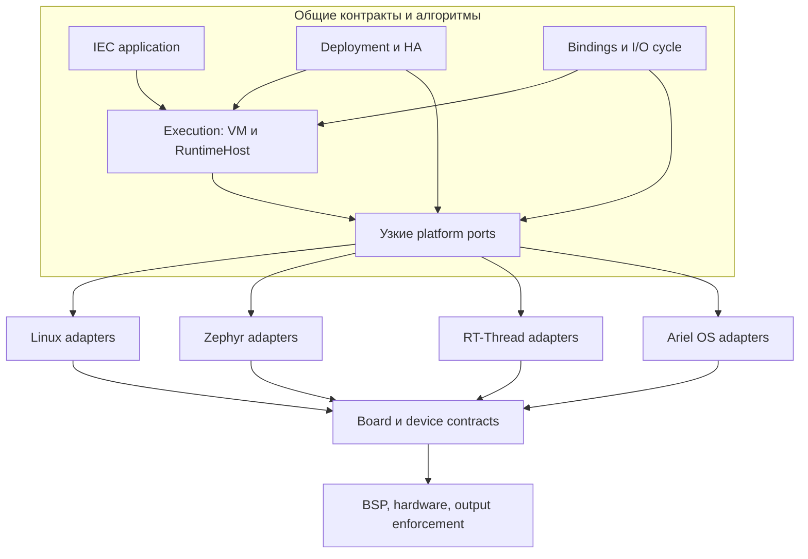
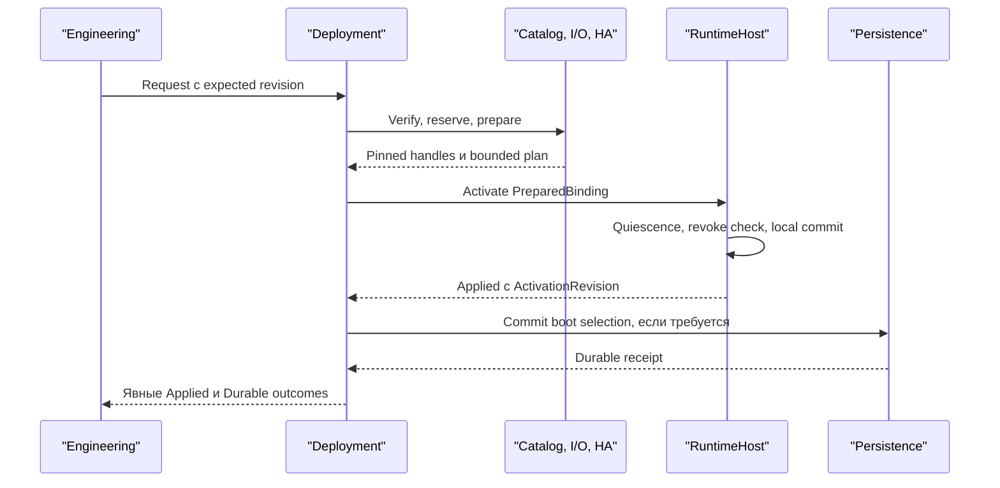

# IronPLC / RegulBUS — спецификация production PLC/DCS platform ecosystem

**Редакция 3.0 · 2026-09-23 · нормативное задание на реализацию и квалификацию.**

Основание: новый handoff «Архит.txt», ранее подготовленная спецификация 2.3, аудит Markdown и выбранного кода boogy777-lgtm/ironplc, референс слоёв Wind River/VxWorks, первичные источники из §24. Пользователь прямо разрешил пересмотреть механизмы и размещение hot edit / redundancy. Эта редакция заменяет архитектурные требования 2.3; противоречащие формулировки прежних редакций не складываются с ней. История анализа репозитория остаётся в отдельном IronPLC_Markdown_Audit_RU.md.

**Главное решение:** вокруг IronPLC строится Controller Platform. В ней один механизм активации согласованного приложения, один владелец его исполняемой привязки, явные владельцы I/O и состояния, отдельное обеспечение исключительного права на физические воздействия. Hot edit — режим deployment; HA — репликация и восстановление на тех же контрактах. Общие алгоритмы не ветвятся по ОС. Linux / Zephyr / RT-Thread / Ariel OS расходятся в реализациях узких platform service contracts, ниже переносимых компонентов.

Документ определяет целевой продукт. Он **не подтверждает production readiness текущего кода**: в этой работе не выполнялись сборка, HIL, измерения аппаратуры или model checking. MUST / MUST NOT — обязательное требование / запрет; SHOULD — рекомендация, исключение требует записанного обоснования. Незаполненный измеряемый параметр блокирует выпуск соответствующего профиля, но не архитектурное проектирование.

## 1. Продукт, границы и профили

Проектируется экосистема исполнения, разработки, установки и эксплуатации PLC для DCS/BPCS: controller firmware, интеграция compiler/runtime, инженерный интерфейс, описания устройств и bindings, совместимость артефактов, commissioning, диагностика, обновления, восстановление, security и опциональная HA-пара. Контроллер MUST автономно управлять без IDE, SCADA, historian, сети управления и облака в пределах квалифицированной конфигурации.

DCS ecosystem здесь включает контракты и эталонную интеграцию с операторской станцией, alarm/event и historian. Создание полного коммерческого HMI/historian, всех fieldbus stacks и сертифицированной SIS не входит в первый выпуск. При этом качество данных, идентичности, команды, конфигурация и восстановление на этих границах входят в обязательное проектирование. SIS/SIL и технологическая безопасность требуют отдельного lifecycle и доказательств; данный PLC-профиль не получает их по факту использования Rust или HA.

| Профиль | Обязательное покрытие | Условие допуска |
|---|---|---|
| PLC-SINGLE | Один execution resource, несколько bounded IEC tasks, local/remote I/O, сохраняемая конфигурация, engineering, update/recovery, independent output containment | Все применимые базовые gates; конкретные OS/board/I/O версии |
| DCS-HA | PLC-SINGLE + PRIMARY/SECONDARY, два независимых optical sync-link, checkpoint, output fencing, failover и согласованный deployment | Отдельные HA timing/fault tests; квалифицированная внешняя граница ownership |
| SIMULATION | Те же application/binding/command semantics; виртуальные clock и endpoints, effects изолированы | Не является доказательством hardware timing или physical safety |

Linux — первый controller target по ADR-0066 рабочего снимка. Zephyr, RT-Thread и Ariel OS — целевые порты с общими контрактами, а не уже доступные production targets. Один и тот же профиль может быть недоступен на части платформ. Пятый target не должен порождать пятую VM.

Первая квалификация ограничивается одной IEC application на execution resource. Несколько независимых applications, произвольные native extensions и active-active control — новые классы изоляции/арбитража; их нельзя объявить поддержанными одним добавлением экземпляра.

## 2. Принятые архитектурные изменения

Таблица — решения этой спецификации, подлежащие оформлению в ADR при интеграции. Она не утверждает, что ADR или код репозитория уже изменены.

| Решение | Было / гипотеза handoff | Принято в 3.0 и причина |
|---|---|---|
| A01. Слои | Все system services над Runtime, вся зависимость через него | RuntimeHost, I/O, deployment, persistence, fault и HA — соседние владельцы controller layer. Они используют middleware/platform ports непосредственно по своим обязанностям; VM не становится шлюзом файловой системы и security |
| A02. Supervisor | Единый authoritative ControllerState и глобальная statechart | BootCoordinator только запускает/останавливает; ModePolicy задаёт намерение/ограничения; RuntimeHost хранит факт исполнения; StatusProjection объединяет наблюдения. Нет второго глобального владельца состояний всех служб |
| A03. PlatformContract | Один интерфейс Clock+Threads+Storage+DMA+Crypto+Firmware | Порты по нуждам потребителей, отдельно OS adaptation и board/device adaptation. Набор и гарантии фиксирует PlatformProfile; универсальный POSIX emulator не создаётся |
| A04. Hot edit | Отдельный hot-edit механизм внутри runtime | DeploymentCoordinator ведёт общую ActivationTransaction; RuntimeHost проверяет локальные условия и единолично применяет PreparedBinding. Cold download, trial, finalize и rollback используют эту семантику |
| A05. Code banks | Всегда ровно два RAM bank | Обязательны immutable generations, capacity reservation и lifetime pins. Два bank — минимальный bounded embedded backend; число resident slots не является частью семантики deployment |
| A06. Состояние | Stateful ограничен lifecycle/resource; остаётся риск раздельных моделей state | Алгоритмическая память тоже stateful. StateSchema / LiveStateStore / Checkpoint — общая модель для execution, migration, retention и replication с разными проекциями. Exact semantic identity/type, а не совпадение layout |
| A07. HA | Монолитная redundancy-обвязка с собственными версиями и state manager | ReplicationEngine переносит checkpoint; RoleCoordinator восстанавливает исполнение; OutputAuthority обеспечивает исключительное владение. Deployment и semantic state не дублируются |
| A08. Потеря двух links | Безусловный запрет automatic takeover при 0/0 | Для DCS-HA решает доказанное fencing + пригодный checkpoint + authority policy. Нулевое число sync-link не даёт и само по себе не отнимает право: полный отказ PRIMARY может оборвать оба канала. Без независимого fencing при 0/0 автоматического takeover нет |
| A09. Binding | Принадлежность физического endpoint строго T xor E | Native/External — исключающие классы конкретной логической связи в данном authority scope. Один прибор/IP может иметь разные endpoints, собственника outputs и нескольких input consumers. Protocol capabilities ограничивают реализацию, но не назначают смысл данных |
| A10. Версионирование | Один номер поколения для всего | Один immutable ApplicationGeneration manifest связывает code/schema/tasks/bindings. Artifact identity, activation revision, checkpoint sequence и ownership term имеют разные обязанности и не подменяют друг друга |

**Что сохраняется:** IEC 61131-3 без нестандартных свойств переменных; active code immutable; единый compiler pipeline; runtime verification; bounded preparation и barrier; PRIMARY/SECONDARY и SYNC_*; два выделенных optical sync-link; отделение application update от firmware; отсутствие God Manager; safe Rust/lint fences; реальные release gates.

**Что отменяется явно:** обязательность двух физических RAM bank для всех targets; применение отсутствия обоих sync-link как универсального основания отказа от takeover; требование единой FSM для PLC; вывод готовности из состояния READY; необходимость отдельного hot-edit version/state/transaction механизма. Формулировка INV06 и сценарии T14/T17 прежней редакции изменены соответственно.

## 3. Основание в репозитории и фактические пробелы

В предыдущем аудите собраны 391 различный Markdown path и 420 уникальных blob-версий с доступных вершин 20 веток; дополнительно выборочно прочитаны 23 Rust/Cargo-файла. Основной snapshot: **lint-fences@8a7f6d0d09b00436daebfd669babd39f2e0f2e13**. 2026-09-23 вершина этой ветки повторно проверена и не изменилась. Вершины всех остальных веток в этой редакции повторно не сканировались. main@951811828dfd8c8b154bbb8beeff501cf1807cdf — другой снимок, не подмена рабочего baseline.

| Область | Что подтверждено чтением | Следствие для реализации |
|---|---|---|
| Compiler / container / VM | Один pipeline; VM typestate; caller-owned VmBuffers; cooperative IEC scheduler | Сохранить frontend → project → parser/analyzer → codegen → container → VM; не создавать compiler для каждого target |
| no_std | Container имеет поддержку no_std, но VM использует std::time::Instant и не является готовой no_std-замкнутой зависимостью | Портировать полное dependency closure; запретить прямой ambient clock в portable execution |
| RuntimeHost | Есть normal/candidate, HostMode Normal/Testing и permit latch | Это selection online edits, не PRODUCT PROGRAM/TEST/RUN; перенести только orchestration, сохранить полезные локальные механизмы |
| Exact edit | swap_buffers создаёт VmBuffers и копирует vars/data_region | Целевой reuse той же arena ещё требуется реализовать; существующий путь нельзя называть O(1) без copy |
| Scheduler | run_session загружает VM, load создаёт TaskState | Проверить непрерывность releases/history при повторных host rounds; запретить незаметный reset каждый run(1) |
| I/O | INPUT_FREEZE / OUTPUT_FLUSH в VM пока no-op | Настоящие bindings, device lifecycle, process image и authoritative effects должны быть реализованы обвязкой |
| Watchdog | Проверка elapsed после возврата task | Бесконечную task это не останавливает; нужны bounded execution и независимое физическое containment |
| HA transport | NicPort возвращает Vec; UDP использует std; capacities и native timing не доказаны | Бounded pools, typed backpressure, реальный driver и HIL; симулятор не доказывает optical deployment |
| Crossload | Offer / StateUpdate с целыми images; Vec/BTreeMap | Это не готовый bounded per-write journal и не завершённый checkpoint commit protocol |
| Epoch | Volatile saturating u32, выдаётся по rounds | Нельзя использовать как durable fencing authority: при 1 ms исчерпание примерно за 49,7 суток; разделить sequence и ownership term |
| SlotStore | A/B files и fsync data; directory durability имеет открытый остаточный риск | Доказать whole transaction на реальном storage; file rename сам по себе не power-fail proof |
| Conversion | ADR-0060/0061 предусматривают conversion/preserve policy | I32→F32 и I64→F64 не гарантируют точности; DINT/TIME одинакового storage type не становятся semantic exact |
| Platform | ADR-0066 выбирает Linux, оставляет topology вопросы | OS/BSP, optical links, authority, boot и real I/O ещё требуют implementation/qualification |

Предлагаемые имена компонентов далее — архитектурные роли, не заявление о наличии crates. Декомпозиция в crates проводится после определения contracts; не создавать заранее 15 пустых микросервисов. Изменение accepted ADR оформляется новой superseding записью с traceability; старые reviews/plans остаются историей, не параллельной нормой.

## 4. Stateless / stateful: правила и реестр состояния

Statefulness, purity, representation и сохранность — независимые оси. PLC как система неизбежно stateful: timer, PID, edge detector, retained variable, connection и незавершённый deployment зависят от истории. Чистая функция step(state, input, time, policy) может реализовывать stateful алгоритм. Stateless adapter, отправляющий MMIO/network write, остаётся effectful. Внешний StateStore не делает композицию stateless.

| ID | Нормативное правило |
|---|---|
| S01 | Для каждого компонента указать границу и какую историю он хранит между вызовами; объяснить необходимость этой истории |
| S02 | Pure evaluator получает все влияющие данные явно, включая time/policy; не читает ambient globals и не выполняет эффекты |
| S03 | FSM/EFSM вводится для существенных фаз протокола, ожидания, cancellation и recovery. Алгоритму фильтра или immutable manifest FSM не навязывается |
| S04 | Каждый компонент имеет owner/state/contract/failure/RT/persistence/security/platform запись. Готовые OS subsystems оцениваются на используемой контрактной границе |
| S05 | Каждый authoritative mutable факт имеет одного логического writer. Передача ownership — протокол; readers используют coherent snapshots |
| S06 | READY/health/status — проекции с provenance, revisions, freshness. Latched fault и acknowledgement — самостоятельная история, а не кэш |
| S07 | Реестр состояния содержит identity, owner, type/schema, capacity, writers/readers, atomicity, lifetime, reset, retain, replication, migration, security и failure reaction |
| S08 | Память между scans не означает сохранность после power loss. Raw pointers, OS handles и timestamps чужого clock domain не входят в переносимый checkpoint |
| S09 | Pure decision → owner admission/revalidation → local commit → effect enforcement → receipt. Decision не является бессрочным полномочием |
| S10 | Никаких full-state copy, heap allocation, remote store или неограниченного event log по требованию функционального стиля на RT path |
| S11 | Rust ownership/typestate укрепляют локальные границы; distributed ownership, deadline и durability доказываются отдельно |
| S12 | Алгоритмы проверяются траекториями, protocols — traces/races/recovery, containers — capacity/lifetime, система — межкомпонентными инвариантами |

| Внутренний компонент | Необходимая память | Pure/stateless часть | Подходящее представление |
|---|---|---|---|
| IEC VM / task scheduler | FB/timer/counter state, PCs во время task, releases и execution history | Decode/verify, выбор due tasks по полным входам | Owned memory, локальный typestate; scheduler algorithm |
| HW_KEY qualifier | Последние samples, стабильный интервал, validity, intent sequence | Decode контактов, mapping ограничений | Bounded qualifier; FSM только при существенных фазах |
| ModePolicy | Принятый mode intent, revision, latched restrictions | Evaluate request against facts | Небольшая policy state; не карта состояний всех служб |
| DeploymentCoordinator | TransactionId, prepared handles, deadline, commit/result journal | Compatibility и migration planning | Локальная transaction FSM |
| I/O cycle owner | Активный BindingPlan, snapshots, force overlay, publication sequence | Mapping/quality/fallback evaluation | Preallocated images + handles |
| ExternalData owner | Subscription/session, latest samples, sequence, queued writes | Codec, validation, normalization | Bounded buffers и connection protocols |
| ReplicationEngine | Transfer/window/ACK, committed checkpoint handles, peer incarnation | Encode/decode/hash/compatibility | Bounded protocol FSM |
| RoleCoordinator | Handover operation, observed peer facts | Eligibility evaluation | Локальный protocol; роль не даёт hardware grant |
| OutputAuthority / endpoint | Holder, scope, term, expiry, accepted sequence | Verify tuple/policy | Stateful arbiter и enforcement на sink |
| Persistence / firmware updater | Journal, slot/trial markers, progress | Schema/integrity checks, recovery selection | Разные transaction protocols поверх общего storage port |
| Diagnostics / status | Bounded ring, counters, latch history | Format, aggregate, severity display | Проекции; отдельный fault latch owner |
| Kernel/drivers/security sessions | Resources, buffers, sessions, keys | Часть преобразований | Готовые stateful subsystems с contract/TCB |

Запрещено делать «всю платформу stateless» переносом RAM в универсальную БД, делать общий mutable ContractStore или хранить один и тот же authoritative field в Supervisor, Runtime и ApplicationManager. Один owner может владеть несколькими связанными инвариантами одного ресурса; искусственное дробление каждого bool на service ухудшает атомарность.

## 5. Слои по Wind River и точка платформенного ветвления

Слой задаёт допустимые зависимости. Execution plane задаёт время и scheduling. Protection domain задаёт покрытие отказов. Firmware image задаёт поставку/обновление. Эти четыре классификации не взаимозаменяемы.

| Слой сверху вниз | Компоненты / принадлежащее состояние | Контракт и допустимые зависимости | RT, failure, persistence, security |
|---|---|---|---|
| Engineering / DCS tools — вне target stack | IDE/CLI, project/build, catalog, commissioning, HMI/historian integration | Версионированный controller API и artifacts; не private VM memory | Потеря host не прерывает control; user/project secrets на host; аутентифицированный ingress |
| IEC applications | POU/FB, алгоритмическая память, declared retain | IEC execution/data contracts | Bounded tasks; fault scope application; не имеют raw OS/device полномочий |
| Controller platform / execution | RuntimeHost+VM, I/O cycle, deployment, mode, checkpoint/HA, fault reaction | Узкие domain contracts и middleware/service ports | Здесь определяется scan, activation, state semantics, output authorization; scoped owners |
| Middleware / protocol services | CIP/OPC UA stacks, engineering framing, discovery, diagnostic export | Platform networking/crypto/time; привязки через controller adapters | Sessions/buffers локальны; quotas; transport не определяет Native/External класс |
| OS Services | Bounded transport/storage/clock/identity/watchdog/boot-slot providers | Core OS, drivers и kernel через safe APIs | **Здесь реализуются platform contracts и начинается OS-specific ветвление**; реальные guarantees публикуются профилем |
| Core OS | Network/file systems, memory/resource services, driver management | Kernel и device/BSP contracts | Stateful ресурсы; restart semantics; persistence только по backend contract |
| Kernel | Threads/tasks, interrupts, timers, synchronization, protection | BSP/architecture primitives | Планирование и isolation ОС; не IEC task semantics и не PRIMARY/SECONDARY |
| BSP / HAL / hardware | Startup, pinmux, clock tree, PHY/NIC/flash/watchdog/MPU, inhibit | Конкретная CPU/board; trusted hardware behavior | Независимое containment, power/reset boundaries, физическое output enforcement |

Не требуется переписывать ОС в одинаковую структуру каталогов. На embedded часть OS Services/Core OS поставляется библиотеками; на Linux — kernel/userspace services. Переносимые protocol engines могут жить в middleware; их native sockets, DMA и driver adapters принадлежат нижней ветви. Binding semantics остаются выше неё.

Стрелки показывают зависимость от контрактов; I/O и execution обмениваются подготовленными views через composition root, а не вызывают внутренние enum друг друга. Shared contract types размещаются ниже потребителей; callbacks не создают обратной compile-time зависимости на implementation.

Оси OS и board независимы: новый NIC не требует нового LinuxRuntime, новая ОС не требует новой IEC семантики. Target composition root связывает конкретные providers; platform selection разрешён здесь и в adapters. Условия if linux / if redundancy / if protocol внутри VM, общего verifier, migration planner и mode evaluator запрещены.

Hypervisor/partitioning — опциональная deployment-технология. Само выделение слоя, thread, process или image не доказывает fault isolation и не разрешает hot replacement binary.

## 6. Компоненты обвязки и публичные контракты

Минимальная единица ответственности — владелец ресурса/протокола, а не отдельный процесс. Конкретный deployment объединяет несколько таких владельцев без смешения данных и полномочий.

| Компонент | Owned state / инвариант | Предоставляет / использует | Исполнение, recovery и доступ |
|---|---|---|---|
| CompositionRoot / BootCoordinator | Ограниченная boot/shutdown operation | Construct/start/stop по dependency DAG | Startup/control; не владеет live state; recovery image доступен без application |
| ModePolicy + HW_KEY owner | Intent revision и qualified key facts — у разных owners | EvaluateMode, ModeIntent, authority constraints | Bounded control; key revoke выше ordinary requests; reboot policy явна |
| RuntimeHost / ExecutionSession | Active ExecutionBinding, LiveStateStore, task history | Advance, PrepareActivation, CommitBinding, status/checkpoint views | Один mutable execution owner; traps останавливают effect publication; private VM access |
| ApplicationCatalog | Immutable artifacts, qualifications, pins | Verify/Stage/Pin/Retire | Non-RT; untrusted bytes и target/trust checks; active artifact не удаляется |
| DeploymentCoordinator | Одна mutating activation operation на resource | Prepare/ActivateTrial/Finalize/Revert; uses catalog, host, I/O, persistence, HA participants | Control + workers; requests имеют principal/deadline/id; durable result отдельно |
| BindingCompiler / Resolver | Не хранит operational authority | Pure config+descriptors+capabilities → validated BindingPlan | Engineering/prepare; детерминированные ошибки; plan immutable и подписан manifest |
| IoCycle owner | Input/output images, active plan, channel quality, force overlay | FreezeInputs, PublishOutputs, ObserveDevice | RT bounded; writes только через EffectGate; module replacement требует requalification |
| ExternalData owner | Scoped buffers/subscriptions/write requests | Read snapshots / enqueue authorized effect | Non-RT ingress → bounded boundary import; не пишет IEC RAM асинхронно |
| EffectGate | Текущий binding/mode/permit view и revoked generations | Admit effect, issue scoped ticket; endpoint делает final enforcement | RT, bounded; ticket не заменяет external ownership grant; TEST запрещает live application effects |
| ReplicationEngine | Checkpoint windows, peer ACK и incarnation | Send/receive complete checkpoint; artifact staging через общий catalog | Bounded service; incomplete/overflow снимает sync eligibility; без private VM serialization |
| RoleCoordinator | Handover operation и observations | Request ownership, select recoverable checkpoint, restore host | Control; PRIMARY label после acquisition/qualification; role не mint-ит физическое authority |
| OutputAuthority / endpoint | Единственный holder для consistency group | Acquire/Renew/Revoke + accepted term/sequence | Внешний controller failure domain; локальный sink/gateway enforcement; persistence/reboot fail-closed |
| PersistenceService | Durable records по отдельным namespaces | CommitRecord, ReadCommitted, durability receipt | Non-RT; power loss contract; scoped keys и budgets; no save_everything |
| FirmwareUpdater | Firmware transaction, trial/confirm intent | Stage firmware, request boot slot; uses secure loader | Maintenance; независим от app deployment; ограниченные retries и rollback |
| Fault detectors / reaction owners | Local fault latches и response deadlines | FaultFact, reaction command, recovery result | Detection на месте; fast inhibit не зависит от диагностической очереди |
| HealthSupervisor / watchdog feed | Прогресс выбранных обязательных domains | Bounded progress qualification → watchdog kick | Независимость зависит от hardware; process alive недостаточно; не выбирает технологический setpoint |
| EngineeringService / security | Sessions, operation receipts, auth context | Stable command/read API; uses owner commands | Management; quotas/auth/audit; reconnect не повторяет physical effect автоматически |
| DiagnosticExporter / StatusProjection | Bounded telemetry buffers, derived status | Events/metrics/status with freshness | Management; failure не блокирует scan; secrets redacted; log full имеет policy |

Общий формат контрактов: identity/version, capacity, clock domain, deadline/freshness, consistency scope, preconditions, success boundary, error/retry/cancel semantics, resource lifetime, security scope и qualification evidence. Для команд обязательны OperationId, ControllerId/BootId, expected activation/config revision, principal/capabilities, deadline и payload digest.

Reply MUST различать Rejected, Accepted, Applied, Durable, Failed, Cancelled и UnknownOutcome. Accepted означает принятие операции, Applied — локальный effect/commit согласно контракту, Durable — подтверждённый recovery point. Потерянный reply не является доказательством ни отказа, ни выполнения. Dedupe key связывается с principal, scope и digest; повтор с тем же id и другим payload отклоняется.

StatusSnapshot содержит revisions, source/boot identity, timestamp/clock, observed execution, mode intent, selected generation, durable boot selection, channel health и HA readiness. Это согласованная проекция с указанным возрастом, не глобальный authoritative ControllerState. Строка RUNNING в UI не выдаёт полномочий.

## 7. Execution contract, concurrency и real-time

### 7.1. Три execution plane

| Plane | Работа | Запрещённые зависимости |
|---|---|---|
| Real-time | Releases IEC tasks, bounded input freeze/import, VM execution, output sealing/admission, bounded checkpoint capture и activation commit | Filesystem, allocation после admission, blocking network wait, TLS handshakes, log formatting, engineering RPC, firmware flash erase без доказанного bound |
| Control | Mode/revocation, fault reaction, deployment/HA decisions, подготовленные команды к execution owner | Неограниченная работа в одном dispatch; захват глобального host mutex сетевым worker |
| Management | Upload/verify/compile on host, storage, firmware staging, sessions, telemetry export | Прямые writes в VM/state/images/driver; изменение active binding из callback |

Reference deployment: один control/execution thread владеет mutable RuntimeHost и координирует фазовый доступ к I/O views; фоновые workers готовят immutable результаты и передают bounded handles. При росте нагрузки допускается отдельный bounded control dispatcher, но mutating commit остаётся у execution owner. Threads — deployment choice, не число domain owners.

Каждая очередь имеет maximum entries/bytes, producer/consumer model, priority, overflow и cancellation policy. Отдельный revoke latch/канал не может быть вытеснен telemetry flood. Worker response содержит operation/boot/session identity; поздний completion после cancel/reset игнорируется либо запускает reconciliation физического результата. Незавершённый upload не удерживает scan lock.

### 7.2. Цикл исполнения

Для baseline cooperative scheduler все завершённые задачи достигают общего безопасного boundary. Приёмка требует минимум две IEC tasks с разными периодами. Более поздний parallel/multicore профиль обязан отдельно доказать rendezvous и data-race semantics.

1. Execution owner принимает ограниченное число control commands; первыми обрабатывает revocation и critical faults. Публикует подтверждённый progress, не фиктивный heartbeat.
2. Scheduler выбирает due tasks по monotonic/logical time и сохранённой release history. Объявлены phase, priority/tie-break, deadline, execution budget, overrun и missed-release policy.
3. IoCycle фиксирует input snapshot для consistency group и qualified ExternalData samples. Value и quality/age относятся к одной версии. Runtime получает immutable input view.
4. Runtime исполняет задачи с owned state и эксклюзивным working output view. Публикуемые значения не видны драйверу до завершения установленной unit. %M — application memory, не physical I/O.
5. Runtime возвращает task/scan result. При fault working output не публикуется; ReactionOwner/EffectGate применяют policy. Заявленная all-or-nothing unit — task group/scan, а не автоматически весь контроллер.
6. На boundary формируется coherent checkpoint/state view и sealed output batch. При HA действует ordering §11; сетевой ACK не ожидается неограниченно внутри VM.
7. EffectGate проверяет текущий binding, RUN/effect policy, revoked revisions, output age и ownership proof; sink принимает только разрешённый batch. Send queued, peer ACK и физически применённое значение — разные milestones.
8. Pending PreparedBinding может применяться только на объявленном quiescent boundary. В одном output batch не смешиваются старые и новые code/schema/task/binding identities. Resource retirement выполняется после окончания readers, вне неограниченной RT работы.

Процессные images принадлежат IoCycle; право записи working view передаётся RuntimeHost только на фазу исполнения и возвращается перед seal. Provider пишет только ingress buffer; он не меняет уже frozen image. Borrow/handle API MUST отражать эти lifetime и отсутствие одновременно активных writers.

PLC task scheduler — переносимая логика release/priority/deadline. OS scheduler — предоставление CPU execution contexts. Недопустимо заменить семантику IEC tasks набором OS threads без сохранения ordering и определения shared state/I/O consistency.

### 7.3. Временные обязательства

Для task i документируются period T_i, deadline D_i, WCET budget C_i, release jitter J_i, blocking B_i и interference. Полный end-to-end budget включает sensor/sample age, ingress, freeze, scheduling, compute, checkpoint policy, output queue, network/module и actuator acceptance. Среднее время scan и percentile сами по себе не доказывают worst-case bound.

Отдельно измеряются prepare duration, ожидание quiescence, critical commit, reclamation, stop latency и fault detection/reaction. O(1) publication descriptor не означает O(1) online-change pause. Budget принимается для одновременно разрешённых operations: active application + candidate + rollback pins + checkpoint windows + migration workspace + network/trace/security buffers.

Instruction/work budget проверяется внутри execution loop или эквивалентным доказанным способом. Проверка времени только после возврата task обнаруживает завершённый overrun, но не infinite loop. Отсутствие release/progress обнаруживается отдельно от времени task, уже начавшей выполнение. Неконтролируемый native call не допускается в bounded PLC-SINGLE/DCS-HA execution profile.

Allocation разрешается при загрузке/подготовке в заранее ограниченном pool, но не на steady-state scan/commit. Стек, DMA, filesystem cache, bus contention, IRQ storms, flash/XIP stalls и cache effects входят в resource profile. Low priority не устраняет shared-bus interference. Освобождение последнего большого reference/контейнера не прячется в RT commit.

Timeout/freshness используют монотонные часы с BootId/ClockId. UTC/PTP используются для operator timestamps и координации, где доказана error bound; скачок UTC не продлевает lease, force TTL или watchdog. Raw monotonic timestamps разных узлов не сравниваются. Числовая семантика, widths, rounding/overflow и FP assumptions фиксируются для portable conformance; одинаковая сборка не обещает побитового равенства FP на всех CPU.

## 8. Binding-first, process image и все физические эффекты

### 8.1. Семантическая классификация

Topology определяет administrative/control ownership и membership; Binding — связь source/target, direction и semantics; Provider — конкретный доступ/transport; IoCycle — момент, когда наблюдение становится входом task и когда вычисленный output можно публиковать; Runtime — вычисление по разрешённым данным.

**NativeIoBinding** связывает channel, принадлежащий логической topology данного ControllerId/PairId, с process image и жизненным циклом I/O. **ExternalDataBinding** связывает данные/команды внешней системы с объявленным application data interface. Удалённый I/O rack через EtherNet/IP остаётся native I/O. Переменная соседнего PLC через тот же CIP stack остаётся external data.

Native xor External действует **на одну binding relation в заданном scope**, а не на весь IP/device. Одно устройство может иметь native output channel, input-only consumers и внешнюю diagnostic interface. Два контроллера HA образуют один логический ownership scope. Подписка на input не даёт права на output. Адрес в той же Ethernet-сети не означает принадлежности control topology.

| Пример | Binding semantics | Provider | Обязательное отличие |
|---|---|---|---|
| Rack1.Slot3.AI2 → Pressure | Native input | Local ADC или EtherNetIpIoProvider | Module identity, sample/quality, consistency group, I/O loss/replacement policy |
| Valve1.Command ← %Q | Native output | RegulBUS / CIP output adapter | Exclusive owner, fallback/age, accepted sequence, no bypass |
| PLC_02.Speed → RemoteSpeed | External input | EtherNetIpDataProvider / OPC UA client | Source authority, subscription/sequence/staleness; task imports по объявленной политике |
| RemoteController.Setpoint ← operator request | External command | Authorized data provider | Command authorization, idempotency/outcome; это тоже потенциальное physical effect |

Один protocol stack может обслуживать обе adapter роли при квотах и явном failure coupling. Протокол не задаёт смысл binding; при этом его ordering, max payload, latency, write ownership и delivery semantics ограничивают возможность выполнить этот binding. Нельзя сделать непригодный transport real-time заменой имени adapter. Источник [R02] показывает различие Exclusive Owner, Input Only и Listen Only; существование input consumer не доказывает output ownership.

### 8.2. BindingPlan и подготовка

BindingCompiler получает TopologyRevision, DeviceDescriptors, semantic StateSchema/port schema, selected BindingProfiles, ProviderCapabilities и process policy. Он выдаёт immutable BindingPlan либо типизированный отказ. Порядок: определить endpoint/scope → выбрать semantics → разрешить source/target → проверить provider и ресурсы → скомпилировать plan. Discovery поставляет facts, но не меняет разрешённую topology автоматически.

Plan MUST содержать BindingId, EndpointId/ChannelId, logical owner scope, direction, semantic type/units/scaling, access class, source/target StateId, mapping offsets после проверки, sample/import/publish timing, consistency group, quality/age/fallback, output authority group, provider instance, capacities и digest всех assumptions. Два writers в одном application target/output запрещены без явного deterministic arbitration. Overlap адресов и conversions проверяются до RUN.

Native channel quality хранится в system metadata рядом с value/snapshot identity: good/bad/uncertain, stale, disconnected, forced/substituted, source/time quality. Отсутствующий датчик не превращается в «валидный ноль». IEC syntax не расширяется: metadata доступны через документированную system API/standard-compatible library и engineering model.

External data не обязаны иметь I/O scan semantics. Допустимы last-qualified-sample, sampled-at-task-boundary или queued-events с bounded capacity и explicit overflow. Ingress никогда не пишет IEC RAM параллельно с execution. Если value нужен task, импорт выполняет её owner на выбранной границе. Outbound side effects проходят тот же admission/enforcement contract, даже если они не используют %Q.

### 8.3. Coherence, forces, replacement

Input freeze создаёт coherent software snapshot в рамках объявленной group; это не утверждение об одновременном физическом измерении разных modules. Для физической синхронности нужны timestamps/trigger и квалифицированная точность. Output seal также не означает одновременного срабатывания всех actuator: hardware scheduled apply требуется отдельным профилем.

Device replacement проверяет serial/type/revision/calibration/config identity по policy; совпадение rack slot/IP недостаточно. Перезапуск provider меняет session/boot generation; старые frames, DMA completion и queued writes отвергаются. Соединения и opaque handles не восстанавливаются из semantic checkpoint.

Force — scoped overlay с principal, reason, TTL, target identity, generation, precedence и audit. Он хранится отдельно от retained IEC value и видим оператору. На смене binding, reboot и takeover default — отозвать; перенос разрешается только явной квалифицированной policy и повторным admission. Force не обходит TEST, hardware inhibit, ownership и output envelope. Никакая внешняя запись не конкурирует напрямую с IEC writer.

### 8.4. EffectGate и окончательное enforcement

Физическое воздействие возможно через %Q, protocol FB, external setpoint, force, commissioning write и firmware/device command. Для каждого пути MUST быть определён authoritative sink. Отсутствие прямого MMIO у IEC недостаточно, если application может открыть socket и отправить команду actuator в обход gate.

EffectTicket связывает scope/group, caller, binding/config identity, ModeRevision, OwnerTerm/OwnerId, sequence, payload digest и deadline/age в определённом clock domain. Local gate проверяет execution/mode policy; endpoint или квалифицированный gateway проверяет факты, доступные ему: holder/term/session/sequence, freshness и разрешённый scope. Инвалидация ticket и распространение запрета имеют измеренный bound; endpoint не обладает мгновенным знанием всех внутренних состояний PLC.

Remote clock-expiry MUST NOT быть произвольным timestamp из другого CPU: применяется receiver-maintained lease/timeout либо модель синхронизации с bounded error. Replay/старый owner не продлевает hold time. Endpoint хранит последнее принятое значение и его age независимо от controller scheduler.

Для каждой output group заранее задаются допустимое hold-last, fallback values, максимальное время до fallback, поведение при boot/PROGRAM/TEST/fault/link loss/owner loss и способ восстановления. Hold-last не универсально безопасен. TEST запрещает application-driven live effects по всем путям; maintenance writes допускаются только отдельной явно видимой процедурой с собственной authority, не скрытым исключением TEST.

## 9. ApplicationGeneration и общее семантическое состояние

### 9.1. Идентичности

| Identity / объект | Что обозначает | Владелец и правила |
|---|---|---|
| ArtifactId | Digest immutable package + format | Catalog; содержимое нельзя менять под прежним id |
| ApplicationGeneration | CodeRoot + StateSchema + task config + logical topology/bindings + control/effect policy + compatibility/resource manifest | Единый reproducible manifest; изменение любого связанного элемента создаёт новую generation |
| NodeConfigRevision | Node-local IP/NIC paths, device identity references, management settings | Configuration owner; HA peers могут иметь разные local config при совместимой logical topology |
| ActivationRevision | Факт выбора PreparedBinding в конкретном execution resource | RuntimeHost; не равен durable boot selection и не служит fencing token |
| CheckpointId | ApplicationGeneration + source BootId + checkpoint sequence + consistency boundary | Execution capture/ReplicationEngine; целая согласованная версия state |
| OwnershipTerm | Authority incarnation + монотонный term в scope output group + holder | Только OutputAuthority; не выдаётся каждым scan, не восстанавливается из RETAIN |
| OperationId | Команда/транзакция с известным payload и scope | Инициатор + operation owner; ограниченная dedupe/recovery history |
| DeviceId / BootId / SessionId | Устройство, запуск, connection lifetime | Соответствующий owner; исключают повторное принятие старых сообщений |

Одна модель поколений не означает один счётчик для всех причин изменения. Shared envelope и manifest устраняют дублирование; semantic identities разделены, чтобы boot, retransmit и output ownership не конфликтовали. Wire widths, overflow/exhaustion и reboot persistence фиксируются; silent saturation/reuse запрещены.

Manifest MUST связывать compiler/container/runtime ABI versions, target capability requirements, semantic state descriptors, defaults/reset classes, task budget, required providers, logical mapping, library versions, hashes/signature/trust policy и build provenance. Native addresses/usize/Rust struct layout не являются portable format. Configuration-only activation использует общий deployment и binding barrier; management-only network change не подменяет application generation, но invalidates затронутые qualification/session facts.

### 9.2. StateSchema и проекции

LiveStateStore — принадлежащая RuntimeHost область mutable semantic state: variables, nested FB instances, timers, edge memory, counters, integrators и требуемая task execution history на checkpoint boundary. В manifest идентичность задаётся StableStateId и полным semantic type, включая shape, units/time class, storage/reset class и versioned FB semantics, где они влияют на перенос.

StateSchema — общий словарь, но четыре проекции различны:

| Проекция | Содержание и цель | Что исключается |
|---|---|---|
| Execution | Все необходимые live values/history | Ничего нельзя выбросить лишь потому, что поле не RETAIN |
| Migration | Только явно mapped preserved/converted/initialized state | Случайное копирование по имени, offsets или одинаковому размеру |
| Retention | Объявленные RETAIN/PERSISTENT и связанные recovery metadata по reset contract | Role, permits, OS handles, active sessions и произвольная вся RAM |
| HA checkpoint | State, logical task/time history, execution binding identity, effects watermark и необходимые protocol receipts | Process memory image, sockets, DMA buffers, local monotonic timestamps без преобразования |

Общий bounded StateView/Capture API даёт coherent snapshots. Изменения можно отслеживать общей MutationCapture: dirty bitmap/slot sequence или bounded journal. Запись того же значения учитывается как write, если этого требует scope; несколько записей допустимо coalesce только когда checkpoint semantics сохраняют конечное состояние и отдельные observable write-effects не теряются. Это state crossload, не обязательная репликация всех команд/инструкций.

Incremental capture нужен, когда подтверждён его выигрыш/необходимость. Для небольшого state допустим bounded full snapshot. Нельзя вводить журнал «на всё» и replay всей истории с момента boot. Переполнение capture/workspace прекращает соответствующую подготовку/qualification, не портит active state. Retention, HA и migration имеют отдельные cursors/budgets, чтобы медленный consumer не удерживал RT навсегда.

### 9.3. Exact reuse и миграция

Exact reuse требует однозначного соответствия всех сохраняемых StateIds и semantic types, объявленной совместимости FB memory/time semantics и проверенной StateAddressMap. Новый код обращается к существующим slots через подготовленный binding; active code не патчится. Имена, порядок деклараций, layout и storage width не доказывают semantic equality.

Same-layout DINT→TIME — semantic change. I32→F32 может потерять значение 16 777 217; I64→F64 также не всегда exact. Convert / initialize / reinterpret — отдельные явно допущенные действия MigrationPlan, не BUMPLESS_PROVEN. Последнее название допустимо в legacy API только с scope «сохранение совместимого state»; UI MUST NOT обещать неизменную траекторию outputs. Даже при полном сохранении state новый алгоритм может изменить output с 10 на 90.

Raw pointers и OS resources либо запрещены в portable semantic state, либо заменены checked logical handles с rebinding. Timers переносят elapsed/remaining/logical time по policy; pause/downtime учитываются явно. PCB/socket/OS timer не сериализуется в IEC state. Для новых объектов обязательны определённые defaults; неинициализированная память не становится live.

Structural migration поддерживается в двух допустимых масштабах: bounded migration на остановленном quiescent boundary, если её worst-case полностью помещается в pause budget; либо подготовка snapshot + tracked mutations + bounded final catch-up. Второй механизм вводится только для профиля, которому недостаточно первого. Простое растянутое копирование изменяемой RAM через несколько scans запрещено. При невозможности доказать bound требуется stop-and-redeploy, а не обещание произвольного zero-pause edit.

## 10. Deployment и hot edit как одна операция

### 10.1. Разделение полномочий

DeploymentCoordinator владеет намерением/ходом операции; Catalog — verified immutable artifacts; RuntimeHost — единственным active ExecutionBinding и локальным commit; IoCycle — binding plan/image lifecycle; Persistence — durable boot selection; HA — готовностью реплики и эффектами передачи ownership. Это участники конкретной activation operation, а не подключаемый универсальный distributed transaction framework.

CompatibilityPlanner — pure библиотека. Результат compiler/IDE — предложение. На target повторно проверяются manifest/schema/bounds/trust/resources и локальные preconditions. RuntimeHost окончательно решает, может ли он выполнить конкретный prepared binding; endpoint окончательно решает, может ли принять физический output. Нельзя объявить одну из этих инстанций единственной властью над всей системой.

PreparedBinding содержит pinned generation, StateAddressMap/MigrationPlan, preallocated state resources, task schedule config, prepared BindingPlan, effect policy и compatibility proof, привязанные к source ActivationRevision и qualification revisions. Revalidation на commit — bounded проверка подготовленных evidence и актуальных revocations; expensive verification выполняется заранее. Смена предпосылок требует новой подготовки либо отказа.

Диаграмма показывает локальный happy path. Durable-before-activation intent и HA protocol описаны ниже; стрелки не обещают атомарности сети/flash/физического мира.

### 10.2. Единый lifecycle

Операция имеет существенные фазы RECEIVING → VERIFIED → PREPARED → APPLIED_TRIAL → FINALIZING → FINALIZED; альтернативы FAILED/CANCELLED/RECONCILING и REVERTING имеют определённые исходы. Не вся операция обязана пройти trial: cold download может активировать подготовленную generation по объявленному варианту. Видимость состояния принадлежит transaction owner, не копируется в enum каждой службы.

| Команда | Семантика и линейная граница |
|---|---|
| Stage | Артефакт проверен и pinned; executing Original не меняется |
| Activate / Test Edits | На barrier выбирается candidate; Applied означает новый local execution binding |
| Finalize | Выбранная generation становится durable boot target вместе с совместимыми schema/config/state references; освобождение rollback pin после требуемых receipts |
| Untest / Revert | Новая activation предыдущего кода с текущим совместимым state или проверенным обратным планом |
| Discard | Освобождение неисполняемого candidate после отмены его references; active code удалить нельзя |
| Cold download | Тот же artifact/prepare/commit contract, при STOP/PROGRAM; reset/init policy задаётся отдельно |

**Test Edits ≠ TEST mode.** Trial в RUN воздействует на реальный процесс. Возврат старого кода не отменяет уже выполненные воздействия и не возвращает физический объект во вчерашнее состояние. Snapshot rewind допустим только как отдельная остановочная restore procedure с admission, не как default Untest.

Два RAM banks — backend PLC-SINGLE с capacity active+trial/rollback. Пока rollback generation pinned, новый candidate при исчерпанной capacity отклоняется. Linux может использовать bounded arena/artifact pool с большим числом slots. Дополнительные slots не дают права на параллельные conflicting activations. Reclamation ждёт readers/HA/rollback pins и имеет самостоятельный budget.

### 10.3. Атомарность и crash recovery

Local activation linearizes публикацию одного descriptor на quiescent boundary. Code, schema, tasks, bindings и effect policy одного resource переходят как совместимая целая версия. Никакой flash write, object graph copy или unbounded destructor не включается в обещание constant-size commit.

До потенциально необратимого действия Coordinator сохраняет recoverable operation intent, если продукт обещает восстановить его исход после reboot. Stage/trial могут иметь declared volatile outcome; это явно отражается в API. Boot selection и application artifact не меняются только потому, что инженер нажал Test Edits.

| Точка отказа | Recovery contract |
|---|---|
| До VERIFIED/PREPARED | Original работает; orphan candidate удаляется после проверки pins/операций |
| После preparation, до local commit | Original остаётся active; stale PreparedBinding не применяется после reboot |
| После Applied trial, до Durable finalize | При reboot действует прежний durable boot target, если он совместим с имеющимся retained state; иначе recovery/STOP. Живой trial нельзя объявлять finalized |
| После durable selection, до ответа | ReadOperation/boot records устанавливают результат; повтор того же id не создаёт ещё один activation |
| Partial state/schema migration при power loss | Только целый compatible checkpoint/retained root либо recovery; нельзя прикрепить старый code к новому несовместимому state |
| Потеря инженера | Operation owner следует заранее выбранной continue/cancel/deadline policy; нет бессрочного waiting и автозапуска от reconnect |

Структурный trial требует сохранить совместимую recovery generation/state root либо документированно перейти в recovery при reboot. RetentionService MUST NOT перезаписать единственную retain-версию Original несовместимой trial schema, пока обещается восстановление Original.

Concurrent mutation policy: один mutating deployment на execution resource; read/watch параллельны; privileged writes/force проходят свой bounded admission; firmware activation несовместима с running app activation; takeover и application activation сериализуются через revocable resource-scoped activation reservation. Reservation — не физическое ownership и не глобальный lock всех сервисов. Нет взаимного ожидания на неопределённое время; emergency revoke всегда приоритетнее.

## 11. Redundancy: общая семантика, отдельное физическое authority

### 11.1. Выбранная архитектура и модель отказов

Базовый DCS-HA использует PRIMARY/SECONDARY, checkpoint-based state crossload и единственного физического writer. SECONDARY держит проверенные code/schema/bindings и согласованный resume state; shadow execution допустимо для диагностики, но его произвольный результат не является authority. Lockstep execution, автоматическая миграция OS process и active-active outputs не входят в baseline.

Независимые обязанности:

- ReplicationEngine — целостный перенос state/artifacts и bounds lag;
- RoleCoordinator — подготовка/восстановление execution и handover protocol;
- OutputAuthority — исключение двух физических writers;
- DeploymentCoordinator — смена согласованного application binding на существующем механизме;
- Health/link supervision — свежие facts, а не выдача права на выходы.

Модель single-fault coverage включает crash/power loss одного controller, bounded message loss/delay/duplicate/reorder, отказ одного sync path и объявленные provider faults. Byzantine peer, разрушение всех output sinks, общий power loss пары, одновременная потеря replica и PRIMARY, общий непокрытый hardware defect не получают автоматической гарантии непрерывности. Security защищает от spoof/replay в заявленной threat model; fault-tolerant protocol не становится Byzantine consensus.

### 11.2. OutputAuthority: выбранный обязательный extension point

Для полного DCS-HA требуется **arbiter/gateway либо native output enforcement вне failure domain обоих controller execution contexts**. Он может входить в RegulBUS/I/O hardware. Его задача узкая: владелец output consistency group, выдача term/lease, запрет старого writer. Он не управляет deployment, PID или всеми службами PLC и не требует универсального distributed database.

Reference contract — один логический authority для consistency group. Реализация должна иметь квалифицированный hardware/gateway путь либо согласованный protocol native endpoints. Репликация самого arbiter не предполагается автоматически: single arbiter может стать availability bottleneck, его отказ MUST завершаться prescribed fallback, а покрытие его отказа заявляется отдельно.

Authority хранит Controller/Pair scope, свой incarnation, монотонный term, holder NodeId/BootId, состояние acquisition, lease и admitted endpoints. Term/authority identity, выдаваемые как действующие, не повторяются после reboot; durable commit выполняется до подтверждения нового grant, без NVM write на каждом scan. Lease timeout исполняется по monotonic time самого authority/receiver. Сетевой heartbeat, который можно продолжать при остановленном execution, не является достаточным renewal evidence.

Кроме holder, authority хранит **RecoveryAdmission record** для этого scope: required ApplicationGeneration/control-policy digest, membership revision, разрешение automatic recovery/start и свою record revision. Это ограничение выдаваемого grant, а не копия active RuntimeHost state или supervisor FSM. Deployment/ModePolicy устанавливают его через versioned authenticated commands; authority не читает IEC memory и не вычисляет application compatibility. При acquisition предъявленные generation/membership должны совпасть с record, а automatic recovery быть разрешён. Неизвестная/невосстановленная record после reboot означает deny.

Перед первым разрешённым effect иной application generation или degraded edit authority MUST durable-подтвердить новое RecoveryAdmission. До этого effects новой generation закрыты. Изолированный standby со старым checkpoint не сможет получить grant, даже если его локальный checkpoint ещё не превысил age bound. При штатном Stop/maintenance automatic recovery сначала запрещается на authority и подтверждается receipt; аварийный local inhibit выполняется независимо, не ожидая этого receipt. Stop API отдельно сообщает local stop и pair-wide enforced stop; недоступный authority не позволяет обещать второй результат. Hardware pair-stop/ключ с pair-wide scope должен иметь квалифицированный путь к enforcement либо bounded expiry соответствующего разрешения; node-local stop не маскируется под остановку всей пары.

**Acquire protocol:** standby сначала резервирует готовое execution/state; authority допускает acquisition только после release/revocation/истечения предыдущего grant. Он создаёт новый term и устанавливает fence на всех обязательных sinks. После ACK установки нового fence либо доказанного окончания всех прежних leases допускается GrantReady. До этого новый controller не публикует outputs. При недоступном sink никакой «успех большинства» не разрешает запись в оставшийся consistency group, если профиль требует совместного владения.

Для каждой remote group требуется реальное enforcement: native endpoint проверяет grant/term/sequence либо квалифицированный gateway единолично владеет downstream I/O connection и закрывает прямые обходные пути. Локальное role=PRIMARY, смена IP, Ethernet exclusive connection без изучения её failover semantics или номер epoch, который модуль игнорирует, этим контрактом не являются.

После partial acquire старый owner мог потерять часть sinks. Процедура не «возвращает старый term»: до whole-group recovery outputs следуют group fallback; допустимое возобновление получает новый согласованный grant. После reboot authority сначала восстанавливает identity и reconciles endpoint fences; выдавать permits по старому backup запрещено. При потере связи с authority receivers самостоятельно ограничивают срок старых grants. Ни один network callback не продлевает их задним числом.

Принцип проверки поколения полномочий получателем известен из distributed systems [R06]. Здесь он адаптирован к actuator/output boundary; документ не предлагает внедрять Chubby в PLC.

### 11.3. Пересмотр правила двух sync-link

Два независимых optical sync-link сохраняются, отдельно от I/O, SCADA и engineering. Независимость оценивается по PHY/NIC/DMA/IRQ/cable/power/driver failure domains. Два VLAN или два логических channels поверх одного интерфейса не доказывают требуемую независимость. Authority path также должен сохранять доступность в тех отказах PRIMARY/sync, для которых обещается takeover.

Вместо безусловного запрета при 0/0 вводится:

**AutoTakeoverAllowed = QualifiedResumeState ∧ LocalExecutionReady ∧ PolicyAllows ∧ RecoveryAdmissionMatches ∧ FreshExclusiveGrant ∧ AllRequiredSinksFenced.**

Link state влияет на свежесть checkpoint и возможности sync, но не заменяет ни один член этой формулы.

| Ситуация | Предписанный исход |
|---|---|
| 1/1 либо один рабочий sync-link | Синхронизация может поддерживать SYNC_READY; это ещё не право на физическую запись |
| 0/0, прежний PRIMARY жив и поддерживает законный grant | PRIMARY продолжает по degraded policy; SECONDARY не может приобрести занятый grant, split-brain не возникает |
| 0/0 вследствие полного отказа PRIMARY | SECONDARY может перейти к takeover после истечения/отзыва старого grant, whole-group fencing и проверки допустимого resume checkpoint |
| 0/0 и checkpoint слишком старый/неизвестная generation | Automatic takeover запрещён даже при свободном grant; fallback/manual recovery |
| Нет независимого authority/enforcement или его исход неизвестен | Нет automatic takeover при 0/0; это ограниченный HA-профиль, а не полный DCS-HA |
| Восстановился прежний PRIMARY | Входит в SECONDARY/unqualified, отбрасывает старые permits; не отнимает выходы автоматически |

Изменение сделано осознанно в рамках разрешения пользователя пересмотреть redundancy. Старый запрет можно сохранить как conservative compatibility policy без обещания восстановления после любого полного отказа PRIMARY. Он не является baseline полного DCS-HA 3.0.

Role, sync и ownership не объединяются в один enum. Role — PRIMARY/SECONDARY плюс необходимые transition phases; sync — SYNC_UNQUALIFIED / SYNC_UPDATING / SYNC_READY / SYNC_STALE; link facts — per-link session/freshness; ownership — отдельный grant. Persisted роль после reboot не выдаёт право.

### 11.4. Checkpoint и граница эффекта

Checkpoint содержит ApplicationGeneration, activation lineage, StateSchemaId, source incarnation, monotonically increasing sequence, task/logical time state, coherent state image/delta, inputs metadata необходимого scope, planned output batch/EffectWatermark и integrity. Оpaque handles остаются локальными. Получатель ACK-ит только целиком проверенный и пригодный для restore checkpoint, а не receipt последнего Ethernet fragment.

Два profiles replication используют один checkpoint protocol с разной policy:

| Policy | Ordering | Гарантия и цена |
|---|---|---|
| ACK_BEFORE_PUBLISH — reference DCS-HA | Complete checkpoint с рассчитанным output batch → replica RAM ACK → разрешённая output publication | При одном последующем отказе PRIMARY replica знает state для разрешённого batch; network round входит в output deadline. Это не NVM durability пары и не exactly-once actuator |
| BOUNDED_LAG — явно квалифицируемая опция | Публикация разрешена при измеренном lag/age ≤ profile bound | Возможна потеря объявленного прогресса; нужен process acceptance и replay/outcome policy |

Ожидание ACK — bounded protocol phase с deadline/backpressure, не blocking socket call внутри VM. Pipeline/window, число in-flight checkpoints и правило следующего task release заданы профилем. Reference начинает с одного in-flight checkpoint на consistency unit; если задержка не помещается в cycle/output budget, такой workload не принимается. Нельзя молча перейти к asynchronous semantics ради прохождения timing test.

При потере replication baseline prioritizes продолжение здорового PRIMARY как явно наблюдаемое degraded single-controller operation, если process policy это допускает. Нормальная HA-гарантия в этот период снята; standby остаётся кандидатом только в пределах отдельно квалифицированного degraded recovery age/progress envelope. Для процесса, не допускающего такого RPO, degraded policy ограничивает дальнейшую publication/переводит outputs в fallback. Primary continuation и zero-loss failover после произвольно долгой потери sync нельзя обещать одновременно.

Если PRIMARY упал после replica ACK, но до output acceptance, SECONDARY имеет state «после вычисления» и batch с неизвестным physical outcome. Для циклических absolute setpoints допустима идемпотентная перепубликация после acquisition с новым owner term и проверенным age. Для impulse, increment, latch, remote command требуется стабильный EffectId, dedupe/outcome query в sink либо feedback-based reconciliation. Без этого эффект имеет UnknownOutcome и не повторяется автоматически. Запрет относится также к external data writes и protocol FB.

Не обещается общий atomic commit flash + две CPU RAM + все actuator. Протокол задаёт согласованный recovery outcome и отсечение недопустимых повторов. Полная потеря питания пары восстанавливается по отдельной retain/durable policy, а не по последнему RAM ACK.

### 11.5. Failover и hot edit вместе

Новая generation MUST находиться и пройти проверку на SECONDARY до её first-effect publication в qualified HA operation. Общий DeploymentCoordinator подготавливает тот же manifest/plan; ReplicationEngine переносит артефакт через Catalog и новый state checkpoint, без второго HAApplicationManager.

Порядок: stage обоих participants → source-revision reservation → local barrier/prepare new state → replica принимает new-generation checkpoint и readiness record → PRIMARY получает ACK → authority durable-подтверждает RecoveryAdmission новой generation → разрешается первый batch новой generation. Local Applied может предшествовать ACK/authority receipt; в промежутке новые effects закрыты. Publication старых prepared batches после смены binding исключается. Для неидемпотентных outstanding effects сначала требуется outcome reconciliation.

| Отказ в deployment/HA | Допустимое восстановление |
|---|---|
| До new-generation readiness ACK | Новая логика ещё не имеет разрешённых effects; восстановление последней согласованной старой generation/checkpoint либо STOP |
| После readiness ACK, до authority RecoveryAdmission receipt | Replica имеет новую generation, но acquire следует действующей authority record; старый compatible checkpoint остаётся pinned. Если исход record update неизвестен, требуется её read/reconciliation |
| После authority receipt, до первого physical effect | Acquire требует новую generation/checkpoint; outcome первого batch может быть Unknown, действует effect policy |
| После первого нового effect | Standby использует совместимую новую generation/checkpoint или более поздний; stale old-generation promotion запрещён |
| SECONDARY reboot/reset | Любой старый SYNC_READY/ACK привязан к прежнему BootId и не даёт новую readiness; resync обязателен |
| Takeover во время structural migration | Только committed coherent checkpoint одной schema; промежуточная migration arena не является restore state |
| Primary crash при Finalize | Новый owner reconciles operation/durable records; состояние trial/finalized не выводится из роли или отсутствия IDE |
| Online Revert | Та же activation sequence и state policy; не откат процесса и не reuse старого ownership term |

При недоступном SECONDARY application edit по умолчанию отклоняется для сохранения HA readiness. Продукт может разрешить явно подтверждённый degraded edit через тот же API только после изменения RecoveryAdmission на authority: stale standby физически лишается возможности acquire со старой generation, даже если не получил invalidate message. При недоступном authority такой edit с новыми live effects отклоняется. Автоматический возврат HA возможен только после полного resync. Approval инженера не снимает memory/ownership/timing invariants. Abort/revert после изменения record также reconciles её; простая отмена local transaction не возвращает старое право автоматически.

Failover sequence: detect → qualify checkpoint/resources → prepare restore без outputs → acquire/fence → revalidate mode/revocations/binding → commit role/execution → reconcile/publish допустимый first batch → report. Target RTO включает detection, lease expiry/revoke, fencing ACK всех групп, restore, connection requalification и первый accepted output, а не только смену role enum.

При намеренном handover required generation и run authorization сохраняются, меняется holder/term. При штатном pair Stop они не разрешают самопроизвольный restart от потери peer heartbeat. Приоритет «revocation перед ordinary grants» действует и на authority; race Stop/Acquire имеет определённую линейную границу и bounded последующий revoke.

### 11.6. Supervision, timing и протокол

Ping/pong использует BootId/SessionId и consecutive sequence; потери/duplicates/reordering считаются отдельно. Никаких скачков +1000 в protocol counter. RTT включает обработку peer; RTT/2 не объявляется upper bound односторонней задержки без модели асимметрии. EMA — telemetry trend, не worst-case guarantee.

Calibration report фиксирует hardware/topology/build/load/clock identities, latency/jitter distribution, qualified bounds, запас и expiry/invalidation conditions. Uncalibrated профиль допускается только на заранее квалифицированных conservative bounds. Значения «десятки/сотни ms hold» из handoff — пример, а не требование или доказательство safety.

Fencing term имеет отдельного authority issuer; checkpoint/transport sequence имеют своих single writers в соответствующих scopes. Это уточняет прежний pair-epoch: общий increment-per-round не выполняет все три обязанности. Wire version, replay windows, overflow handling и boot recovery обязательны до interoperability release.

## 12. Persistence, retention и reset semantics

PersistenceService предоставляет bounded asynchronous durable-record API. Он не выбирает, какое application state переживает cold reset, и не сериализует все domain objects одной save_everything транзакцией. Каждый owner определяет namespace/schema/commit unit, backend обеспечивает объявленную atomicity/durability/power-fail model.

| Namespace | Владелец / unit | Recovery и доступ |
|---|---|---|
| Application artifacts / boot selection | Catalog / Deployment; manifest + committed selection root | Whole compatible generation; подпись/integrity; active pins защищены |
| RetainedApplicationState | Runtime schema + retention policy | CheckpointId/schema/generation/reset class; controlled compatible restore |
| Controller configuration | Configuration owner; immutable revision | Logical control config связан с generation; node-local config отдельно; conflict check |
| Firmware metadata | Bootloader / FirmwareUpdater | Slot/trial/confirmed/security counter; application не пишет произвольно |
| Authority identity / RecoveryAdmission | OutputAuthority | Не откатываются restore PLC backup; stale term/generation и запрещённый automatic restart исключены |
| Security material | Identity/security owner | Scoped access, protected storage, rotation/revocation и export policy |
| Calibration / manufacturing | Device owner | Board/serial/version bound; replacement/recalibration rules |
| Audit / diagnostics | Audit/event owners | Bounded history, loss markers и capacity policy; не блокирует scan |

Record имеет format/schema version, scope/device identity, revision, length, integrity и commit marker. CRC обнаруживает часть повреждений, но не аутентифицирует атакующего; trusted artifacts/critical metadata требуют подходящей authentication/signature/integrity protection. Duplicate/torn/older records не становятся latest только по имени файла.

Linux file backend MUST учитывать file data, rename/metadata и directory fsync, реальные filesystem/mount/device cache guarantees [R09]. Flash backend — erase/program granularity, torn writes, ECC/bad blocks, wear, brownout и XIP interference. A/B либо journal допустимы как backend, но commit acknowledgment соответствует только проверенной модели. Другие assets и free-space GC имеют quotas; ENOSPC/read-only/failed fsync возвращаются явно.

RETAIN/PERSISTENT support определяется compiler/runtime contract, а не названием keyword. Если конкретный keyword/class ещё не реализован, manifest/admission сообщает unsupported; платформа не заявляет его автоматически. App declaration определяет требуемую сохранность; backend должен доказать RPO, write rate и power-fail support. Сохранение файла только при clean shutdown не обеспечивает сохранность всех последних значений при внезапном power loss [R10].

| Событие | Volatile / algorithm state | Retained/Persistent | Authority, sessions, forces | Автостарт |
|---|---|---|---|---|
| Stop→Start в одном boot | По declared stop/start policy; task history reset только явно | Сохраняется по классу | Permits переоцениваются; force TTL/режим проверяются | Только новый принятый intent либо заданная последовательность |
| Warm restart | Initialize nonretained; timers по time policy | Restore целого совместимого committed state | Old grants/handles/session readiness недействительны; force default clear | По profile + cause + key/auth/fault policy |
| Cold reset | Default initial values и scheduler origin | RETAIN обычно reinitialize по product language contract; PERSISTENT сохраняется только если заявлен такой класс | Повторная qualification и authority acquire | Явный cold-start policy |
| Origin/application reset | Default для application scope | Сброс согласно declared reset command | Node identity/bootloader security metadata не стираются этим reset | Отдельный Start |
| Watchdog/crash reboot | Не доверять произвольной RAM | Последний пригодный committed root; lost-progress report | Всё authority заново; bounded crash-loop recovery | По severity/restart policy, не по прошлому RUNNING |
| HA takeover | Restore согласованного semantic checkpoint | Не подменять checkpoint stale retain файлом | Новые local resources и owner term; force transfer только explicit | Только protocol admission |
| Factory reset | Удаление configured app/user data по manifest процедуры | Scoped erase | Identity/calibration/security counter сохраняются либо меняются отдельной provision/decommission policy | Запрещён до commissioning |

Точные различия language storage classes закрепляются в compatibility specification и tests; таблица не изобретает поддержку отсутствующего языка. Backup/restore связывает compatible firmware/app/config/retain, redacts/защищает secrets и не переносит действующее output право на заменённый CPU. Restored node не включается в чужую pair автоматически.

## 13. Boot, shutdown и firmware lifecycle

### 13.1. Четыре объекта обновления

Application, runtime binary, system firmware и bootloader — разные compatibility/update objects. Они не обязаны поставляться четырьмя независимыми packages. Reference embedded firmware image включает runtime, controller services, platform adapters и stacks как tested unit. Linux может поставлять userspace image отдельно от kernel/rootfs, но только по опубликованной ABI/qualification matrix.

ApplicationGeneration activation не используется для обновления Rust runtime executable, драйвера, OS или bootloader. Для каждого update unit заданы signature/trust, compatible hardware/layout, dependency versions, power-loss recovery, reboot/maintenance needs и rollback boundary. Bootloader update разрешён только с доказанным recovery root; при его отсутствии полевая замена bootloader не входит в release capability.

### 13.2. Cold boot / no application / recovery

1. Аппаратные defaults удерживают outputs в commissioning/fallback policy до выполнения любого software init. Независимый watchdog/inhibit не должен требовать живого runtime для исходного запрета.
2. Boot ROM/bootloader проверяет firmware chain, slot metadata и допустимый security counter. Неуспешная trial image возвращается к допустимой confirmed image либо recovery.
3. BSP/OS поднимают необходимые clock/memory/driver services; composition root создаёт bounded pools и providers. Определяется свежий BootId и reset cause.
4. Проверяются hardware identity/profile, node configuration, key qualification и обязательные ресурсы. Optional network/HMI failure не становится автоматическим общим STOP.
5. Recovery/engineering/diagnostics запускаются с минимальным разрешённым surface даже при отсутствующей/битой application; access policy сохраняется. App corruption не требует blind reflashing всей firmware.
6. Catalog проверяет durable boot selection, generation, trust/schema/resources, resolves bindings и retained root. Нет application — статус NO_APPLICATION, outputs закрыты, разрешена authenticated installation.
7. RuntimeHost создаёт execution session; physical permits всё ещё закрыты. Standby выполняет resync/authority protocol; local resources никогда не берутся из чужой RAM.
8. Start допускается только после mode/restart intent, актуальных preconditions и effect/ownership qualification. Firmware health confirmation использует набор проверок платформы и recovery capability, а не безусловное требование уже работающей user application.

Полностью повреждённая firmware требует отдельного recovery image/ROM/service procedure. Нельзя обещать доступность обычного engineering daemon, если его own image не bootable. Recovery channel обеспечивает authentication/physical-presence policy и проверку images; не является undocumented bypass secure boot.

### 13.3. Firmware update transaction

Stage signed image в неактивный slot → verify target/layout/dependencies/security policy → зафиксировать recoverable update intent → controlled stop/handover → request trial boot → self-tests/health envelope → confirm либо revert/recovery. Power cut проверяется на каждом erase/write/marker step. Bootloader, application A/B и application RAM banks имеют разные metadata и не разделяют один «active bank» flag.

Anti-rollback counter и маркетинговая firmware version различны. Повышение security floor не должно преждевременно запрещать единственную допустимую recovery image; порядок повышения и confirmation доказывается для конкретного bootloader/storage. MCUboot демонстрирует разделение trial/confirm/revert и security counter [R04], но не назначается автоматически всем OS targets и не гарантирует свойства любой его конфигурации.

Rolling firmware update пары разрешён только для конкретной qualified version pair: wire/state schema, numeric behavior, task timing, I/O/authority и rollback совместимы. Unknown mixed-version pair → maintenance/STOP, а не optimistic failover. Отдельный HA протокол обновления не должен копировать application deployment internals; он координирует другие update units с их boot semantics.

### 13.4. Controlled shutdown / restart

Закрыть admission новых mutations → завершить/отменить операции по deadline → остановить новые task releases на boundary → применить prescribed outputs и отозвать/передать ownership → дождаться bounded output acknowledgment либо задействовать независимый fallback → сохранить требуемые retain/config/operation records → завершить providers и запросить restart/power action.

Если shutdown не достиг boundary из-за infinite task, software stop не является единственным путём: watchdog/output timeout обеспечивает bounded containment. Подтверждение operator Stop, отгрузка final log и fsync не могут бессрочно задерживать физическую реакцию. Restart counters/backoff имеют limits; crash loop приводит в диагностируемый recovery mode с закрытыми outputs.

## 14. Fault containment, supervision и наблюдаемость

### 14.1. Facts отдельно от решений

FaultFact: source/domain identity, stable code/class, severity/evidence confidence, first/last occurrence, sequence, monotonic+optional UTC time, affected resources/binding, bounded context и detector revision. ReactionDecision: policy revision, target scope, deadline, action и reason. RecoveryResult: исполненный outcome/ack/retry state. Не включать в immutable raw fact «универсальное правильное действие» от detector.

Классы application/task/I/O/communication/storage/HA/platform/firmware/hardware/security определяют маршрутизацию и evidence; любой DEGRADED не означает STOP всего контроллера. Каждая mandatory dependency имеет failure policy в manifest/profile. Latched fault, acknowledge, clear, repair и restart — разные операции. Ack/Clear не порождает Start.

### 14.2. Границы отказов

| Domain | Что может отказать вместе | Что должно продолжать работать | Реальная граница и recovery |
|---|---|---|---|
| IEC application | Trap/budget exhaustion, invalid program state | Engineering, диагностика, output fallback | VM checks + execution revoke; recreate session по reset policy |
| Native runtime/controller process | Panic/abort/deadlock, memory corruption TCB | Independent endpoint timeout/inhibit; Linux management только если отделён | Process/MMU либо весь embedded image; thread сам не обеспечивает memory isolation |
| Protocol service | Malformed input, reconnect storm, blocked library | Scan и независимое output containment | Bounded queues/pools и при необходимости process/MPU; same-address-space fault может затронуть всё image |
| Management/diagnostics | CPU/memory/log flood, server crash | Control в рамках qualification | Linux process/resource isolation или квалифицированный RTOS partition; cgroups threads не являются отдельной памятью |
| OS/CPU | Scheduler/kernel hang, reset/power loss | Output endpoint policy, независимый watchdog/arbiter | Отдельный hardware/failure domain; никакая FSM той же CPU не достаточна |
| I/O module/network | Stale/missing samples, wrong device, lost writes | Остальные независимые groups и diagnostics по policy | Receiver freshness/fallback, scoped invalidation, requalification |
| Storage | ENOSPC/read-only/corruption/erase stall | Допущенный control, если profile позволяет; physical fallback всегда | New durable mutations reject; recovery root/read-only management |
| Authority | Crash/link loss/uncertain term | Не допускается двойной writer; output fallback | Receiver expiry/fence, reacquire после reconciliation; availability отдельно |

HealthSupervisor кормит watchdog только при свежем progress обязательных execution/I/O/control domains и отсутствии запрещающих faults. Логирование и network daemon heartbeat не подменяют task progress. Проверяются hardware timeout/granularity/close behavior и actual reset cause; Linux watchdog behavior зависит от driver/options, включая nowayout [R05].

Fast reaction выполняется у owner/gate/endpoint в заданный bound; копия fault идёт в DiagnosticExporter асинхронно. Если diagnostic queue переполнена, loss counter/summary сохраняет факт деградации, но reactor не ждёт log sink. Firmware panic strategy фиксируется: не рассчитывать на catch_unwind как универсальное восстановление RTOS/native corruption.

Telemetry: task releases/duration/max/overruns/missed cycles, input/output ages, effect acceptance, checkpoint lag, leases/terms, queue/pool high-water marks, storage wear/health, update/boot causes, active/durable generation, mode/forces, auth failures и loss markers. High-cardinality payload/trace имеет quota и expiry; raw secrets и private keys не попадают в support bundle.

## 15. Engineering API, режимы и security

### 15.1. Режим и ключ не являются runtime typestate

ModePolicy хранит желаемый PROGRAM/TEST/RUN и принятый intent; RuntimeHost хранит фактическое stopped/running/faulted execution и выбранную code generation. HostMode Normal/Testing остаётся внутренней edit-selection semantics, пока проводится рефакторинг. Тип VM typestate описывает доступные локальные API. Эти три пространства не соединяются в гигантский enum.

HW_KEY owner декодирует контакты, квалифицирует стабильность/validity и публикует ограничения плюс однократный intent. Decode/mapping pure; debounce/history stateful. Qualified RUN transition, boot с уже установленным RUN и recovery после fault — разные события. Restrictive changes имеют отдельный bounded path; долгий symmetric debounce не должен задерживать revoke. UNKNOWN/fault не выдаёт новых grants, реакция на уже идущий процесс определяется process policy.

Ниже reference product policy, а не заявление о поведении чужого PLC. Права всегда пересекаются с principal capability, состоянием операции, mode и fault/ownership constraints.

| Операция | RUN_LOCK | REMOTE | PROGRAM_LOCK | UNKNOWN / INPUT_FAULT |
|---|---|---|---|---|
| Read status/diagnostics | По READ | По READ | По READ | По READ, validity видна |
| Remote Start / mode change | Запрещён; local qualified intent рассматривается отдельно | По OPERATE и admission | Start/RUN запрещён | Новые grants запрещены |
| Application stage/test/finalize/revert | Запрещён | По PROGRAM, совместимости и mode policy | Stage/finalize остановленного приложения по PROGRAM; execute trial запрещён | Mutation запрещена |
| Variable write / force | Remote mutation запрещена | По scoped PROGRAM/OPERATE policy, audit и effect gate | Только non-executing state edit с явно заданной restart semantics; live force запрещён | Mutation запрещена |
| Firmware/security administration | Запрещена | MAINTAIN/UPDATE/SECURITY_ADMIN и maintenance admission | Допустима по отдельным capabilities/maintenance procedure | Recovery-only policy с подтверждённой локальной процедурой, без live effects |
| Emergency stop / hardware inhibit / critical revoke | Всегда разрешено предписанному защитному пути | То же | То же | То же |

Reference RUN_LOCK запрещает привилегированные удалённые mutations; это conscious usability/security выбор, изменяемый только как версия product policy. Ключ не аутентифицирует пользователя и не заменяет emergency stop. Расширение ограничений до allow не запускает application без принятого intent. ModePolicy не сохраняет действующие grants между reboot.

### 15.2. Стабильный controller API

| Группа | Обязательные операции / данные |
|---|---|
| Connection / identity | Discover с ограниченными данными, connect/authenticate, device/profile/capabilities, API versions, firmware/application identity |
| Operations | Submit scoped command, query/read result, cancel where legal, subscribe progress, reconcile UnknownOutcome; expected revision и idempotency |
| Execution | Get observed/desired mode, set intent, start/stop/ack/reset с distinct semantics |
| Application | Upload/download/compare manifest; stage/prepare/test/finalize/revert/discard через общий deployment |
| Data / I/O | Typed snapshot read, authorized write at boundary, force/unforce, topology/channel quality и replacement status |
| Diagnosis / debug | Bounded metrics/events/trace; debug halt только после maintenance admission и output policy |
| Maintenance | Backup/restore, firmware stage/trial/status, certificates/provisioning, reset classes |
| HA | Pair identities, generation/checkpoint/lag, link facts, authority/term, readiness reasons; controlled handover/rejoin |

Один transport-neutral contract используется VS Code, CLI, Web UI, commissioning tools и будущей DCS engineering station. Transport encoding/framing и authentication bindings версионируются; raw VM pointers/private enums не входят в wire API. Compiler frontend сохраняет один pipeline; Web UI не содержит другой compiler/deployment backend.

Read snapshot ограничен выбранным consistency scope, имеет generation/revision и quality; subscriptions имеют quotas/sequence/loss indication. После hot edit client rebinds symbols по stable identity/schema; старый numeric address не пишет новый символ. API negotiation различает unsupported capability, incompatible version, denied, stale revision, busy и resource exhausted. Ошибка не кодируется бесконечным pending.

Много клиентов чтения допускаются; conflicting writer operations serialize по resource scope с optimistic revisions. Session disconnect не отменяет подтверждённый durable commit. Права long-running operation проверяются при admission и перед privileged commit; revocation имеет defined in-flight outcome. Нельзя безопасно «отменить» уже переданную неидемпотентную команду одним удалением UI operation.

### 15.3. Security architecture

Обязательные domains: DeviceIdentity/provisioning, secure boot, trust/certificate store, user/service identity, authenticated engineering channel, authorization, artifact verification, protected secrets, audit, anti-rollback и vulnerability/update lifecycle. TLS защищает канал, но не заменяет permission checks или checks внутри target loader.

Capabilities как минимум READ, OPERATE, PROGRAM, MAINTAIN, FIRMWARE_UPDATE, SECURITY_ADMIN с scope Controller/Pair/Application/Binding/OutputGroup. RBAC может отображать роли в capabilities. Decision пересекает user capabilities, HW_KEY constraints, operation/mode policy и current resource facts. Любой переход к capability должен иметь issuer, lifetime, revoke и audit semantics; boolean can_run без provenance не является контрактом.

HA и provider endpoints аутентифицируются; spoofed peer/channel не даёт SYNC_READY. Network zones разделяют engineering, DCS data, I/O и optical sync; authorization действует даже в доверенной зоне. Certificate expiry/rotation/revocation имеют bounded processing и не допускают скрытого unlimited offline bypass. Потеря UTC обрабатывается по объявленной trust/time policy; temporal uncertainty видна и не продлевает authority leases.

Resource limits применяются до дорогого parse/verification: max package/schema/messages/nesting/rate, decompression limits, handshake quotas, pool reservations. Dangerous debug interfaces отключены или gated в production profile. Signed application проверяется вместе с compatibility/resource admission; подпись не доказывает корректность process algorithm.

Audit фиксирует principal, operation/digest, scope, revisions, mode/key conditions, outcome и time quality. При full audit storage policy может запретить новые privileged mutations, сохраняя действующий control и independent protection. Read secrets и diagnostic exports проходят redaction/access policy. Service accounts не получают необязательный firmware privilege.

Release security case включает threat model, attack surface, dependency/SBOM provenance, signing/key rotation/recovery, vulnerability intake, supported lifetime и patch/rollback qualification. IEC 62443 mapping выполняется по применимым parts/editions в проекте; этот документ не является certification report. NIST OT guidance используется с учётом performance/reliability/safety constraints [R08]; публичная карточка Rev.3 отмечает существование draft Rev.4, который не принимается здесь за утверждённый нормативный baseline.

## 16. Экосистема DCS и эксплуатация

Обвязка runtime становится продуктовой платформой, когда инженер может воспроизводимо собрать приложение, установить его на проверенный target, подключить устройство без изменения VM, наблюдать качество управления и восстановить контроллер с понятным исходом. Ни обязательный cloud, ни marketplace framework для первого выпуска не требуются.

| Часть экосистемы | Обязательный контракт / артефакт | Что должно быть возможно |
|---|---|---|
| Project/build | Versioned project model, library lock/provenance, reproducible build inputs, target capability profile | Получить тот же manifest; сравнить source/artifact/controller; сохранить compiler diagnostics |
| IEC libraries | Tested FB semantics, numeric bounds, state schema и evolution/reset rules | Менять library version через общий compatibility/deployment, включая PID/timers |
| Device/provider packages | Signed/versioned descriptors: identity/channel/schema/units/limits/fallback/firmware compatibility | Добавить N+1 module/provider без custom IEC syntax и VM branch |
| Engineering clients | Общая API/schema/error model и symbol identity | VS Code/CLI/automation совместимы с одним controller, multi-client mutation конфликты видны |
| Simulation / test harness | Тот же domain core, virtual clock/endpoints, recorded inputs/fault traces | Воспроизвести decisions; сопоставить trace с HIL, не выдавать simulation timing за real |
| Commissioning | Device identity/topology binding, calibration, loop checks, forces registry, first-start checklist и signed accepted config | Контролируемо перейти от installed к commissioned; неподтверждённая замена модуля не запускает output |
| DCS data adapter | Stable tag/BindingId, value+quality+source time/time quality+generation | HMI/historian отличают stale от good, не используют случайный raw memory address |
| Commands / operator actions | Principal, source, target scope, sequence/idempotency, expected revision, outcome | Удержать один authority для mode/setpoint/ack, отслеживать lost replies и handover |
| Alarms / SOE | Stable source/event id, condition vs event, ack state owner, ordering/clock quality, overflow/loss marker | Переподключить operator station без выдуманного отсутствия alarms; duplicates не меняют actuator |
| Historian / trends | Bounded subscription/export, sequence gaps, reconnect/backfill policy и data quality | Отключение historian не тормозит scan; пропуски не маскируются интерполяцией good data |
| Fleet / maintenance | Device inventory/profile, supported version matrix, maintenance window, backup/restore, rollback provenance | Обновлять по qualified tuples; fleet не является runtime dependency |
| Product support | FAT/SAT evidence, field replacement/runbooks, support bundle redaction, incident/version trace, license notices | Диагностировать отказ по build/device identities и восстановить без live debugger |

DCS namespace разделяет equipment/tag identity и память конкретной compilation. Unit/scaling/display metadata сохраняются вне language syntax. Изменение tag binding проходит version/rebind; stale clients получают explicit mismatch. OPC UA DataValue показывает стандартное разделение value/status/timestamps [R07]; provider обязан выполнять выбранный information/security profile, а не только открыть TCP port.

Порядок SOE между разными узлами доказуем только при известной clock uncertainty; иначе сообщаются local sequence и частичный порядок. Alarm acknowledgement и suppress/shelve semantics имеют одного owner и отдельные полномочия; они не равны clear runtime fault. Полный alarm server может быть внешним, но contract потерь, reconnect и source identity обязателен.

Historian retention, HMI rendering и fleet database остаются вне control critical path. Если данные временно буферизуются в controller, задаются maximum bytes/duration, overwrite/loss markers и flash wear. Все optional services проходят removal/overload test.

Manufacturing/field qualification дополняет software: actual CPU/board/BSP tuple, power/brownout, reset/watchdog, storage endurance, environmental/EMC/electrical requirements, calibration и device identity provisioning. Применимые product standards и рынки определяются выпускаемым изделием. Software spec и прохождение Rust tests не заменяют испытания hardware.

## 17. Platform service contracts и четыре OS-ветви

### 17.1. Узкие порты

| Порт | Потребитель / обязательный смысл | Чего интерфейс не обещает |
|---|---|---|
| MonotonicClock / DeadlineWake | Execution/supervision; ticks, resolution, overflow, wake jitter, Boot/ClockId | Не UTC и не одинаковый origin у двух CPU |
| ExecutionContext | Composition root; priority/affinity/stack/protection configuration и qualified wake behavior | Не новый IEC scheduler и не общий spawn из VM |
| BoundedMailbox / BufferPool | Domain crossings; max entries/bytes, ownership, backpressure, cancellation | FIFO сам по себе не означает bounded allocation |
| FrameTransport | HA / raw provider; caller-owned buffers, MTU, send acceptance, receive timestamps, max work, errors | send queued не равен wire/peer commit; bool DMA не timing evidence |
| NetworkSession | Engineering / protocols; explicit state/quotas/cancel/reconnect | Socket API не даёт hard RT или survival при failover |
| DeviceEndpoint | Native I/O; identity/channel views, qualified IO/IRQ/DMA lifetime, sample/acceptance facts | Смена OS не исправляет unsupported hardware fencing |
| DurableRecordStore | Persistence; transaction unit, receipt, integrity, power-fail/error/capacity contract | File write/rename не автоматически durable; flash API не generic database |
| Watchdog / Reset / Inhibit | Health/recovery; actual timeout granularity, independent path, reset cause | Tick от той же зависшей CPU не доказывает независимость |
| Identity / Crypto / Entropy | Security/loaders; safe API, key scope, trust root, resource bound | Private keys не экспортируются в application; crypto verification не safety proof |
| BootSlots / FirmwareInstaller | Updater; staging/trial/confirm/revert и flash-layout identity | Не каждая ОС/board имеет A/B или одинаковую anti-rollback strategy |

DMA, IRQ, cache maintenance и low-level memory placement остаются в provider/BSP contracts; runtime получает safe bounded view, а не универсальный raw capability API. Не все ports обязаны использовать один trait-object registry. Static composition и feature-selected adapters предпочтительны для known embedded profile; runtime negotiation используется там, где реально меняются устройства/clients.

PlatformProfile связывает OS/kernel/BSP/toolchain/build flags/board/driver versions, resource capacities, clock/timing, protection domains, storage model, output/authority capabilities и evidence. Missing capability вызывает admission error; adapter не имитирует отсутствующий hard bound. Profile может разрешать application на SINGLE и запрещать тот же hardware для DCS-HA.

### 17.2. Реализация по платформам

| Target | Размещение и доступные подходы | Что необходимо доказать перед выпуском |
|---|---|---|
| Linux | Persistent execution process/session; PREEMPT_RT при нужном timing; bounded IPC, отдельные management processes; native drivers/file storage | Scheduler policy/priorities/affinity, IRQ/memory/CPU isolation, locked/prefaulted memory где требуется, filesystem power-fail, watchdog/inhibit и HIL. PREEMPT_RT не доказывает WCET [R11]; cgroups threads не отдельная address space [R12] |
| Zephyr | Kernel threads/workqueues, fixed-size queues/pools, userspace/MPU где supported; Rust module safe bindings | Target/toolchain/board support и весь no_std closure, ISR/driver semantics, protection configuration, flash stalls. Rust support включается как отдельная интеграция [R13]; msgq bounded по размеру/числу, FIFO требует собственной capacity discipline [R14] |
| RT-Thread | Kernel threads/timers/IPC, device framework, SAL для поддержанных network stacks | Safe Rust integration и linker/allocator/ABI, complete port, measured wake/IPC/driver/storage. SAL унифицирует networking API, не гарантирует deterministic behavior [R16]; SMP/affinity проверяется по версии/config |
| Ariel OS | Rust embedded stack, preemptive multithreading и async integration; board/HAL providers | Qualified scheduling/critical sections/IRQ/flash/time. Нельзя считать его только cooperative async [R17]. Документированное ограничение штатного networking одним interface мешает full dual-link profile без нового доказанного adapter [R18]; fixed persistent partitions обязательны [R19] |

Прочитанные OS sources относятся к snapshot проверки 2026-09-22/23; страницы latest/dev не являются lockfile версии продукта. Каждый release pin-ит версии и повторяет qualification. Ariel storage documentation предупреждает о размещении storage, которое может сместиться с размером firmware; это требует fixed partition/layout migration, а не веры в название persistent.

Common core целится в no_std-compatible execution/policy/state/checkpoint formats с явно ограниченным alloc при initialization/prepare. Host compile/engineering/UDP/storage implementations могут использовать std. Успешная no_std сборка container не закрывает VM/runtime/HA dependency closure.

### 17.3. Safe Rust и TCB

Workspace deny unsafe и запреты panic/unwrap/expect/todo в production code сохраняются. Порт не имеет права добавлять allow(unsafe_code), выключать gate или переносить собственный unsafe в соседний workspace для обхода. Используются существующие audited safe APIs/bindings с pinned versions. Если допустимого API нет, это blocker порта; требуется отдельное явное решение о проектной политике, которого данная спецификация не выдаёт.

Safe API caller не означает отсутствие unsafe/C в OS/HAL/driver/crypto/bootloader dependencies. Эти компоненты, DMA behavior и compiler/linker assumptions входят в TCB и qualification scope. Для wire/storage запрещены native pointer/Rust layout/usize serialization; fixed widths, endian, length validation, alignment и numeric semantics заданы явно.

### 17.4. Требования переносимости для интеграции в repository conformance

Следующие IDs сохранены из 2.3, но не зарегистрированы этой работой в generated test suite. Изменение требований redundancy-002/004 отражает §11. При интеграции используются действующие правила ironplc-dev/spec_requirements_gen; фиктивный passing test не заменяет hardware evidence.

| ID | MUST | Проверка |
|---|---|---|
| **REQ-PORT-vm-001** | Execution kernel и полный dependency closure собираются без std для выбранного bare-metal target; alloc policy отдельно | T45 |
| **REQ-PORT-vm-002** | Scheduler release/history сохраняются между host rounds; reset только по lifecycle | T47 |
| **REQ-PORT-vm-003** | Различаются instruction budget, completed overrun и independent containment | T08/T53/T67 |
| **REQ-PORT-runtime-001** | Один mutable execution owner; callbacks/adapters не меняют private host state | T46/T52 |
| **REQ-PORT-runtime-002** | Exact reuse не делает allocation/full-state copy на barrier; total pause bounded отдельно | T10/T46 |
| **REQ-PORT-runtime-003** | Semantic schemas сравниваются; conversion/initialize/reinterpret не выдают за exact | T54 |
| **REQ-PORT-runtime-004** | PROGRAM/TEST/RUN, HostMode edit selection и physical permission различны | T12/T52 |
| **REQ-PORT-runtime-005** | Admission резервирует ресурсы всей одновременной active/candidate/HA/trace комбинации | T48/T56 |
| **REQ-PORT-runtime-006** | Accepted/Applied/Durable/UnknownOutcome различаются и восстанавливаются | T44/T49/T57 |
| **REQ-PORT-runtime-007** | Immutable artifacts/caller-owned state сохраняются при смене OS providers без fork compiler/VM | T45/T60 |
| **REQ-PORT-redundancy-001** | Frames/reassembly/windows/work per call bounded; local send не равен peer commit | T48/T56 |
| **REQ-PORT-redundancy-002** | У каждой области sequence/term один issuer; output term выдаёт authority; reboot/exhaustion не повторяют identity | T50/T57/T78 |
| **REQ-PORT-redundancy-003** | Два независимых sync paths квалифицированы для DCS-HA | T51 |
| **REQ-PORT-redundancy-004** | Promotion требует compatible checkpoint и real whole-group fencing по обновлённой policy | T14–T19/T57/T76 |
| **REQ-PORT-redundancy-005** | Одинаковые domain traces при допустимом N+1 OS/transport extension | T26/T60 |
| **REQ-PORT-container-001** | Semantic schema/format versions связаны с verified artifact integrity, без native-layout serialization | T54/T59 |

## 18. Межкомпонентные инварианты и пределы доказательств

Always-invariants на commit points, bounded-response свойства и liveness проверяются отдельно. Owner не обязан знать ещё не обнаруженный физический отказ мгновенно; detection/reaction interval входит в qualification. Ограниченная модель протокола не доказывает корректность drivers и actuator hardware.

| ID | Нормативное свойство | Проверяемая граница |
|---|---|---|
| INV01 | Authoritative state изменяет только его owner/явно переданное право записи | API/lifetime/concurrency |
| INV02 | Start commit требует актуальных prerequisites и принятого intent | Mode + execution decision point |
| INV03 | Принятый application-driven effect связан с RUN, совместимым binding и действующим permit/owner | Gate + sink; mode propagation bounded |
| INV04 | В output consistency group нет двух одновременно принимаемых физических владельцев | Authority + все обязательные sinks |
| INV05 | Replayed/stale frame не восстанавливает отозванное право | Term/session/sequence checks |
| INV06 | Automatic promotion требует qualified resume state, local readiness, действующего RecoveryAdmission и whole-group exclusive grant; link timeout сам по себе недостаточен | Обновлённый §11, заменяет безусловное 0/0 правило 2.3 |
| INV07 | Execution не использует освобождённую/непроверенную generation или несовместимую schema | Catalog pins + host loader |
| INV08 | Task/consistency unit не видит половину старого/нового execution binding | Quiescence + descriptor publication |
| INV09 | Неудачная candidate preparation не инвалидирует работающий Original | Catalog/deployment isolation |
| INV10 | TEST не допускает application-driven live effects ни через один обходной путь | I/O, external commands, protocol FB, force |
| INV11 | Revocation/fault вызывает предписанную физическую реакцию в квалифицированный bound | Software и independent protection |
| INV12 | Power loss даёт целое допустимое durable state либо recovery, не mixed version | Storage/boot/deployment model |
| INV13 | Ack/Clear/расширение permissions сами по себе не создают Start | Mode/restart policy |
| INV14 | Presentation/diagnostic status не является источником operational authority | Dependency/capability review |
| INV15 | Readiness cache используется только при актуальных dependencies/revisions/freshness | Admission/commit и independent expiry |
| INV16 | Semantic state scope и time semantics сохранены независимо от выбранного FSM/struct представления | State Inventory, schema, migration/HA |
| INV17 | Старый operation/boot/session completion не завершает новую операцию | Correlation/recovery |
| INV18 | Pure evaluator с одинаковыми полными входами даёт одинаковый результат в объявленной числовой модели | Property tests; без ambient effects |
| INV19 | Замена OS/board provider не меняет domain semantics; отсутствующая capability явно блокирует операцию | Dependency/build и common traces |
| INV20 | После acknowledged durable commit восстанавливается он либо допустимый последующий; durable не означает send queued | Backend crash/power-cut model |
| INV21 | Commit/owner identity не повторяется после overflow/reboot/restore | Incarnation/term/exhaustion handling |
| INV22 | Последовательные host rounds не сбрасывают scheduler history вне lifecycle | Continuing ExecutionSession |
| INV23 | Native/External класс принадлежит binding relation; provider не выдаёт write ownership по input subscription | Resolver/provider/authority |
| INV24 | Value, quality, binding generation и age одного snapshot согласованы | Freeze/import/export |
| INV25 | Trial activation не уничтожает обещанную compatible boot/retain recovery версию | Deployment/persistence |
| INV26 | Неизвестный исход неидемпотентного эффекта не превращается в автоматический безопасный retry | EffectId/sink reconciliation |
| INV27 | После first effect новой generation HA не восстанавливает несовместимую старую; изолированная реплика не обходит RecoveryAdmission | Readiness ACK + activation lineage + authority record |
| INV28 | Потеря management/diagnostics не блокирует обязательный control/containment path в заявленной isolation model | Fault injection и deployment evidence |
| INV29 | Outputs не удерживаются бесконечно replay/старой freshness; expiry исполняется даже при остановленной CPU | Receiver timer / hardware inhibit |
| INV30 | Production capability заявляется только для прошедшего gates versioned target/workload profile | Release manifest и test evidence |

Для start/revoke, generation activation/recovery, HA acquisition/partition/reboot и effect ambiguity создаются небольшие TLA+/PlusCal либо эквивалентные state-space models. В моделях есть duplicate/lost/late messages, reboot, partial acquire, exhaustion, timeout и недоступный participant. Указываются fairness/timing assumptions, проверенные bounds и traceability к API/tests. Формальный файл без запущенной проверки не помечается verified.

Liveness: при устойчивых prerequisites, допустимой нагрузке, отсутствии higher-priority revoke и обеспеченном progress принятая операция достигает Applied/Durable/Failed/Cancelled/UnknownOutcome за заявленный deadline. Бесконечное pending не является допустимым способом сохранить safety.

## 19. Проверка «адвокатом дьявола»: кто замечает, что остаётся живо

DA — новый реестр решений 3.0; прежние D01–D48 в истории 2.3 не перенумерованы и не используются как актуальные ссылки. Таблица задаёт требуемое поведение, не отчёт о пройденных испытаниях.

| ID / отказ | Detector → reaction owner | Обязательная реакция / что продолжает работать | Что сохраняется и как восстанавливается |
|---|---|---|---|
| DA01. IEC infinite loop | Instruction budget / progress watchdog → gate/independent endpoint | Не ждать недостижимого barrier; outputs по bound; management жив при qualified isolation | Fault/reset cause; recreate session из permitted state |
| DA02. Native panic/deadlock | OS/process/progress monitor → external watchdog/inhibit | Не рассчитывать на тот же зависший thread; endpoint fallback | Crash evidence при возможности; bounded reboot/recovery |
| DA03. Task вообще не released | Release/progress monitor → ReactionOwner | Живой diagnostic heartbeat не скрывает отказ; effect revoke | Scheduler/fault trace; restart policy |
| DA04. Потерян I/O connection | Provider/receiver timeout → IoCycle/endpoint | Bad/stale quality; fallback scoped group; остальные groups по policy | Last accepted value/age; requalify identity/connection |
| DA05. Модуль заменён на том же slot | Discovery/device verification → topology owner | Запрет auto output к чужому устройству | New identity/calibration/config admission |
| DA06. Force остался при disconnect | Force TTL/revision owner → gate | Revoke по policy; operator видит force status | Scoped audit, без слепого retain forces |
| DA07. Flash power cut | Backend/boot validation → recovery selector | Только old/new whole commit или recovery | Marker/journal/root, integrity и compatible schema |
| DA08. Retain corrupted | Integrity/schema validator → reset/recovery owner | Не трактовать мусор как good process state | Last valid root либо explicit initialize/STOP |
| DA09. Filesystem read-only/full | Persistence error → requesting owner | Reject новые durable mutations; допущенный control и protection сохраняются | Failure receipt; free-space/repair procedure |
| DA10. Firmware не стартует | Boot trial/watchdog → bootloader | Revert compatible confirmed image/recovery; outputs closed | Trial marker, security floor и reset cause |
| DA11. App отсутствует/испорчен | Catalog verifier → deployment/boot | No application Start; engineering/recovery доступен | Install verified artifact; не reflashing вслепую |
| DA12. Exact edit даёт скачок output | Change-impact review / bounds → deployment/gate | State preservation не выдаётся за process bumplessness | State delta + process acceptance/validation |
| DA13. Migration dirty backlog растёт | Capture capacity/deadline → Deployment | Abort candidate или stop-required result; Original цел | No partial arena activation; bounded reclamation |
| DA14. Инженер исчез после commit | Session/operation query → Deployment | Продолжить/завершить по policy; не повторять Applied команду | Durable receipts либо honest UnknownOutcome |
| DA15. PRIMARY погиб при hot edit | Peer/authority/progress → RoleCoordinator | Только готовая generation/checkpoint, fence before outputs | Activation lineage/readiness; reconcile finalize |
| DA16. SECONDARY reset | Boot/session mismatch → Replication | Снять старую qualification; PRIMARY в declared degraded policy | Resync whole checkpoint, без старого READY |
| DA17. Потерян один optical path | Link supervision → Replication | Использовать второй в пределах budget; предупреждение | Per-link sequence/metrics и requalification |
| DA18. Потеря 0/0, PRIMARY жив | Sync facts + arbiter → RoleCoordinator | Нет второму grant; PRIMARY по degraded policy; readiness стареет | Lag/age и availability состояние явно видны |
| DA19. PRIMARY power loss и 0/0 | Arbiter lease/progress → RoleCoordinator | Takeover только после fencing и state qualification; иначе fallback | Last coherent checkpoint + fresh term |
| DA20. Authority reboot/partial fencing | Authority/endpoints → ownership protocol | No GrantReady до whole-group reconciliation; исключить два writers | Durable identity/new incarnation, endpoint fences |
| DA21. Старый backup/epoch wrap | Identity/revision checks → authority/loader | Не повторять term; controlled refusal/recovery | Provisioned identity/security floor вне app backup |
| DA22. Clock jump/reset | Clock quality/ClockId → соответствующий owner | Не продлять timeout/lease; timers по logical-time policy | Origin/elapsed semantics и uncertainty |
| DA23. Protocol/management crash | Process/MPU/resource monitors → local recovery | Scan жив только если isolation это покрывает; иначе independent containment | Recreate sessions, не переносить native handles |
| DA24. Diagnostic service crash | Export/progress monitoring → local restart | Не блокировать gate/watchdog reaction и scan | Ring/loss counters; recovery не требует full log |
| DA25. ACK потерян после impulse | EffectId/outcome query → command owner | Не повторять blindly; feedback/reconciliation либо intervention | Durable sink dedupe/outcome в объявленном scope |
| DA26. Native и external через один stack | Quotas/generation checks → binding/provider owners | Семантика/права не смешиваются; overload одной роли bounded | Пересоздать только её subscription/connection scope |
| DA27. Новый OS «собирается» | Port CI + HIL → release admission | Compile success не даёт timing/isolation/storage claim | Pinned tuple и qualification report |
| DA28. Ошибка all-in-one Supervisor | Ownership/dependency review → architecture gate | Нет duplicate active_generation/role/ControllerState authority | Восстановить owners и contracts до реализации |

Главные остаточные риски — измеряемые timing/hardware/fencing/storage свойства и process acceptance, перечисленные в §23. Они не скрыты словом «production» и не считаются устранёнными одним документом.

## 20. Приёмочные сценарии и fault injection

T01–T68 сохранены по идентичности из предыдущей редакции; T14/T17/T64 уточнены под 3.0. T69–T95 проверяют новые binding/deployment/authority/ecosystem границы. Это требования к испытаниям, а не выполненные тесты.

Каждый test case MUST содержать target/profile/build, initial state, injection point, допустимые event orderings, expected decisions и physical outputs, numeric reaction bound, recovery outcome и evidence artifact. Races проверяются несколькими порядками сообщений, reboot и lost replies. Simulation, model, target software и HIL результаты маркируются отдельно.

| Test | Воздействие | Критерий прохождения | Связь |
|---|---|---|---|
| T01 | Scheduler не стартовал | Outputs в предписанном состоянии; boot failure обнаруживается допустимым путём; нет фиктивно свежего status | INV11 |
| T02 | OS/CPU завис после последнего валидного frame | Независимый путь выполняет output policy в заданный bound | INV11 |
| T03 | Нет application либо подпись/manifest неверны | Start отклонён с reason; diagnostics/engineering доступны по профилю | INV02/INV07 |
| T04 | Ключ дребезжит/обрыв; запрет приходит между validate и commit | Нет unauthorized commit; реакция укладывается в bound | INV02/INV11 |
| T05 | Запоздалый grant от прежнего publisher boot | Grant отвергнут; старое сообщение не восстанавливает authority | INV05 |
| T06 | Потеря необязательного NIC, затем обязательного ресурса | Разные обоснованные reactions; нет общего STOP по любому DEGRADED | §7/8/14, INV11 |
| T07 | Переполнение очереди, network/engineering flood | Управляющий path сохраняет заявленные bounds либо выполняет controlled rejection/fault policy | §7/8/14, INV11 |
| T08 | Бесконечный scan / deadlock / panic | Не требуется недостижимый barrier для физического containment | §7/8/14, INV11 |
| T09 | Candidate испорчен при работающем Original | Original продолжает; Candidate не получает execution binding | INV09 |
| T10 | Exact-match online change под нагрузкой | Сохранение state доказано; latency barrier/commit в профиле | INV08 |
| T11 | Структурная миграция при постоянных записях и journal overflow | Целый согласованный результат либо отказ; нет torn state | INV07/INV08 |
| T12 | TEST + попытка записи через protocol FB/force path | Запись подчиняется заявленной effect policy; обход запрещён | INV10 |
| T13 | Потеря одного sync-link | Degraded, qualification сохранена только при остальных выполненных guards | INV06 |
| T14 | 0/0: живой PRIMARY, внезапный power loss PRIMARY, затем expired recovery age | Пока grant прежнего PRIMARY действителен, второй writer исключён. После его отказа takeover разрешён только с пригодным checkpoint и whole-group fence; stale state/нет authority — отказ | INV04/INV06, §11 |
| T15 | PRIMARY execution fault при сохраняющемся допустимом sync path | Promotion возможен лишь после qualification и fencing, в измеренный bound | INV04 |
| T16 | Partition, reboot старого PRIMARY, replay output frames | Два writer не принимаются; старый owner не возобновляет запись | INV04/INV05 |
| T17 | Link loss во время CLAIMING и partial acquire | Sync loss не заменяет eligibility evaluation; commit только с актуальными state/grant/fence. При неопределённом acquire нет publication, partial grants проходят recovery | INV04/INV06, §11.2 |
| T18 | Checkpoint неполный/повреждён/устарел | Не используется как committed state; SYNC_READY снимается | INV07 |
| T19 | HA failover во время каждого этапа Test/Untest/Finalize | Исполняется одна допустимая целая generation со своей schema; исход определён | §7/8/14, INV11 |
| T20 | Power loss на каждом durable step firmware/config/retain | Восстановление целой версии либо recovery; mixed version не запускается | INV12 |
| T21 | Неизвестная mixed-version пара при rolling update | Операция запрещена до прекращения управления/утверждённой процедуры | §7/8/14, INV11 |
| T22 | Повтор engineering request, потеря ACK, reconnect/reboot | Нет повторного эффекта; результат доступен либо честно неизвестен с recovery protocol | §7/8/14, INV11 |
| T23 | Wall clock jump, monotonic restart/wrap, peer clock mismatch и takeover с активными timers | Timeout/freshness не получают ложное продление; timers сохраняют заявленную временную семантику | §7/8/14, INV11 |
| T24 | Выходное значение достигло предельного age | Выполняется утверждённый fallback; hold не продлевается старым owner/replay | §7/8/14, INV11 |
| T25 | Исчезло storage / исчерпан audit log | Cyclic и emergency path ведут себя по профилю; новые mutations ограничены явно | §7/8/14, INV11 |
| T26 | Linux provider заменён Zephyr/RT-Thread/Ariel provider при одинаковом поддержанном semantic profile | Те же domain traces при одинаковых событиях/времени; timing и hardware tests проходят независимо | §17/21, INV19 |
| T27 | Поворот RUN при boot, после fault и после Clear | Запуск происходит только в разрешённых restart сценариях | INV13 |
| T28 | CPU/I/O replacement, stale restore, чужая hardware/config identity | Недопустимое восстановление управления запрещено с reason | INV02/INV07 |
| T29 | Закрытие IDE, потеря engineering link и попытка debug halt в RUN | Допущенное управление автономно; pending requests завершаются по policy; halt не обходит maintenance admission | §13/15, INV28 |
| T30 | Новая board revision/BSP с прежними domain contracts | Не меняются Runtime/Application transitions; board timing, clock/reset и device lifetime проходят повторную квалификацию | §5/17/21, INV19 |
| T31 | Добавление/удаление optional middleware и его overload | Отсутствие optional service не создаёт ложный общий fault; обязательная отсутствующая capability блокируется при admission; scan budget сохраняется | §7/8/14, INV11 |
| T32 | Protocol FB / debug agent пытается использовать raw driver write вместо output admission | Недопустимый caller не получает доступ; physical write не обходит authority/fencing | INV03/INV10 |
| T33 | Driver/NIC reset с inflight DMA, stale completion и восстановлением session | Buffers/lifetimes корректны; stale completion отвергнут; capability перевыдаётся только после requalification | INV05 |
| T34 | Замена OS/middleware component с совместимым API, но иным ABI или timing profile | Manifest/admission выявляет необходимые restart/requalification; application hot edit не используется как обход | §7/8/14, INV11 |
| T35 | Две истории PID/TON/edge/hysteresis с одинаковыми текущими входами | Различие результатов объясняется явным State Inventory; hot edit/HA сохраняют объявленный scope | S01/S07, INV16 |
| T36 | Повтор полного входа pure evaluator; изменение ambient clock/global state | Результат не зависит от скрытой среды; нет MMIO/network/storage effects; время вводится явно | S02/S12, INV18 |
| T37 | Cache READY при смене config/binding, revoke или истечении freshness без нового сообщения | Разрешение пересчитывается/отклоняется; cache не продлевает право и hold | S06, INV15 |
| T38 | Два параллельных запроса получили allow по одной revision; между ними revoke | Commit/effect исполняют согласованную conflict policy; не возникает двойного writer или устаревшего Start | S09, INV02/INV04 |
| T39 | Cancel/reset, новая операция, затем late completion/timeout старой | Старый ответ не завершает новую операцию; неизвестный физический исход проходит recovery | INV17 |
| T40 | Cold/warm/provider restart и HA с native handles в локальной памяти | Старые handles не используются/не crossload; ресурсы квалифицируются; role не восстанавливает authority | S07/S08, INV16 |
| T41 | Stateful algorithm реализован pure step, максимальный StateStore и максимальные входы | Нет полного copy на exact-match barrier, remote dependency или неограниченного allocation/backlog; budgets соблюдены | S10 |
| T42 | Artifact проверен; сменились trust/runtime/config prerequisites; Candidate upload отклонён | Stale qualification не даёт права нового activation; Original не инвалидируется одним отказом Candidate; trust revoke обрабатывается отдельной policy | S06, INV07/INV09 |
| T43 | Добавлен N+1 экземпляр того же filter/key qualifier/diagnostic resource | Добавляются instance data/config; используется существующий механизм и контракт; capacity повторно проверена | S03/S04/S12 |
| T44 | Power loss между journal, логическим commit, physical effect и ACK | Для каждой операции определён recoverable outcome; повтор не создаёт недопустимый эффект; отсутствие атомарности не скрыто | S08/S09, INV12 |
| T45 | Bare-metal build полного portable dependency closure и OS-specific import в одном общем модуле | Непереносимая зависимость обнаружена gate; поддержанный профиль имеет воспроизводимые artifacts; `std host` отделён | INV19 |
| T46 | Exact-match Test/Untest с максимальным live state и instrumentation allocation/copy | Та же state arena; нет full-state copy/allocator на barrier; отдельно измерен весь pause | INV08 |
| T47 | Непрерывная сессия и серия host rounds; минимум две IEC tasks с разными периодами | Одинаковые releases/semantic results; scheduler history не сбрасывается каждым host вызовом | INV22 |
| T48 | NIC queue/reassembly/pool исчерпаны, giant/corrupt/reordered frames | Ограниченные память/работа, типизированный backpressure, отсутствие allocation на critical path и ложного ACK | G03/G06 |
| T49 | Power cut между каждым data/name/marker durable step; flash erase при работающем scan | Выполнен declared durability и timing contract; old/new целые, нет mixed commit; XIP stalls учтены | INV12/INV20 |
| T50 | Epoch около максимума, promotion, reboot одного/обоих peers, delayed old frame | Уникальная identity либо предписанный controlled refusal/recovery; нет silent saturation/reuse | INV05/INV21 |
| T51 | В manifest два logical channels через один интерфейс или общую зависимость; Ariel штатный single-interface stack | Полный dual-independent-link профиль не проходит qualification/admission без требуемого evidence | INV19 |
| T52 | Engineering, HA revoke и TEST/Test Edits/START одновременно; completion между validate и barrier | Один mutable host owner; TEST и Test Edits различаются; критический revoke не теряется в очереди | INV02/INV10 |
| T53 | IEC infinite loop при software watchdog, затем отказ control thread/OS | Нет ожидания возврата loop для physical containment; отдельные execution-budget и hardware tests | INV11 |
| T54 | Одинаковый I32 layout при изменении semantic type; I32→F32 на 16 777 217; explicit preserve | Никакого ложного exact match; precision loss и reinterpretation проходят только разрешённую policy | INV07/INV16 |
| T55 | Отказ/повреждение management domain и давление на память | Заявленная isolation подтверждена для реального deployment; threads/cgroups не выдаются за независимую memory protection | G04 |
| T56 | Async task долго не yield, высокий IRQ/network load, flash/crypto/DMA contention | Scan и HA service получают свои bounds либо профиль отказывает; нет предположения, что low priority устраняет shared-bus stalls | G03 |
| T57 | Частичный pair persist, потеря ACK, reboot I/O authority, старый backup | Authority reconciled с durable identity; до этого grants запрещены; старый PRIMARY не возобновляет физическую запись | INV04/INV20/INV21 |
| T58 | Порт требует отсутствующий safe API; попытка добавить lint suppression/unsafe обход | Gate остаётся включённым; неподдержанный порт получает blocker, общий core не загрязняется FFI | G02 |
| T59 | Cross-target artifact: другая word size/endian/alignment/FP implementation и schema version | Явные wire widths и semantic conformance; несовместимость отклоняется до исполнения | INV07/INV19 |
| T60 | Добавление ещё одной ОС/платы/NIC и protocol adapter того же класса | Общие VM/HA/policy не fork; diff ограничен обоснованными providers/composition; все прежние invariants сохранены | INV19 |
| T61 | Сквозной cold boot→Start→input change→scan→output без подключённой IDE | Исполняется verified app/config; output соответствует commit и policy; missing app даёт диагностируемый empty controller | §7/8/13, G02/G04 |
| T62 | Stale/bad inputs, исчезновение и замена I/O module на том же slot | Quality не превращается в valid zero; old identity/frames отвергнуты; fallback и requalification выполняются | §7/8, INV05/INV11 |
| T63 | Два writers одного output, force и IEC write, TEST и protocol FB | Conflict/rejection по единой policy; нет альтернативного driver bypass; force виден и отзывается | §8/15, INV03/INV10 |
| T64 | Активация generation с новым BindingPlan при inflight I/O/force и crash каждого commit step | Старые maps/frames не попадают на новые channels; после boot whole compatible app/config/retain либо recovery | §8/9/10/12, INV12/INV20/INV25 |
| T65 | Warm/cold/origin reset, retain schema mismatch, power cut и stale restore | Результат соответствует reset/retention matrix; ownership/handles не восстанавливаются из retain | §12/13, INV16/G05 |
| T66 | Engineering flood/disconnect/reconnect, failed privileged request и full logs | Control budgets сохранены; операция reconciled, audit policy выполнена; сессия не создаёт скрытый Start | §14/15, G03/G07/G09 |
| T67 | Control task не получает release, хотя process/diagnostic heartbeat продолжается | Omitted-cycle/progress loss обнаружены; independent output policy выполняется в bound | §14/15, INV11/G04 |
| T68 | Controller process restart, firmware trial failure, repeated recovery/reboot | Bounded retries; корректная whole-version recovery; outputs и authority не восстанавливаются по старому READY | §12/13, G05/G09/G10 |
| T69 | Один EtherNet/IP provider обслуживает native rack и external PLC variable | Binding classes, data/quality lifecycle и write permissions различны; runtime не содержит protocol branch | §8, INV23 |
| T70 | Один physical device имеет output owner и несколько input-only/listen-only consumers | Классификация per binding/scope; input subscription не получает output grant; отсутствие owner не маскируется | §8/11, INV04/INV23 |
| T71 | External updates приходят во время task, subscription теряет сообщения | Task видит объявленную coherent import policy; value/quality/sequence согласованы, gaps видны | §8, INV24 |
| T72 | Native mapping/scaling/quality policy меняется при старых frames и подписчиках | Общий PreparedBinding barrier; stale writes rejected, clients rebind по identity/schema | §8/10/15, INV08/INV24 |
| T73 | Третий candidate при занятых двух banks; тот же scenario с bounded pool из трёх slots | На двух slots capacity rejection без потери Original; на трёх тот же lifecycle/pins, без нового hot-edit механизма | §10, INV07/INV09 |
| T74 | Structural trial записал новые retain values, затем power loss до finalize | Старый boot code не получает несовместимый retain; compatible old/new root либо recovery согласно обещанию | §10/12, INV12/INV25 |
| T75 | Crash вокруг new-generation replica ACK и первого output нового кода | До readiness ACK нет новых physical effects; после first effect запрещён stale incompatible generation restore | §11.5, INV27 |
| T76 | Полный power loss PRIMARY одновременно обрывает оба optical links | В DCS-HA квалифицированный authority fences старого, standby восстанавливается в RTO только при пригодном checkpoint; legacy/no-fence case явно не проходит этот availability claim | §11, INV04/INV06 |
| T77 | Один sink не подтверждает fence, authority link пропал либо authority перезагрузился | Whole-group GrantReady не выдаётся без доказательства; old lease не продлевается, prescribed fallback/reconciliation | §11.2, INV04/INV29 |
| T78 | Scan/checkpoint seq растёт, owner term неизменен; reboot/overflow/restore authority | Отдельные scopes/counters не подменяют друг друга; нет повторной ownership identity | §9/11, INV21 |
| T79 | EtherNet/IP endpoint не поддерживает требуемое fencing, direct bypass gateway доступен | Full HA profile rejected до qualified enforcement; наличие exclusive connection не считается доказательством | §8/11, INV04/INV30 |
| T80 | Impulse/external command применён, ACK потерян, затем takeover/retry | Endpoint dedupe/outcome query либо explicit UnknownOutcome; нет blind duplicate effect | §11, INV26 |
| T81 | Два инженерных клиента отправили конфликтующие commands с одной revision | Одно admission/commit по scope, другой stale/busy; read clients не блокируют control | §10/15, INV01/INV17 |
| T82 | Auth/key revoke во время prepare/commit/force, critical queue переполнена | Revalidation и independent revoke path; no unauthorized effect, bounded reaction, audit по policy | §7/15, INV03/INV11 |
| T83 | HA nodes имеют разные node-local IP/MAC/BootId при одной logical generation | Совместимость не требует одинаковой node config; чужие native handles не crossload, authority scoped correctly | §9/11, INV16/INV23 |
| T84 | Медленные retain/HA/migration consumers одновременно читают MutationCapture | Независимые cursors/budgets; RT не блокируется, overflow явно снимает нужную qualification | §9/12, INV11/INV16 |
| T85 | Trial firmware не подтверждена; security counter изменён; old image запрещена | Recovery выбирает только допустимую image; counter не блокирует единственный обещанный recovery path преждевременно | §13, INV12/INV20 |
| T86 | Diagnostic exporter упал, log storage full, наблюдатель читает stale RUNNING | Scan/containment не ждут logger; projection не даёт grants; loss/freshness видны | §14/16, INV14/INV28 |
| T87 | UTC/PTP quality потеряна, OPC UA exporter получает bad/stale source value | Data quality/time uncertainty переданы честно; lease/timeout используют свой clock domain | §7/8/16, INV24/INV29 |
| T88 | HMI/historian reconnect, alarm duplicates/overflow и out-of-order timestamps | Stable event ids/gaps/ack ownership; без ложного полного SOE order и без блокировки scan | §16, INV14/INV28 |
| T89 | Отсутствующая app, испорченная app и отдельно неbootable firmware | В первых двух случаях защищённое engineering recovery; в третьем отдельный boot recovery path; outputs закрыты | §13, INV02/INV12 |
| T90 | Runtime binary update замаскирован под application hot edit; неизвестная mixed firmware HA pair | Отклонение по update-unit/compatibility; только qualified maintenance/rolling procedure | §13, INV07/INV30 |
| T91 | N+1 OS/provider/board того же класса, но с меньшими capacities или иным jitter | Domain core не fork; новое profile admission может отказать, measurements и прежние tests обязательны | §17/21, INV19/INV30 |
| T92 | Commissioning→backup→CPU replacement→restore→HA rejoin | Device/config/state compatibility проверены; old ownership не восстановлено; controlled start и support evidence | §12/16, INV05/INV21 |
| T93 | Degraded edit на PRIMARY без связи со standby, затем power loss; standby имеет свежий old-generation checkpoint | Authority RecoveryAdmission отвергает старую generation; недоступный authority блокирует first effect нового edit; нет reliance на доставку invalidate | §11.2/11.5, INV06/INV27 |
| T94 | Pair Stop/maintenance и одновременно PRIMARY crash или standby acquire | Local stop и pair-wide enforcement outcomes различаются; после подтверждённого запрета automatic recovery не происходит скрытый restart | §11.2/11.5/15, INV06/INV13 |
| T95 | Power loss/потеря receipt во время RecoveryAdmission update, затем abort/revert | Reconciliation читает authoritative record; resume generation соответствует ей, old/new pins удержаны до определённого результата; unknown record не выдаёт grant | §11.2/11.5, INV12/INV20/INV27 |

T14/T76 проверяют и safety, и заявленную availability. Отсутствие takeover может быть правильным safe outcome, но не прохождением full-failure availability claim. Измеренные RTO/RPO, pause и output ages обязательны для принятого hardware/workload profile.

## 21. N+1: расширение без дублирования механизма

N — число вариантов **одного семантического класса**, M(N) — число независимых механизмов, обеспечивающих этот класс. Цель: при добавлении same-class варианта сохранять M(N+1)=M(N), пока это не ухудшает bounded execution, ownership, qualification и failure containment. M — не число structs/crates/threads/adapters/states/tests.

Same-class требует совпадения смыслового обязательства, модели полномочий и класса отказов. Новый mandatory invariant может оправдывать новый mechanism. Единый generic event bus/transaction manager, внутри которого спрятаны десять несовместимых протоколов, не считается уменьшением M.

| Расширение | Механизм до → после | Разрешённый diff / неизменное | Новое доказательство |
|---|---|---|---|
| Linux → Zephyr/RT-Thread/Ariel/пятая ОС | Те же execution/binding/deployment/HA contracts | Новые providers/composition/profile; без fork VM и state semantics | Complete target build, same domain traces, независимые timing/isolation/storage tests |
| Новая board/NIC | Те же platform/device ports | BSP/driver/provider и profile; decoder/policy не знает board name | Reset/DMA/IRQ/clock/fencing lifetime и contention |
| Local AI → remote EtherNet/IP AI → новый native I/O transport | Один NativeIoBinding и IoCycle | Provider/descriptors/config; нельзя переносить network semantics в VM | Provider выполняет quality/age/consistency/effect contract |
| External CIP variable → OPC UA variable | Один ExternalDataBinding | Provider/codec, совместимые quality/sequence mapping | Subscription loss/time/write semantics и quotas |
| Input-only consumer того же device | Binding instance с read scope | Нет нового owner механизма и скрытого output privilege | Native/External relation class, connection dependence, permission tests |
| Cold deploy → trial → revert → config-only activation | Одна ActivationTransaction / PreparedBinding | Policy/plan/commands, но не отдельные HotEditManager и VersionStore | Barrier, state policy, crash recovery, observer rebind |
| Два code slots → три | Те же pins/retirement/admission | Capacity/backend config; не второй lifecycle | Peak memory и no unsafe reclaim |
| Small migration → large concurrent migration | Общий MigrationPlan; новый capture/catch-up допустим при новом pause guarantee | Явно new-class bounded concurrent-state obligation; не притворяться простым memcpy | Snapshot consistency/backlog/overflow/final catch-up bound |
| Full checkpoint → delta transport | Один checkpoint commit protocol | Transfer strategy/pools; одинаковые identity/atomic apply/recovery | Gap/reassembly/overflow/delta-base validation |
| Один PLC → redundant pair | Общие execution/generation/bindings; добавляются replication и exclusive authority | Новый класс failures, поэтому увеличение M обосновано | Split-brain, partial fencing, physical RTO/RPO |
| Пара → три active writers / multi-master | Не same-class baseline HA | Требуется новая arbitration/consistency architecture; не просто ещё peer instance | Conflict/consensus/process semantics и целевой failure model |
| Один IDE → много IDE/CLI/Web clients | Один engineering API и resource-scoped mutation protocol | Клиенты и credentials; target authority не дублируется | Contention/revisions/quotas/dedupe |
| File storage → flash storage | Один DurableRecordStore meaning | Backend/partition/wear policy; Durable не ослабляется молча | Power-cut matrix, endurance и RT interference |
| Дополнительная firmware image/bank | Тот же update-unit manifest и boot transaction family | Boot backend/dependency graph; не смешение app RAM bank с boot slot | Interrupted multi-image update и compatible recovery |
| Новый diagnostic/HMI/historian consumer | Один bounded facts/export contract | Adapter/subscription quotas | Removal/overload/gaps и отсутствие backpressure на control |
| Single address space → protected deployment | Те же domain APIs при выполнимой семантике | Новые IPC/MPU/process boundaries; isolation guarantee — новый класс | Protection tests, latency, privileged driver surface |
| BPCS → safety-related SIS | Новая safety architecture/lifecycle | Не feature flag и не просто новый firmware profile | Применимые нормативные и process-specific safety доказательства |

Каждый архитектурный PR описывает baseline mechanism, добавленный вариант, аргумент same/new-class, изменённые owners/contracts, ΔM и новые evidence. Прежние conformance traces остаются обязательными. Если новый protocol требует фундаментально другой effect semantics, контракт версионируется честно; неподдерживаемое свойство не прячется в adapter.

## 22. Реализация, артефакты и production gates

### 22.1. Порядок реализации по сквозным гарантиям

| Этап | Конкретный результат | Критерий завершения |
|---|---|---|
| P1. Контракты и корректный execution loop | Single persistent ExecutionSession, logical time/budgets, input/output views, scoped status/commands | T01/T03/T08/T23/T47/T53/T67 на simulator; нет scheduler reset между rounds |
| P2. Вертикальный PLC-SINGLE | Linux composition + реальный I/O provider + EffectGate + watchdog/inhibit + config/artifact boot | Без IDE: cold boot → verify → Start → input → scan → accepted output → I/O loss → fallback → recovery. Затем real hardware HIL |
| P3. Состояние и deployment | StateSchema/StateAddressMap, exact arena reuse, prepared bindings, bounded migration, operation receipts | Failed candidate не мешает Original; T10/T11/T46/T54/T64/T73/T74; measured pause |
| P4. Durable recovery и maintenance | Namespace stores, retain/reset, application boot selection, firmware trial/revert, backup/replacement | Power cut каждого commit step; warm/cold/watchdog/firmware recovery; no mixed schema |
| P5. Qualified HA | Bounded checkpoint transport, two physical paths, external authority/sinks, handover/degraded policy | T14–T19/T50/T57/T75–T80; hardware power-off PRIMARY и replay old owner; measured RTO/RPO |
| P6. Ecosystem conformance | Binding/device packages, engineering clients, DCS data/alarms/history contract, security/operations | Multi-client, stale/rebind, overload/disconnect, provisioning/restore/FAT scenarios |
| P7. N+1 platform | Второй реальный target с тем же core; затем остальные по спросу | Port closure + common traces + target HIL; unsupported profiles технически blocked |

Security, failure model и numeric/resource envelopes проектируются с P1, а не добавляются только на P6. Работа с sim endpoint сохраняет тот же provider contract для hardware. Не создавать отдельную временную VM ради первого slice. После P2 возможен ограниченный PLC-SINGLE release только при прохождении всех применимых gates; до P5 нельзя заявлять production redundant DCS.

### 22.2. Обязательные deliverables реализации

1. ADR: layer/plane/protection/image views; новый deployment ownership; bank backend; revised HA authority/0/0 policy; binding relation classification; state/identity/capture policy. Указать superseded ADR/review conclusions, не стирать историю.
2. Domain component contracts и Dependency DAG с State Inventory, API types, error/cancel/recovery semantics и quotas. Crate boundaries следуют owners; не привязывать все names к разным processes.
3. Schemas: ApplicationGeneration, StateSchema/StableStateId, BindingPlan/DeviceDescriptor, NodeConfig, Checkpoint/EffectId, authority lease/term, operation receipt, durable roots и version negotiation.
4. Runtime integration: persistent ExecutionSession, caller-owned/preallocated buffers, explicit time, instruction budget, prepared activation и no-copy exact reuse; no_std dependency plan/implementation по target.
5. Controller services и provider implementations с safe API/TCB inventory; simulator и как минимум один real I/O path; independent containment.
6. Engineering protocol specification + reference CLI/client conformance; stable symbol/read/write/force/debug/maintenance semantics; security provisioning и audits.
7. Qualification package: numeric profile, supported tuples/version matrix, evidence для timing, isolation, power loss, state migration, HA/output effects, protocol interoperability и environmental tests по scope.
8. Tests/models с traceability S/INV/REQ-PORT/T; model assumptions/results; fuzz/property/concurrency/fault/HIL artifacts. Repository test registration не подменяется prose.
9. Release/SBOM/signatures/licenses, reproducible build instructions, upgrade/rollback/backup/replacement/incident runbooks и FAT/SAT acceptance forms.

Правила репозитория и ironplc-dev сохраняются: один compiler pipeline, curated public APIs/newtypes, bounded module responsibility, production panic/unsafe fences, meaningful spec tests. При дальнейшей реализации выполняются применимые AGENTS.md, CI и PR gates. В рамках этой редакции код/ветки/PR не создавались.

### 22.3. Release gates

Production-ready заявляется для **точного firmware build + hardware revision + OS/BSP/config + workload/application class + I/O topology + failure/security profile**, а не для абстрактного проекта или всех будущих ОС.

| Gate | Требуемый evidence | Причина отказа |
|---|---|---|
| G01. Scope/process | Failure model, accepted process envelope, групповые output/hold/fallback/restart policies и scope exclusions | Нет допустимой реакции/максимального interruption age |
| G02. Architecture/build | Owners/State Inventory/contracts/dependencies, S01–S12, REQ-PORT, воспроизводимый build, actual capabilities | Duplicate authority, скрытый state/effect, неподдержанный port или пустой conformance stub |
| G03. Time/resources | Schedulability, target timing под adversarial load, capacity/queues/stacks/buses, pause/stop/ACK bounds | Неограниченная работа/память или нет measured deadline margin |
| G04. Physical containment | CPU/OS stall, omitted cycle, watchdog, I/O timeout и boot reset tests на hardware | Fallback требует живого controller thread |
| G05. Deployment/storage | Exact/migration/trial/revert/power-fail/reset/firmware recovery tests | Torn generation/state, потерянный обещанный recovery root, unbounded catch-up |
| G06. HA | Реальное whole-group fencing, compatible checkpoint/effect ordering, partition/reboot/power-off, RTO/RPO и degraded policy | Возможны два writers; старый checkpoint; обещание failover без proof authority |
| G07. Security | Threat model, privilege/ingress/update tests, fuzzing, SBOM/trust/provisioning/patch plan | Bypass force/driver/update, необоснованный trust fallback, unbounded parser |
| G08. Verification | Traceability к применимым T01–T95, model runs, semantic regression, test evidence quality | Критическое свойство проверено только условием if/неподходящей моделью |
| G09. Operations/ecosystem | Commissioning, DCS quality/commands/alarms/gaps, backup/replace/recovery, support runbooks | Нужен undocumented manual bypass или потеря качества не видна оператору |
| G10. Release/site | Manifest/version matrix, FAT и SAT по применимости, hardware environmental/power/endurance evidence | Невозможно идентифицировать/воспроизвести/квалифицировать поставленный профиль |

Disabled feature указывается как not supported и технически блокируется admission. «Тест не применим» не означает «функция гарантирована». Soak duration, environments и statistical claims определяет validation plan; из одного успешного прогона не выводят MTBF, SIL или пять девяток.

## 23. Параметры, которые закрываются до квалификации

Архитектурные owners и алгоритмы выбраны выше. Ниже остаются входные данные и измерения для конкретного изделия; им не присваиваются вымышленные числа. Проектирование/реализацию можно продолжать, production admission — только после заполнения profile.

| Параметр / решение | Что необходимо зафиксировать | Ответственный / блокируемая гарантия |
|---|---|---|
| Target tuple | CPU/board/RAM/flash/MMU/MPU, OS/kernel/BSP/drivers/toolchain exact versions | Platform; вся target qualification |
| Workload | N tasks, periods/deadlines/phases, instruction/state/image sizes, allowed numeric/FB features | Runtime/application; schedulability/admission |
| RT budgets | Max release jitter, task/scan response, queue work, barrier wait/commit/pause, stop bound | Platform/runtime; G03 |
| Memory | Active/candidate/rollback/capture/migration/code pools, stacks, DMA/network/security/trace reserves | Runtime/platform; no allocation failure во время допущенного scan |
| Input contracts | Sample period, maximum source age/clock uncertainty, freeze scope, stale behavior | I/O/process; корректность данных |
| Output contracts | Groups, maximum output age/hold, fallback values/timing, simultaneous apply needs | Process/I/O; G01/G04 |
| HA authority | Конкретный arbiter/gateway/native endpoint, bypass closure, failure domains, durable identity | Hardware/HA; exclusive writer и power-off takeover |
| HA timing | Detection, lease/receiver expiry, fencing/connection restore, checkpoint ACK/age/lag, RTO/RPO | HA/process; G06; degraded продолжение явно принято |
| Optical topology | Два физических paths и их общие dependencies; authority path при потере PRIMARY | Network/hardware; declared independence |
| Power/storage | Erase/program/power-fail geometry, filesystem/device cache, durability unit, wear/RPO | Platform/storage; G05 |
| State evolution | Stable ID/type/FB semantics, task/time reset, permissible conversions, migration reverse plan | Compiler/runtime; exact/migration/HA compatibility |
| Modes/restart/forces | Key hardware decode, debounce/revoke bounds, allowed automatic restart causes, force TTL/reset/HA rules | Product/process/security; unauthorized start/effect |
| Security | Threat model, key/entropy root, provisioning/revocation/time uncertainty, identity recovery | Security; G07 |
| Update compatibility | Firmware/app/bootloader/HA wire schema/version pairs и anti-rollback recovery order | Release; G05/G10 |
| DCS integration | Information model/profile, tag/event ids, alarm ack owner, clock uncertainty/history gaps | DCS/application; G09 |
| Validation envelope | Worst-case load, fault injection coverage, duration/environment, FAT/SAT numeric criteria | Validation/product; все заявленные guarantees |

Выбор конкретной hardware authority является P0 release blocker DCS-HA, но не повод дублировать role logic в каждом runtime. Если аппаратный механизм не выбран/не выполнен, продукт выпускается лишь в явно ограниченном SINGLE/HA profile. Source review не закрывает ни один hardware measurement.

## 24. Первичные источники и границы выводов

Решения A01–A10, contracts и требуемые guarantees — проектный синтез для IronPLC, а не приписанные производителям рекомендации. Источники подтверждают отдельные исходные факты/механизмы. Ни один источник не подтверждает готовность нашего изделия или всей предложенной композиции. Новые web sources прочитаны 2026-09-23; OS sources повторно используются из проверки 2026-09-22/23.

| Ref | Первичный источник | Что подтверждает; чего из него не следует |
|---|---|---|
| R01 | [Phoenix Contact: PLCnext Technology](https://engineer.plcnext.help/latest/PLCnext_Intro.htm) | Разделение GDS, ESM и fieldbus integration полезно как industrial reference; не требуется копировать PLCnext API/язык/реализацию |
| R02 | [ODVA: EtherNet/IP Developers Guide](https://www.odva.org/wp-content/uploads/2020/05/PUB00213R0_EtherNetIP_Developers_Guide.pdf) | Exclusive Owner / Input Only / Listen Only имеют разные connection semantics; listen-only зависит от существующего соединения. Документ не доказывает fencing выбранного module |
| R03 | [CODESYS: Online Change](https://content.helpme-codesys.com/en/CODESYS%20Development%20System/_cds_cmd_online_change.html) | Online change имеет state/address/initialization consequences; сохранение выполнения не гарантирует правильность нового process behavior |
| R04 | [MCUboot design](https://docs.mcuboot.com/design.html) | Trial/confirm/revert, slots и отдельный security counter; поддержка зависит от mode/port/config и не заменяет наш power-cut test |
| R05 | [Linux watchdog API](https://docs.kernel.org/watchdog/watchdog-api.html) | Hardware watchdog API, close/nowayout и timeout granularity зависят от реализации; generic daemon не доказывает PLC progress |
| R06 | [Burrows, Chubby, OSDI 2006](https://research.google/pubs/the-chubby-lock-service-for-loosely-coupled-distributed-systems/), [paper](https://storage.googleapis.com/gweb-research2023-media/pubtools/4444.pdf) | Отложенный запрос старого lock holder требует recipient-side sequencer checking. Наш actuator fencing — применение принципа, не перенос cloud lock service в RT loop |
| R07 | [OPC Foundation: DataValue, Part 4](https://reference.opcfoundation.org/specs/OPC-10000-4/7.11.1) | Value, status и source/server timestamps различаются; наш internal metadata mapping и timing выбираются отдельно |
| R08 | [NIST SP 800-82 Rev.3](https://csrc.nist.gov/pubs/sp/800/82/r3/final) | OT security рассматривается с performance/reliability/safety constraints; guidance не является сертификатом IEC 62443 |
| R09 | [Linux man-pages: fsync](https://man7.org/linux/man-pages/man2/fsync.2.html) | File fsync сам не гарантирует directory entry durability; конкретный filesystem/device проходит power-fail qualification |
| R10 | [CODESYS: retain data](https://content.helpme-codesys.com/en/CODESYS%20Development%20System/_cds_preserve_data_with_retain_variables.html) | Restart retention и power-loss preservation требуют конкретного storage/hardware поведения; keyword не обеспечивает его автоматически |
| R11 | [Linux PREEMPT_RT theory](https://docs.kernel.org/core-api/real-time/theory.html) | Механизмы preemption/priority inheritance/IRQ; не proof WCET данного workload |
| R12 | [Linux cgroup v2](https://docs.kernel.org/admin-guide/cgroup-v2.html) | Resource/threaded controller model; не отдельная memory protection между threads |
| R13 | [Zephyr Rust support](https://docs.zephyrproject.org/latest/develop/languages/rust/index.html) | Rust integration имеет target/config условия; не ready-made port IronPLC |
| R14 | [Zephyr message queues](https://docs.zephyrproject.org/latest/kernel/services/data_passing/message_queues.html), [FIFOs](https://docs.zephyrproject.org/latest/kernel/services/data_passing/fifos.html) | Fixed-size bounded queue отличается от linked FIFO; allocation/capacity дисциплина задаётся явно |
| R15 | [Zephyr memory domains](https://docs.zephyrproject.org/latest/kernel/usermode/memory_domain.html) | Protection зависит от userspace/architecture configuration; логический service сам по себе не isolated |
| R16 | [RT-Thread SAL](https://www.rt-thread.io/document/site/programming-manual/sal/sal/), [thread implementation](https://github.com/RT-Thread/rt-thread/blob/master/src/thread.c) | Socket abstraction и version-dependent thread/SMP mechanics; реальный Rust port/timing требуют отдельной проверки |
| R17 | [Ariel OS multithreading](https://ariel-os.github.io/ariel-os/dev/docs/book/multithreading.html) | Есть preemptive multithreading alongside async; ошибочно считать платформу только cooperative |
| R18 | [Ariel OS networking](https://ariel-os.github.io/ariel-os/dev/docs/book/networking.html) | На момент проверки штатный stack ограничен одним network interface; два независимых sync paths требуют иного qualified adapter/config |
| R19 | [Ariel OS storage](https://ariel-os.github.io/ariel-os/dev/docs/book/storage.html) | Flash storage placement/layout необходимо учитывать при firmware evolution; KV repair не доказывает любой multi-record transaction |

Репозиторные primary sources, pinned к проверенному commit:

- [AGENTS.md](https://github.com/boogy777-lgtm/ironplc/blob/8a7f6d0d09b00436daebfd669babd39f2e0f2e13/AGENTS.md).
- [ADR-0066: Linux execution platform and global epoch](https://github.com/boogy777-lgtm/ironplc/blob/8a7f6d0d09b00436daebfd669babd39f2e0f2e13/specs/adrs/0066-linux-execution-platform-and-global-epoch.md).
- [ADR-0052: online change performed by runtime host](https://github.com/boogy777-lgtm/ironplc/blob/8a7f6d0d09b00436daebfd669babd39f2e0f2e13/specs/adrs/0052-online-change-performed-by-the-runtime-host.md) и [ADR-0064: online change on a redundant pair](https://github.com/boogy777-lgtm/ironplc/blob/8a7f6d0d09b00436daebfd669babd39f2e0f2e13/specs/adrs/0064-online-change-on-a-redundant-pair.md). Сохраняются полезные execution contracts; orchestration и authority пересматриваются этой целевой спецификацией, но ADR-файлы не изменены.
- [ADR-0010: no_std VM](https://github.com/boogy777-lgtm/ironplc/blob/8a7f6d0d09b00436daebfd669babd39f2e0f2e13/specs/adrs/0010-no-std-vm-for-embedded-targets.md), [ADR-0060: migration policies](https://github.com/boogy777-lgtm/ironplc/blob/8a7f6d0d09b00436daebfd669babd39f2e0f2e13/specs/adrs/0060-type-changing-migration-policies.md), [ADR-0061: out-of-policy changes](https://github.com/boogy777-lgtm/ironplc/blob/8a7f6d0d09b00436daebfd669babd39f2e0f2e13/specs/adrs/0061-engineer-decided-migration-for-out-of-policy-type-changes.md).
- Source checks: [runtime/host.rs](https://github.com/boogy777-lgtm/ironplc/blob/8a7f6d0d09b00436daebfd669babd39f2e0f2e13/compiler/runtime/src/host.rs), [vm.rs](https://github.com/boogy777-lgtm/ironplc/blob/8a7f6d0d09b00436daebfd669babd39f2e0f2e13/compiler/vm/src/vm.rs), [HA hal.rs](https://github.com/boogy777-lgtm/ironplc/blob/8a7f6d0d09b00436daebfd669babd39f2e0f2e13/compiler/ironplc-redundancy/src/hal.rs), [epoch.rs](https://github.com/boogy777-lgtm/ironplc/blob/8a7f6d0d09b00436daebfd669babd39f2e0f2e13/compiler/ironplc-redundancy/src/epoch.rs), [slot_store.rs](https://github.com/boogy777-lgtm/ironplc/blob/8a7f6d0d09b00436daebfd669babd39f2e0f2e13/compiler/vm-cli/src/slot_store.rs). Полный inventory и ограничения чтения — отдельный Markdown audit.

## 25. Покрытие handoff и смена нормативной базы

| Ожидаемый результат из «Архит.txt» | Где закрыт в 3.0 |
|---|---|
| A. Layer model; Wind River и platform branching | §5/17: слои, OS/board axes, ports, four platforms |
| B. Purpose/state/invariants/dependencies/interfaces/failures/RT/persistence/security для компонентов | §4/6/7/12/14/15/17; владельцы и публичные contract fields |
| C. Component graph | §5 graph + §6 component contracts; deployment interaction §10 |
| D. State ownership matrix и stateless/stateful | §4/6/9, S01–S12 |
| E. Failure-domain matrix | §14, независимый authority §11 |
| F. Boot sequence | §13.2; no app и corrupt firmware различаются |
| G. Shutdown/restart | §12 reset matrix, §13.4 |
| H. Application deployment | §9/10, единый generation/operation механизм |
| I. Hot edit | §9.3/10, exact reuse и bounded migration, trial/rollback/recovery |
| J. Redundancy interaction | §11, output-authority-first promotion и first-effect generation ordering |
| K. Platform adaptation | §17, safe Rust/TCB/no_std и conformance IDs |
| L. Devil’s Advocate | §18/19/20: invariants, 28 counterexamples, 95 scenarios |
| M. N+1 audit | §21, same-class/new-class и допустимый diff/evidence |
| Binding-first / engineering / security / ecosystem | §8/15/16; native/external scopes, API, DCS quality/events/support |
| Production readiness | §22/23: implementation slices, deliverables, gates и незакрытые measurement inputs |

Консолидация прежнего ТЗ: повторявшиеся главы о пяти контекстах, OS seam, «конкретной архитектуре» и «обвязке runtime» заменены едиными §4–8/17; hot edit/application/HA versions сведены в §9–11; lifecycle/persistence/update — в §12–14. Исторический аудит репозитория не используется для подмены новых normative decisions.

INV01–INV22, S01–S12, 16 REQ-PORT и T01–T68 сохранены как трассируемые группы требований; уточнение INV06, REQ-PORT-redundancy-002/004 и T14/T17/T64 обозначено явно. Дополнены INV23–INV30, T69–T95 и DA01–DA28. Содержимое других редакционных формулировок приведено к единой новой семантике; для implementation conformance фиксируется именно revision 3.0.

Следующий инженерный результат — работающий и измеряемый PLC-SINGLE vertical slice по P1/P2, затем deployment/recovery и HA на тех же owners/contracts. Архитектура считается реализованной по evidence; статус production присваивается только прошедшему gates конкретному профилю.

[R01]: https://engineer.plcnext.help/latest/PLCnext_Intro.htm
[R02]: https://www.odva.org/wp-content/uploads/2020/05/PUB00213R0_EtherNetIP_Developers_Guide.pdf
[R03]: https://content.helpme-codesys.com/en/CODESYS%20Development%20System/_cds_cmd_online_change.html
[R04]: https://docs.mcuboot.com/design.html
[R05]: https://docs.kernel.org/watchdog/watchdog-api.html
[R06]: https://research.google/pubs/the-chubby-lock-service-for-loosely-coupled-distributed-systems/
[R07]: https://reference.opcfoundation.org/specs/OPC-10000-4/7.11.1
[R08]: https://csrc.nist.gov/pubs/sp/800/82/r3/final
[R09]: https://man7.org/linux/man-pages/man2/fsync.2.html
[R10]: https://content.helpme-codesys.com/en/CODESYS%20Development%20System/_cds_preserve_data_with_retain_variables.html
[R11]: https://docs.kernel.org/core-api/real-time/theory.html
[R12]: https://docs.kernel.org/admin-guide/cgroup-v2.html
[R13]: https://docs.zephyrproject.org/latest/develop/languages/rust/index.html
[R14]: https://docs.zephyrproject.org/latest/kernel/services/data_passing/message_queues.html
[R15]: https://docs.zephyrproject.org/latest/kernel/usermode/memory_domain.html
[R16]: https://www.rt-thread.io/document/site/programming-manual/sal/sal/
[R17]: https://ariel-os.github.io/ariel-os/dev/docs/book/multithreading.html
[R18]: https://ariel-os.github.io/ariel-os/dev/docs/book/networking.html
[R19]: https://ariel-os.github.io/ariel-os/dev/docs/book/storage.html
