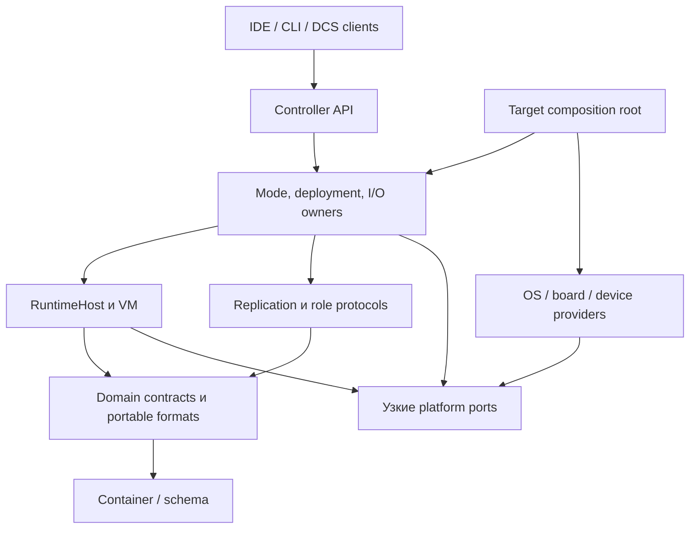

# 02. Модульный каркас

Цель: domain owners реализуют устойчивые механизмы; providers адаптируют их к ОС, устройствам и внешним системам. Общая форма операции: intent → owner admission → подготовка → revalidation/commit → enforcement → receipt. Это общий контракт взаимодействия, а не общий manager всех lifecycle.

## Четыре независимые границы

| Граница | Назначение | Правило реализации |
|---|---|---|
| Rust module / crate | Visibility, зависимости, code ownership | Начать с module; crate нужен для самостоятельного dependency/no_std/qualification seam |
| Execution plane | Scheduling и budget | RT/control/management; actor-like dispatch допустим в control, не вместо IEC scheduler |
| Protection domain | Какие faults изолированы | Process/MMU/MPU/аппаратный sink; отдельный thread не изолирует memory fault |
| Update unit | Что подписывается/активируется/откатывается вместе | ApplicationGeneration, provider/runtime firmware, bootloader — разные lifecycle |

## Размещение относительно существующего кода

Это **предложение file map**, которое W01/W03 уточняют до code changes. Оно не требует создать все каталоги заранее.

| Область | Предлагаемое размещение | Public boundary |
|---|---|---|
| Compiler/project | Существующие `compiler/{sources,project,parser,analyzer,codegen}` | Одна `project::compile`, adapters фронтендов |
| Артефакт | Существующий `compiler/container` | Versioned wire/schema/verifier; shared fixed-width IDs |
| Execution kernel | Существующий `compiler/vm` | Initialize/attach/advance, explicit time/budget, borrowed views |
| Local execution owner | Существующий `compiler/runtime` | ExecutionSession, state/capture, prepare/commit/restore; private mutable fields |
| Domain/port types | Новый `compiler/controller-contracts` при первом реальном consumer | Identity/receipts/profile/port modules, no std ambient effects; не global state store |
| Controller owners | Новый `compiler/controller`, сначала modules | mode, catalog, deployment, topology, io, persistence policy, faults, engineering routing |
| HA | Существующий `compiler/ironplc-redundancy`, refactor modules | link/replication/roles и public participant contracts; не private RuntimeHost serialization |
| OS/board providers | `compiler/controller-adapters` либо target-local modules до второго consumer | clock/storage/network/device/watchdog/boot; OS и board submodules независимы |
| Linux composition | `compiler/controller-linux` при появлении executable slice | Construction, process wiring, bounded IPC, target manifest; не второй domain runtime |
| External authority | Отдельная composition/image `compiler/output-authority` на P5 | Узкий grant/fence/RecoveryAdmission API и sink adapter вне execution failure domains |
| Engineering clients | Существующий VS Code; CLI/reference client | Versioned controller API, shared schema/conformance vectors |
| Qualification | Test/fixture/model/evidence directories, выбранные W04 | Public contracts и внешний observer, без production privilege |

Container не зависит от controller implementations. Общие contract types ссылаются только вниз, например на container IDs/schema; обратный dependency на controller-contracts не добавляется в container. Если общая identity нужна обоим, её размещение решается до образования cycle. Runtime не импортирует controller orchestration; HA не получает &mut к private Host fields. Traits задаются потребителем у нижней контрактной границы, реализации связывает composition root.

Стрелка означает compile-time/use dependency. Вызов реализации port идёт через связанный provider; diagram не помещает hardware authority внутрь controller process. External authority — отдельный участник протокола, даже если его domain library переиспользует типы.

## Виды подключаемых вариантов

| Вид | Когда выбирается | Admission / failure / update |
|---|---|---|
| Static provider | Build/composition; board/OS/stack | Port/version/capacities/TCB; firmware maintenance и requalification |
| Descriptor/policy package | Engineering/prepare | Verified data, schema/identity/limits; новая generation при изменении control semantics |
| IEC library | Reproducible build | Lock+semantic schema, compatibility/migration; общий application deployment |
| External service/client | Connection negotiation | Auth/capabilities/API version/quotas; исчезновение не блокирует control |
| Native hot-loaded executable | Не capability baseline | Новый ABI/isolation/update failure class; отдельное решение и квалификация |

Не вводить `Plugin::execute(&mut ControllerState)` и universal lifecycle для pure algorithms, immutable descriptors и physical drivers одновременно. Для каждого port собственные errors/cancel/recovery. Manifest перечисляет **проверяемые** capabilities и budgets; signature подтверждает происхождение, а не выполнение временной гарантии.

## Construction и lifecycle

1. Root проверяет target profile, dependency DAG и совместимость contracts; выделяет bounded pools.
2. Создаёт owners и concrete providers, передаёт только нужные capabilities/handles. Ни service locator, ни ambient globals не нужны.
3. Providers квалифицируют local resources/sessions; facts передаются owners. Boot не объявляет RUN самостоятельно.
4. Catalog/BindingResolver готовят immutable generation/plan. Host принимает prepared handles и переоценивает Start.
5. Во время scan разрешены bounded calls/views. Management готовит результаты вне RT; revoke обрабатывается независимо от ordinary queue.
6. Replacement сначала invalidates session/qualification; rebind/activation проходит существующий protocol. Retirement ждёт pins, но тяжёлая работа вынесена из commit.

FSM вводится для ожидания/commit/cancel/recovery, не для каждого filter или record. При необходимости actor-подобного control dispatcher: owned state + typed message + bounded mailbox + explicit effects; library не зависит от Tokio. Runtime execution остаётся deterministic Task→Program→POU→seal.

## Проверяемые барьеры модульности

W03/W04 проверяют Cargo graph, forbidden dependency/import rules и public API; W38 — actual target closure. W35/W44 добавляют второй implementation. Вместо широкого snapshot всех symbols проверять конкретные запреты: private state недоступен; VM не импортирует OS/transport/vendor adapter; release нельзя получить с missing capability; critical revoke не зависит от telemetry queue.

Все новые Rust crates наследуют workspace lint fences. Port, требующий запрещённого unsafe, остаётся blocker. Изоляция в отдельном crate не разрешает обход политики.
