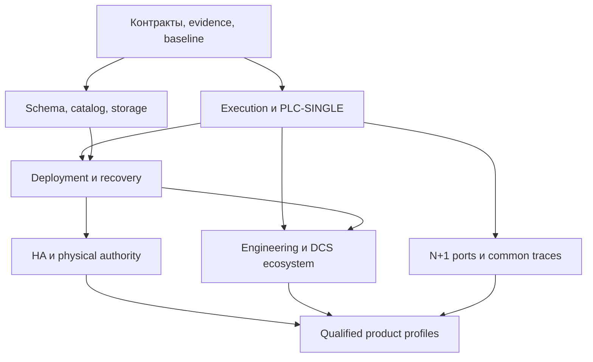

# 04. Порядок реализации и зависимости

W-номера — устойчивые IDs, не календарный порядок. Например, W20 storage, W29 security и W33 diagnostics начинаются в P1; их завершённые contracts нужны до первого реального внешнего управления. Полная продуктовая реализация расширяется на P4/P6.

| Milestone | Завершённый сквозной результат | Основные work packages | Exit evidence |
|---|---|---|---|
| P1 | Один continuous execution owner, bounded time/work, typed contracts, sim sinks | W01–W09; ранние W20/W29/W33 | Scheduler traces; infinite-loop fault; no hidden Start; requirements harness |
| P2 | Linux PLC-SINGLE с real I/O и independent containment без IDE | W10–W15; W42 | Boot/input/scan/accepted output/fallback/recovery на target |
| P3 | Общие state/schema/capture и bounded deployment | W07/W08/W16–W19 | Exact no-copy instrumentation; migration overflow; operation outcomes |
| P4 | Durable recovery, retain/reset и firmware maintenance | W20–W22; W18 integration | Crash/power-cut points, compatible roots и boot recovery |
| P5 | HA на тех же owners/state, с real external authority | W23–W28 | Model + protocol fault tests + physical RTO/RPO/fencing |
| P6 | Project/libraries/SDK/API/IDE/DCS/operations | W29–W37/W43/W44 | Multi-client, quality/gaps, replace/restore, release case |
| P7 | Второй реальный target; следующие по отдельной квалификации | W38 + W39 или W40 или W41; W42–W44 | Closure/common traces + target HIL; unsupported profiles denied |

Платформенные contracts и dependency separation проектируются с P1. P7 означает qualification новых ports, а не отложенное на конец устранение OS coupling. Security и независимое containment не опциональный последний этап.

## Первые проверяемые PR

1. W01: baseline/ADR conflict map и accepted source norms. Документы не меняют runtime behavior.
2. W02/W04: минимальный contract set и independent trace harness; не сразу все features.
3. W05: регрессия multi-period host rounds, затем initialize/attach separation. Это первый узкий runtime fix.
4. W06: work/time budgets; одновременная работа W07 schema и W09 mode по закреплённым contracts.
5. W03/W20/W29/W33: composition, storage/security/diagnostic seams для P2, включая actual resource limits.
6. W10–W15: binding/image/gate/provider/real Linux loop. Сначала integration seam, затем аппаратная qualification.
7. W16–W22: state reuse, activation/recovery на работающем single slice; HA использует его дальше.

Каждый пункт может делиться на contract+implementation+evidence PR. Нельзя merge contract stub как production capability. Task интегрируется, когда закрыты перечисленные predecessors; анализ/model work допускается раньше. Общие файлы меняются одним интегратором либо последовательными PR, не конкурирующими массовыми refactors.

## Полная таблица prerequisites

| Задание | Обязательные predecessors до интеграции |
|---|---|
| [W01](tasks/W01-baseline.md) | — |
| [W02](tasks/W02-contracts.md) | [W01](tasks/W01-baseline.md) |
| [W03](tasks/W03-composition.md) | [W02](tasks/W02-contracts.md) |
| [W04](tasks/W04-verification.md) | [W02](tasks/W02-contracts.md) |
| [W05](tasks/W05-execution-session.md) | [W02](tasks/W02-contracts.md), [W04](tasks/W04-verification.md) |
| [W06](tasks/W06-execution-budget.md) | [W05](tasks/W05-execution-session.md) |
| [W07](tasks/W07-semantic-schema.md) | [W02](tasks/W02-contracts.md), [W04](tasks/W04-verification.md) |
| [W08](tasks/W08-catalog.md) | [W03](tasks/W03-composition.md), [W07](tasks/W07-semantic-schema.md) |
| [W09](tasks/W09-mode-key.md) | [W02](tasks/W02-contracts.md), [W04](tasks/W04-verification.md) |
| [W10](tasks/W10-binding.md) | [W03](tasks/W03-composition.md), [W07](tasks/W07-semantic-schema.md) |
| [W11](tasks/W11-process-image.md) | [W05](tasks/W05-execution-session.md), [W10](tasks/W10-binding.md) |
| [W12](tasks/W12-effects.md) | [W09](tasks/W09-mode-key.md), [W11](tasks/W11-process-image.md) |
| [W13](tasks/W13-linux-boot.md) | [W03](tasks/W03-composition.md), [W06](tasks/W06-execution-budget.md), [W12](tasks/W12-effects.md), [W20](tasks/W20-durable-store.md), [W29](tasks/W29-security.md) |
| [W14](tasks/W14-ethernet-ip.md) | [W10](tasks/W10-binding.md), [W11](tasks/W11-process-image.md), [W12](tasks/W12-effects.md), [W29](tasks/W29-security.md) |
| [W15](tasks/W15-single-slice.md) | [W08](tasks/W08-catalog.md), [W13](tasks/W13-linux-boot.md), [W14](tasks/W14-ethernet-ip.md), [W29](tasks/W29-security.md) |
| [W16](tasks/W16-exact-activation.md) | [W05](tasks/W05-execution-session.md), [W07](tasks/W07-semantic-schema.md), [W08](tasks/W08-catalog.md), [W11](tasks/W11-process-image.md), [W12](tasks/W12-effects.md) |
| [W17](tasks/W17-migration.md) | [W16](tasks/W16-exact-activation.md), [W19](tasks/W19-capture.md) |
| [W18](tasks/W18-deployment.md) | [W16](tasks/W16-exact-activation.md), [W17](tasks/W17-migration.md), [W20](tasks/W20-durable-store.md), [W21](tasks/W21-retain-reset.md) |
| [W19](tasks/W19-capture.md) | [W05](tasks/W05-execution-session.md), [W07](tasks/W07-semantic-schema.md) |
| [W20](tasks/W20-durable-store.md) | [W02](tasks/W02-contracts.md), [W03](tasks/W03-composition.md), [W04](tasks/W04-verification.md) |
| [W21](tasks/W21-retain-reset.md) | [W07](tasks/W07-semantic-schema.md), [W19](tasks/W19-capture.md), [W20](tasks/W20-durable-store.md) |
| [W22](tasks/W22-firmware.md) | [W13](tasks/W13-linux-boot.md), [W20](tasks/W20-durable-store.md), [W29](tasks/W29-security.md) |
| [W23](tasks/W23-ha-transport.md) | [W03](tasks/W03-composition.md), [W04](tasks/W04-verification.md), [W29](tasks/W29-security.md) |
| [W24](tasks/W24-replication.md) | [W08](tasks/W08-catalog.md), [W19](tasks/W19-capture.md), [W23](tasks/W23-ha-transport.md) |
| [W25](tasks/W25-output-authority.md) | [W02](tasks/W02-contracts.md), [W04](tasks/W04-verification.md), [W12](tasks/W12-effects.md), [W20](tasks/W20-durable-store.md), [W29](tasks/W29-security.md) |
| [W26](tasks/W26-roles.md) | [W09](tasks/W09-mode-key.md), [W13](tasks/W13-linux-boot.md), [W24](tasks/W24-replication.md), [W25](tasks/W25-output-authority.md) |
| [W27](tasks/W27-ha-deployment.md) | [W18](tasks/W18-deployment.md), [W24](tasks/W24-replication.md), [W25](tasks/W25-output-authority.md), [W26](tasks/W26-roles.md) |
| [W28](tasks/W28-ha-qualification.md) | [W15](tasks/W15-single-slice.md), [W22](tasks/W22-firmware.md), [W27](tasks/W27-ha-deployment.md), [W42](tasks/W42-budgets.md) |
| [W29](tasks/W29-security.md) | [W02](tasks/W02-contracts.md), [W03](tasks/W03-composition.md), [W04](tasks/W04-verification.md) |
| [W30](tasks/W30-engineering-api.md) | [W02](tasks/W02-contracts.md), [W09](tasks/W09-mode-key.md), [W18](tasks/W18-deployment.md), [W29](tasks/W29-security.md), [W33](tasks/W33-observability.md) |
| [W31](tasks/W31-project-build.md) | [W07](tasks/W07-semantic-schema.md), [W08](tasks/W08-catalog.md) |
| [W32](tasks/W32-ide.md) | [W30](tasks/W30-engineering-api.md), [W31](tasks/W31-project-build.md) |
| [W33](tasks/W33-observability.md) | [W02](tasks/W02-contracts.md), [W03](tasks/W03-composition.md), [W04](tasks/W04-verification.md) |
| [W34](tasks/W34-dcs-data.md) | [W11](tasks/W11-process-image.md), [W29](tasks/W29-security.md), [W30](tasks/W30-engineering-api.md), [W33](tasks/W33-observability.md) |
| [W35](tasks/W35-package-sdk.md) | [W10](tasks/W10-binding.md), [W14](tasks/W14-ethernet-ip.md), [W31](tasks/W31-project-build.md) |
| [W36](tasks/W36-operations.md) | [W21](tasks/W21-retain-reset.md), [W22](tasks/W22-firmware.md), [W30](tasks/W30-engineering-api.md), [W35](tasks/W35-package-sdk.md) |
| [W37](tasks/W37-iec-libraries.md) | [W07](tasks/W07-semantic-schema.md), [W19](tasks/W19-capture.md), [W31](tasks/W31-project-build.md) |
| [W38](tasks/W38-portable-core.md) | [W03](tasks/W03-composition.md), [W05](tasks/W05-execution-session.md), [W06](tasks/W06-execution-budget.md), [W07](tasks/W07-semantic-schema.md), [W19](tasks/W19-capture.md), [W23](tasks/W23-ha-transport.md) |
| [W39](tasks/W39-zephyr.md) | [W35](tasks/W35-package-sdk.md), [W38](tasks/W38-portable-core.md), [W42](tasks/W42-budgets.md) |
| [W40](tasks/W40-rt-thread.md) | [W35](tasks/W35-package-sdk.md), [W38](tasks/W38-portable-core.md), [W42](tasks/W42-budgets.md) |
| [W41](tasks/W41-ariel.md) | [W35](tasks/W35-package-sdk.md), [W38](tasks/W38-portable-core.md), [W42](tasks/W42-budgets.md) |
| [W42](tasks/W42-budgets.md) | [W03](tasks/W03-composition.md), [W04](tasks/W04-verification.md), [W06](tasks/W06-execution-budget.md), [W11](tasks/W11-process-image.md), [W13](tasks/W13-linux-boot.md) |
| [W43](tasks/W43-release.md) | [W15](tasks/W15-single-slice.md), [W18](tasks/W18-deployment.md), [W21](tasks/W21-retain-reset.md), [W22](tasks/W22-firmware.md), [W29](tasks/W29-security.md), [W30](tasks/W30-engineering-api.md), [W34](tasks/W34-dcs-data.md), [W35](tasks/W35-package-sdk.md), [W36](tasks/W36-operations.md), [W37](tasks/W37-iec-libraries.md), [W42](tasks/W42-budgets.md) |
| [W44](tasks/W44-n-plus-one.md) | [W03](tasks/W03-composition.md), [W10](tasks/W10-binding.md), [W14](tasks/W14-ethernet-ip.md), [W20](tasks/W20-durable-store.md), [W30](tasks/W30-engineering-api.md), [W38](tasks/W38-portable-core.md) |

Release W43 имеет дополнительные **условные** gates: DCS-HA требует W28; qualification нового OS требует соответствующий W39/W40/W41; заявление same-class N+1 conformance требует W44. Не требуется выполнить все три embedded ports для отдельного Linux PLC-SINGLE release. Это условные зависимости профиля, не скрытые универсальные DAG edges.

Для каждой partial delivery записать доступные profiles и denied capabilities. Short demo может быть implemented/verified в SIMULATION; ему нельзя присвоить PLC-SINGLE hardware-qualified по сходству API.
